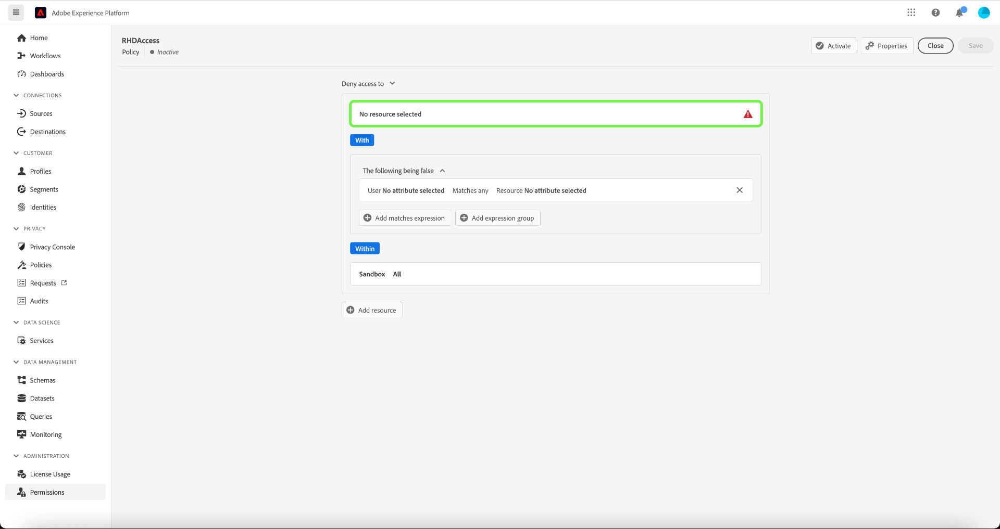

# 以屬性為基礎的存取控制端對端指南

在Adobe Experience Platform上使用以屬性為基礎的存取控制，為您自己和其他重視隱私權的多品牌客戶提供更大的彈性，以管理使用者存取許可權。 個別物件（例如綱要欄位和區段）的存取權可根據物件的屬性和角色以原則授予。 此功能允許您授予或撤銷組織中特定平台使用者對個別物件的存取權限。

此功能可讓您使用定義組織或資料使用範圍的標籤，將結構描述欄位、區段等分類。 您可以將這些相同的標籤套用至Adobe Journey Optimizer中的歷程、選件和其他物件。 同時，管理員可以定義有關Experience Data Model (XDM)結構描述欄位的存取原則，並更好地管理哪些使用者或群組（內部、外部或第三方使用者）可以存取這些欄位。

>[!NOTE]
>
>本檔案著重於存取控制原則的使用案例。 如果您嘗試設定原則來控管 **使用** 而不是哪些Platform使用者有權存取這些資料，請參閱的端對端指南 [資料控管](../../data-governance/e2e.md) 而非。

## 快速入門

本教學課程需要您實際瞭解下列平台元件：

* [[!DNL Experience Data Model (XDM)] 系統](../../xdm/home.md)：Experience Platform組織客戶體驗資料的標準化架構。
   * [結構描述組合基本概念](../../xdm/schema/composition.md)：瞭解XDM結構描述的基本建置區塊，包括結構描述組合中的關鍵原則和最佳實務。
   * [結構描述編輯器教學課程](../../xdm/tutorials/create-schema-ui.md)：瞭解如何使用結構編輯器UI建立自訂結構描述。
* [Adobe Experience Platform Segmentation Service](../../segmentation/home.md)：內的分段引擎 [!DNL Platform] 用於根據客戶行為和屬性，從您的客戶設定檔建立對象區段。

### 使用案例概觀

您將透過以屬性為基礎的存取控制工作流程範例，在此範例中，您將建立並指派角色、標籤和原則，以設定使用者是否可以存取組織中的特定資源。 本指南以限制存取敏感資料為例，示範工作流程。 此使用案例概述如下：

您是醫療保健提供者，且想設定對組織中資源的存取權。

* 您的內部行銷團隊應該要能夠存取 **[!UICONTROL PHI/規範健康資料]** 資料。
* 您的外部機構應該無法存取 **[!UICONTROL PHI/規範健康資料]** 資料。

為此，您必須設定角色、資源和原則。

您將會：

* [為您的使用者加上角色](#label-roles)：以醫療保健提供者（ACME業務群組）為例，其行銷群組與外部代理合作。
* [為資源加上標籤（結構欄位和區段）](#label-resources)：指派 **[!UICONTROL PHI/規範健康資料]** 標籤到結構描述資源和區段。
* 
   * [啟動將它們連結在一起的原則：](#policy)：啟用預設原則，將資源上的標籤連結至您角色中的標籤，以防止存取結構描述欄位和區段。 之後，擁有相符標籤的使用者將獲得結構欄位和所有沙箱之區段的存取權。

## 權限

[!UICONTROL 許可權] 是Experience Cloud區域，管理員可在此定義使用者角色和原則，以管理產品應用程式內功能和物件的許可權。

到 [!UICONTROL 許可權]，您可以建立和管理角色，並為這些角色指派所需的資源許可權。 [!UICONTROL 許可權] 也可讓您管理與特定角色相關聯的標籤、沙箱和使用者。

如果您沒有管理員許可權，請聯絡系統管理員以獲得存取權。

取得管理員許可權後，請前往 [Adobe Experience Cloud](https://experience.adobe.com/) 並使用您的Adobe憑證登入。 登入後， **[!UICONTROL 概觀]** 此時會出現您擁有管理員許可權之組織的頁面。 此頁面顯示貴組織訂閱的產品，以及新增使用者和管理員至組織的其他控制項。 選取 **[!UICONTROL 許可權]** 以開啟工作區以進行您的Platform整合。

Platform UI的許可權工作區隨即顯示，並開啟在 **[!UICONTROL 角色]** 頁面。

## 將標籤套用至角色 {#label-roles}

>[!CONTEXTUALHELP]
>id="platform_permissions_labels_about"
>title="什麼是標籤？"
>abstract="標籤可讓您根據適用於該資料的使用原則對資料集和欄位進行分類。平台提供了幾個 Adobe 定義的「核心」資料使用標籤，涵蓋了適用於資料控管的各種常見限制。例如，敏感資料「S」標籤 (例如 RHD (受監管的健康資料))，可讓您將受保護的健康資訊 (PHI) 加以分類。您也可以定義適合您組織需求的自訂標籤。"
>additional-url="https://experienceleague.adobe.com/docs/experience-platform/data-governance/labels/overview.html?lang=zh-Hant#understanding-data-usage-labels" text="資料使用標籤概觀"

>[!CONTEXTUALHELP]
>id="platform_permissions_labels_about_create"
>title="建立新標籤"
>abstract="您可以建立適合您組織需求的自訂標籤。自訂標籤可用於資料控管和存取控制設定套用到您的資料。"
>additional-url="https://experienceleague.adobe.com/docs/experience-platform/data-governance/labels/overview.html?lang=zh-Hant#manage-labels" text="管理自訂標籤"

>[!CONTEXTUALHELP]
>id="platform_permissions_roles_about"
>title="什麼是角色？"
>abstract="角色用於分類與 Platform 執行個體互動的使用者類型，也是存取控制原則的組成要素。一個角色具有一組給定的權限，您的組織成員可以指派到一個或多個角色，依據他們需要的視圖範圍或寫入權限而定。"
>additional-url="https://experienceleague.adobe.com/docs/experience-platform/access-control/abac/permissions-ui/roles.html?lang=zh-Hant" text="管理角色"

>[!CONTEXTUALHELP]
>id="platform_permissions_roles_about_create"
>title="建立新角色"
>abstract="您可以建立一個新角色以更好地分類存取您 Platform 執行個體的使用者。例如，您可以為內部行銷團隊建立角色並將 RHD 標籤套用到該角色，進而允許您的內部行銷團隊存取受保護的健康資訊 (PHI)。或者，您也可以為外部機構建立一個角色，且不將 RHD 標籤套用到該角色來拒絕該角色存取 PHI 資料。"
>additional-url="https://experienceleague.adobe.com/docs/experience-platform/access-control/abac/permissions-ui/roles.html?lang=zh-Hant#create-a-new-role" text="建立新角色"

>[!CONTEXTUALHELP]
>id="platform_permissions_roles_details"
>title="角色概觀"
>abstract="角色概觀對話框顯示給定角色可存取的資源和沙箱。"

角色是分類與您的Platform執行個體互動的使用者型別的方法，也是存取控制原則的建置組塊。 角色具有一組指定的許可權，而您組織的成員可以根據他們需要的存取範圍，指派一或多個角色。

若要開始使用，請選取 **[!UICONTROL ACME業務群組]** 從的 **[!UICONTROL 角色]** 頁面。

接下來，選取 **[!UICONTROL 標籤]** 然後選取 **[!UICONTROL 新增標籤]**.

貴組織中的所有標籤清單隨即顯示。 選取 **[!UICONTROL RHD]** 新增標籤 **[!UICONTROL PHI/法規健康資料]**. 請稍候片刻，讓標籤旁邊出現一個藍色核取記號，然後選取 **[!UICONTROL 儲存]**.

>[!NOTE]
>
>將組織群組新增至角色時，該群組中的所有使用者都會新增至角色。 對組織群組所做的任何變更（移除或新增的使用者）都會在角色中自動更新。

## 將標籤套用至結構描述欄位 {#label-resources}

現在您已使用設定使用者角色 [!UICONTROL RHD] 標籤，下一步是將相同的標籤新增至您要為該角色控制的資源。

選取 **[!UICONTROL 方案]** 從左側導覽列中，然後選取 **[!UICONTROL ACME醫療保健]** 從出現的方案清單中。

接下來，選取 **[!UICONTROL 標籤]** ，檢視顯示與結構描述關聯欄位的清單。 從這裡，您可以一次將標籤指派給一或多個欄位。 選取 **[!UICONTROL 血糖]** 和 **[!UICONTROL 胰島素水準]** 欄位，然後選取 **[!UICONTROL 套用存取權和資料治理標籤]**.

此 **[!UICONTROL 編輯標籤]** 對話方塊會顯示，讓您選擇要套用至結構描述欄位的標籤。 對於此使用案例，請選取 **[!UICONTROL PHI/規範健康資料]** 標籤，然後選取 **[!UICONTROL 儲存]**.

>[!NOTE]
>
>將標籤新增到欄位時，該標籤將套用到該欄位的父級資源（類別或欄位群組）。 如果父類別或欄位群組被其他結構描述使用，這些結構描述將繼承相同的標籤。

## 將標籤套用至區段

完成標示結構描述欄位後，您現在可以開始標示區段。

選取 **[!UICONTROL 區段]** 從左側導覽。 隨即顯示貴組織中可用的區段清單。 在此範例中，下列兩個區段會加上標籤，因為它們包含敏感的健康情況資料：

* 血糖>100
* 胰島素&lt;50

選取 **[!UICONTROL 血糖>100]** 以開始標籤區段。

區段 **[!UICONTROL 詳細資料]** 畫面隨即顯示。 選取 **[!UICONTROL 管理存取權]**.

此 **[!UICONTROL 編輯標籤]** 對話方塊會出現，讓您選擇要套用至區段的標籤。 對於此使用案例，請選取 **[!UICONTROL PHI/規範健康資料]** 標籤，然後選取 **[!UICONTROL 儲存]**.

重複上述步驟，使用 **[!UICONTROL 胰島素&lt;50]**.

## 啟動存取控制原則 {#policy}

預設的存取控制原則將運用標籤來定義哪些使用者角色可以存取特定平台資源。 在此範例中，如果使用者不在結構欄位中具有對應標籤的角色中，其存取結構欄位和區段的許可權將在所有沙箱中遭到拒絕。

若要啟用存取控制原則，請選取 [!UICONTROL 許可權] 從左側導覽列中，然後選取 **[!UICONTROL 原則]**.

接著，選取省略符號(`...`)旁，下拉式清單會顯示可編輯、啟動、刪除或複製角色的控制項。 選取 **[!UICONTROL 啟動]** 下拉式清單中的。

啟動原則對話方塊會出現，提示您確認啟動。 選取 **[!UICONTROL 確認]**.

已收到啟用原則的確認，您將返回 [!UICONTROL 原則] 頁面。

<!-- ## Create an access control policy {#policy}

>[!CONTEXTUALHELP]
>id="platform_permissions_policies_about"
>title="What are policies?"
>abstract="Policies are statements that bring attributes together to establish permissible and impermissible actions. Every organization comes with a default policy that you must activate to define rules for resources like segments and schema fields. Default policies can neither be edited nor deleted. However, default policies can be activated or deactivated."
>additional-url="https://experienceleague.adobe.com/docs/experience-platform/access-control/abac/permissions-ui/policies.html" text="Manage policies"

>[!CONTEXTUALHELP]
>id="platform_permissions_policies_about_create"
>title="Create a policy"
>abstract="Create a policy to define the actions that your users can and cannot take against your segments and schema fields."
>additional-url="https://experienceleague.adobe.com/docs/experience-platform/access-control/abac/permissions-ui/policies.html#create-a-new-policy" text="Create a policy"

>[!CONTEXTUALHELP]
>id="platform_permissions_policies_edit_permitdeny"
>title="Configure permissible and impermissible actions for a policy"
>abstract="A <b>deny access to</b> policy will deny users access when the criteria is met. Combined with <b>The following being false</b> - all users will be denied access unless they meet the matching criteria set. This type of policy allows you to protect a sensitive resource and only allow access to users with matching labels.  A <b>permit access to</b> policy will permit users access when the criteria are met. When combined with <b>The following being true</b> - users will be given access if they meet the matching criteria set. This does not explicitly deny access to users, but adds a permit access. This type of policy allows you to give additional access to resource and in addition to those users who might already have access through role permissions."
>additional-url="https://experienceleague.adobe.com/docs/experience-platform/access-control/abac/permissions-ui/policies.html#edit-a-policy" text="Edit a policy"

>[!CONTEXTUALHELP]
>id="platform_permissions_policies_edit_resource"
>title="Configure permissions for a resource"
>abstract="A resource is the asset or object that a user can or cannot access. Resources can be segments or schemas fields. You can configure write, read, or delete permissions for segments and schema fields."

>[!CONTEXTUALHELP]
>id="platform_permissions_policies_edit_condition"
>title="Edit conditions"
>abstract="Apply conditional statements to your policy to configure user access to certain resources. Select match all to require users to have roles with the same labels as a resource to be permitted access. Select match any to require users to have a role with just one label matching a label on a resource. Labels can either be defined as core or custom labels, with core labels representing labels created and provided by Adobe and custom labels representing labels that you created for your organization."

Access control policies leverage labels to define which user roles have access to specific Platform resources. Policies can either be local or global and can override other policies. In this example, access to schema fields and segments will be denied in all sandboxes for users who don't have the corresponding labels in the schema field.

>[!NOTE]
>
>A "deny policy" is created to grant access to sensitive resources because the role grants permission to the subjects. The written policy in this example **denies** you access if you are missing the required labels.

To create an access control policy, select **[!UICONTROL Permissions]** from the left navigation and then select **[!UICONTROL Policies]**. Next, select **[!UICONTROL Create policy]**.

The **[!UICONTROL Create new policy]** dialog appears, prompting you to enter a name and an optional description. Select **[!UICONTROL Confirm]** when finished.

To deny access to the schema fields, use the dropdown arrow and select **[!UICONTROL Deny access to]** and then select **[!UICONTROL No resource selected]**. Next, select **[!UICONTROL Schema Field]** and then select **[!UICONTROL All]**.

The table below shows the conditions available when creating a policy:

| Conditions | Description |
| --- | --- |
| The following being false| When 'Deny access to' is set, access will be restricted if the user does not meet the criteria selected. |
| The following being true| When 'Permit access to' is set, access will be permitted if the user meets the selected criteria. |
| Matches any| The user has a label that matches any label applied to a resource. |
| Matches all| The user has all labels that matches all labels applied to a resource. |
| Core label| A core label is an Adobe-defined label that is available in all Platform instances.|
| Custom label| A custom label is a label that has been created by your organization.|

Select **[!UICONTROL The following being false]** and then select **[!UICONTROL No attribute selected]**. Next, select the user **[!UICONTROL Core label]**, then select **[!UICONTROL Matches all]**. Select the resource **[!UICONTROL Core label]** and finally select **[!UICONTROL Add resource]**.

>[!TIP]
>
>A resource is the asset or object that a subject can or cannot access. Resources can be segments or schemas.

To deny access to the segments, use the dropdown arrow and select **[!UICONTROL Deny access to]** and then select **[!UICONTROL No resource selected]**. Next, select **[!UICONTROL Segment]** and then select **[!UICONTROL All]**.

Select **[!UICONTROL The following being false]** and then select **[!UICONTROL No attribute selected]**. Next, select the user **[!UICONTROL Core label]**, then select **[!UICONTROL Matches all]**. Select the resource **[!UICONTROL Core label]** and finally select **[!UICONTROL Save]**.

Select **[!UICONTROL Activate]** to activate the policy, and a dialog appears which prompts you to confirm activation. Select **[!UICONTROL Confirm]** and then select **[!UICONTROL Close]**.

 -->

## 後續步驟

您已完成將標籤套用至角色、結構描述欄位和區段。 指派給這些角色的外部機構無法檢視這些標籤，及其在結構描述、資料集和設定檔檢視中的值。 使用區段產生器時，這些欄位也限制用於區段定義。

如需以屬性為基礎的存取控制的詳細資訊，請參閱 [屬性型存取控制概觀](./overview.md).

以下影片旨在協助您瞭解屬性型存取控制，並概述如何設定角色、資源和原則。

>[!VIDEO](https://video.tv.adobe.com/v/345641?learn=on)
