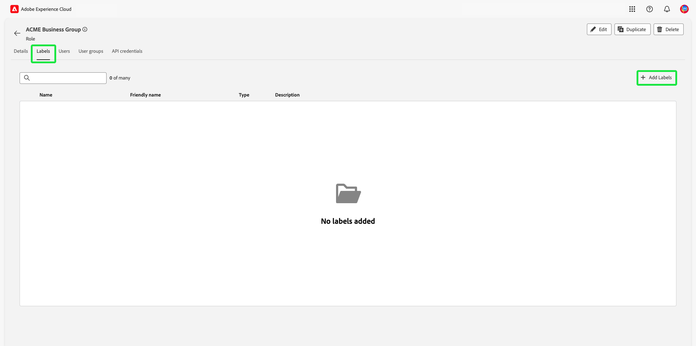
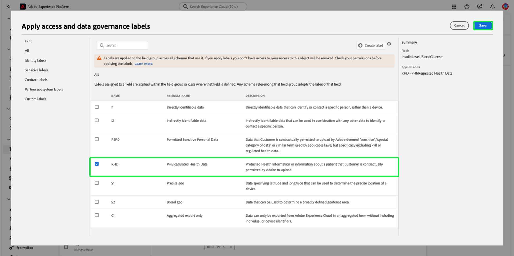

# 基於屬性的訪問控制端到端指南

基於屬性的存取控制是Adobe Experience Platform的一項功能，可讓多品牌和注重隱私的客戶擁有更大的彈性來管理使用者存取。 可以根據對象的屬性和角色使用策略來授予/拒絕對單個對象（如方案欄位和段）的訪問權。 此功能可讓您授予或撤銷組織中特定Platform使用者對個別物件的存取權。

此功能可讓您使用定義組織或資料使用範圍的標籤，對結構欄位、區段等進行分類。 您可以將這些相同的標籤套用至Adobe Journey Optimizer中的歷程、選件和其他物件。 同時，管理員可以定義Experience Data Model(XDM)結構欄位的存取原則，並更妥善地管理哪些使用者或群組（內部、外部或第三方使用者）可以存取這些欄位。

>[!NOTE]
>
>本文檔重點介紹訪問控制策略的使用案例。 如果您正嘗試設定策略以管理 **use** 請參閱上的端對端指南， [資料控管](../../data-governance/e2e.md) 。

## 快速入門

本教學課程需要妥善了解下列平台元件：

* [[!DNL Experience Data Model (XDM)] 系統](../../xdm/home.md):Experience Platform組織客戶體驗資料的標準化架構。
   * [結構構成基本概念](../../xdm/schema/composition.md):了解XDM結構描述的基本建置組塊，包括結構描述的主要原則和最佳實務。
   * [結構編輯器教學課程](../../xdm/tutorials/create-schema-ui.md):了解如何使用結構編輯器UI建立自訂結構。
* [Adobe Experience Platform區段服務](../../segmentation/home.md):內的分段引擎 [!DNL Platform] 用於根據客戶行為和屬性，從您的客戶設定檔建立受眾區段。

### 使用案例概觀

您將執行一個基於屬性的訪問控制工作流示例，在該工作流中，您將建立並分配角色、標籤和策略，以配置您的用戶是否可以訪問組織中的特定資源。 本指南使用限制存取敏感資料的範例來示範工作流程。 此使用案例概述如下：

您是醫療保健提供商，希望配置對組織中資源的訪問。

* 您的內部行銷團隊應能存取 **[!UICONTROL PHI/受管制的健康資料]** 資料。
* 您的外部機構應無法訪問 **[!UICONTROL PHI/受管制的健康資料]** 資料。

要執行此操作，您必須設定角色、資源和原則。

您會：

* [為您的使用者標籤角色](#label-roles):以其行銷組與外部代理合作的醫療保健提供商（ACME業務組）為例。
* [標示資源（結構欄位和區段）](#label-resources):指派 **[!UICONTROL PHI/受管制的健康資料]** 標籤至架構資源和區段。
* 
   * [激活將它們連結在一起的策略： ](#policy):啟用預設原則，將資源上的標籤連結至角色中的標籤，以防止存取架構欄位和區段。 接著，系統會為具有相符標籤的使用者提供所有沙箱之結構欄位和區段的存取權。

## 權限

[!UICONTROL 權限] 是Experience Cloud的區域，管理員可在其中定義用戶角色和策略，以管理產品應用程式內的功能和對象的權限。

通過 [!UICONTROL 權限]，您可以建立和管理角色，並為這些角色指派所需的資源權限。 [!UICONTROL 權限也可讓您管理與特定角色相關聯的標籤、沙箱和使用者。]

如果您沒有管理員權限，請連絡您的系統管理員以取得存取權。

取得管理員權限後，請前往 [Adobe Experience Cloud](https://experience.adobe.com/) 並使用您的Adobe憑證登入。 登入後， **[!UICONTROL 概述]** 會針對您擁有管理員權限的組織顯示頁面。 此頁面顯示您組織訂閱的產品，以及新增使用者和管理員至組織的其他控制項。 選擇 **[!UICONTROL 權限]** 以開啟您的平台整合工作區。

Platform UI的「權限」工作區隨即顯示，在 **[!UICONTROL 角色]** 頁面。

## 將標籤應用於角色 {#label-roles}

>[!CONTEXTUALHELP]
>id="platform_permissions_labels_about"
>title="什麼是標籤？"
>abstract="標籤可讓您根據適用於該資料的使用原則對資料集和欄位進行分類。平台提供了幾個 Adobe 定義的「核心」資料使用標籤，涵蓋了適用於資料控管的各種常見限制。例如，敏感資料「S」標籤 (例如 RHD (受監管的健康資料))，可讓您將受保護的健康資訊 (PHI) 加以分類。您也可以定義適合您組織需求的自訂標籤。"
>additional-url="https://experienceleague.adobe.com/docs/experience-platform/data-governance/labels/overview.html?lang=zh-Hant#understanding-data-usage-labels" text="資料使用標籤總覽"

>[!CONTEXTUALHELP]
>id="platform_permissions_labels_about_create"
>title="建立新標籤"
>abstract="您可以建立適合您組織需求的自訂標籤。自訂標籤可用於資料控管和存取控制設定套用到您的資料。"
>additional-url="https://experienceleague.adobe.com/docs/experience-platform/data-governance/labels/overview.html?lang=zh-Hant#manage-labels" text="管理自訂標籤"

>[!CONTEXTUALHELP]
>id="platform_permissions_roles_about"
>title="什麼是角色？"
>abstract="角色用於分類與 Platform 執行個體互動的使用者類型，也是存取控制原則的組成要素。一個角色具有一組給定的權限，您的組織成員可以指派到一個或多個角色，依據他們需要的視圖範圍或寫入權限而定。"
>additional-url="https://experienceleague.adobe.com/docs/experience-platform/access-control/abac/permissions-ui/roles.html?lang=zh-Hant" text="管理角色"

>[!CONTEXTUALHELP]
>id="platform_permissions_roles_about_create"
>title="建立新角色"
>abstract="您可以建立一個新角色以更好地分類存取您 Platform 執行個體的使用者。例如，您可以為內部行銷團隊建立角色並將 RHD 標籤套用到該角色，從而允許您的內部行銷團隊存取受保護的健康資訊 (PHI)。或者，您也可以為外部機構建立一個角色，且不將 RHD 標籤套用到該角色來拒絕該角色存取 PHI 資料。"
>additional-url="https://experienceleague.adobe.com/docs/experience-platform/access-control/abac/permissions-ui/roles.html?lang=zh-Hant#create-a-new-role" text="建立新角色"

>[!CONTEXTUALHELP]
>id="platform_permissions_roles_details"
>title="角色概觀"
>abstract="角色概觀對話框顯示給定角色可存取的資源和沙箱。"

角色是將與您的Platform例項互動的使用者類型分類的方法，也是存取控制原則的基礎要素。 角色具有一組指定的權限，而您組織的成員可依其需要的存取範圍，指派給一或多個角色。

若要開始，請選取 **[!UICONTROL ACME Business Group]** 從 **[!UICONTROL 角色]** 頁面。

下一步，選擇 **[!UICONTROL 標籤]** 然後選取 **[!UICONTROL 新增標籤]**.

組織中所有標籤的清單隨即顯示。 選擇 **[!UICONTROL RHD]** 為添加標籤 **[!UICONTROL PHI/受管制的健康資料]**. 讓藍色勾號在標籤旁出現幾分鐘，然後選取 **[!UICONTROL 儲存]**.

>[!NOTE]
>
>將組織群組新增至角色時，該群組中的所有使用者都會新增至角色。 對組織群組所做的任何變更（移除或新增的使用者）都會在角色內自動更新。

## 將標籤應用於架構欄位 {#label-resources}

現在您已使用 [!UICONTROL RHD] 標籤，下一步是將相同標籤新增至您要控制該角色的資源。

選擇 **[!UICONTROL 結構]** 從左側導覽列中，然後選取 **[!UICONTROL ACME Healthcare]** 從顯示的結構清單中。

下一步，選擇 **[!UICONTROL 標籤]** 以查看顯示與架構關聯欄位的清單。 從這裡，您可以一次將標籤指派給一或多個欄位。 選取 **[!UICONTROL 血糖]** 和 **[!UICONTROL 胰島素水準]** 欄位，然後選取 **[!UICONTROL 套用存取權和資料控管標籤]**.

此 **[!UICONTROL 編輯標籤]** 對話框，可讓您選擇要應用到架構欄位的標籤。 針對此使用案例，選取 **[!UICONTROL PHI/受管制的健康資料]** 標籤，然後選取 **[!UICONTROL 儲存]**.

>[!NOTE]
>
>將標籤添加到欄位時，該標籤將應用到該欄位的父資源（類或欄位組）。 如果父類或欄位組被其他方案採用，則這些方案將繼承相同的標籤。

## 將標籤套用至區段

完成架構欄位的標籤後，您現在可以開始標籤區段。

選擇 **[!UICONTROL 區段]** 從左側導覽。 隨即顯示組織中可用的區段清單。 在此範例中，以下兩個區段的標籤為包含敏感健康資料：

* 血糖>100
* 胰島素&lt;50

選擇 **[!UICONTROL 血糖>100]** 開始為區段加上標籤。

區段 **[!UICONTROL 詳細資料]** 畫面。 選擇 **[!UICONTROL 管理存取]**.

此 **[!UICONTROL 編輯標籤]** 對話方塊，讓您選擇要套用至區段的標籤。 針對此使用案例，選取 **[!UICONTROL PHI/受管制的健康資料]** 標籤，然後選取 **[!UICONTROL 儲存]**.

使用 **[!UICONTROL 胰島素&lt;50]**.

## 激活訪問控制策略 {#policy}

預設的存取控制原則會利用標籤來定義哪些使用者角色可存取特定平台資源。 在此範例中，對於不在架構欄位中具有對應標籤之角色的使用者，在所有沙箱中都會拒絕存取架構欄位和區段。

要激活訪問控制策略，請選擇 [!UICONTROL 權限] 從左側導覽列中，然後選取 **[!UICONTROL 原則]**.

接下來，選取省略號(`...`)旁邊，下拉式清單會顯示編輯、啟用、刪除或複製角色的控制項。 選擇 **[!UICONTROL 啟動]** 中。

此時將顯示激活策略對話框，提示您確認激活。 選擇 **[!UICONTROL 確認]**.

收到策略激活的確認，並將您返回 [!UICONTROL 原則] 頁面。

<!-- ## Create an access control policy {#policy}

>[!CONTEXTUALHELP]
>id="platform_permissions_policies_about"
>title="What are policies?"
>abstract="Policies are statements that bring attributes together to establish permissible and impermissible actions. Every organization comes with a default policy that you must activate to define rules for resources like segments and schema fields. Default policies can neither be edited nor deleted. However, default policies can be activated or deactivated."
>additional-url="https://experienceleague.adobe.com/docs/experience-platform/access-control/abac/permissions-ui/policies.html?lang=en" text="Manage policies"

>[!CONTEXTUALHELP]
>id="platform_permissions_policies_about_create"
>title="Create a policy"
>abstract="Create a policy to define the actions that your users can and cannot take against your segments and schema fields."
>additional-url="https://experienceleague.adobe.com/docs/experience-platform/access-control/abac/permissions-ui/policies.html?lang=en#create-a-new-policy" text="Create a policy"

>[!CONTEXTUALHELP]
>id="platform_permissions_policies_edit_permitdeny"
>title="Configure permissible and impermissible actions for a policy"
>abstract="A <b>deny access to</b> policy will deny users access when the criteria is met. Combined with <b>The following being false</b> - all users will be denied access unless they meet the matching criteria set. This type of policy allows you to protect a sensitive resource and only allow access to users with matching labels.  A <b>permit access to</b> policy will permit users access when the criteria are met. When combined with <b>The following being true</b> - users will be given access if they meet the matching criteria set. This does not explicitly deny access to users, but adds a permit access. This type of policy allows you to give additional access to resource and in addition to those users who might already have access through role permissions." 
>additional-url="https://experienceleague.adobe.com/docs/experience-platform/access-control/abac/permissions-ui/policies.html?lang=en#edit-a-policy" text="Edit a policy"

>[!CONTEXTUALHELP]
>id="platform_permissions_policies_edit_resource"
>title="Configure permissions for a resource"
>abstract="A resource is the asset or object that a user can or cannot access. Resources can be segments or schemas fields. You can configure write, read, or delete permissions for segments and schema fields."

>[!CONTEXTUALHELP]
>id="platform_permissions_policies_edit_condition"
>title="Edit conditions"
>abstract="Apply conditional statements to your policy to configure user access to certain resources. Select match all to require users to have roles with the same labels as a resource to be permitted access. Select match any to require users to have a role with just one label matching a label on a resource. Labels can either be defined as core or custom labels, with core labels representing labels created and provided by Adobe and custom labels representing labels that you created for your organization."

Access control policies leverage labels to define which user roles have access to specific Platform resources. Policies can either be local or global and can override other policies. In this example, access to schema fields and segments will be denied in all sandboxes for users who don't have the corresponding labels in the schema field.

>[!NOTE]
>
>A "deny policy" is created to grant access to sensitive resources because the role grants permission to the subjects. The written policy in this example **denies** you access if you are missing the required labels.

To create an access control policy, select **[!UICONTROL Permissions]** from the left navigation and then select **[!UICONTROL Policies]**. Next, select **[!UICONTROL Create policy]**.

The **[!UICONTROL Create new policy]** dialog appears, prompting you to enter a name and an optional description. Select **[!UICONTROL Confirm]** when finished.

To deny access to the schema fields, use the dropdown arrow and select **[!UICONTROL Deny access to]** and then select **[!UICONTROL No resource selected]**. Next, select **[!UICONTROL Schema Field]** and then select **[!UICONTROL All]**.

The table below shows the conditions available when creating a policy:

| Conditions | Description |
| --- | --- |
| The following being false| When 'Deny access to' is set, access will be restricted if the user does not meet the criteria selected. |
| The following being true| When 'Permit access to' is set, access will be permitted if the user meets the selected criteria. |
| Matches any| The user has a label that matches any label applied to a resource. |
| Matches all| The user has all labels that matches all labels applied to a resource. |
| Core label| A core label is an Adobe-defined label that is available in all Platform instances.|
| Custom label| A custom label is a label that has been created by your organization.|

Select **[!UICONTROL The following being false]** and then select **[!UICONTROL No attribute selected]**. Next, select the user **[!UICONTROL Core label]**, then select **[!UICONTROL Matches all]**. Select the resource **[!UICONTROL Core label]** and finally select **[!UICONTROL Add resource]**.

>[!TIP]
>
>A resource is the asset or object that a subject can or cannot access. Resources can be segments or schemas.

To deny access to the segments, use the dropdown arrow and select **[!UICONTROL Deny access to]** and then select **[!UICONTROL No resource selected]**. Next, select **[!UICONTROL Segment]** and then select **[!UICONTROL All]**.

Select **[!UICONTROL The following being false]** and then select **[!UICONTROL No attribute selected]**. Next, select the user **[!UICONTROL Core label]**, then select **[!UICONTROL Matches all]**. Select the resource **[!UICONTROL Core label]** and finally select **[!UICONTROL Save]**.

Select **[!UICONTROL Activate]** to activate the policy, and a dialog appears which prompts you to confirm activation. Select **[!UICONTROL Confirm]** and then select **[!UICONTROL Close]**.

 -->

## 後續步驟

您已完成將標籤套用至角色、結構欄位和區段的作業。 指派給這些角色的外部代理受限於無法在結構、資料集和設定檔檢視中檢視這些標籤及其值。 使用「區段產生器」時，這些欄位也無法用於區段定義中。

有關基於屬性的訪問控制的詳細資訊，請參見 [基於屬性的訪問控制概述](./overview.md).
