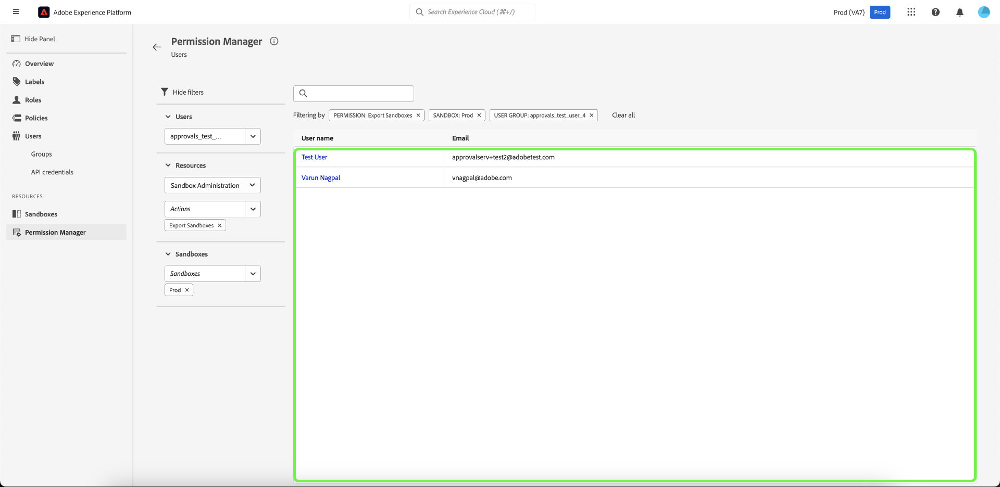
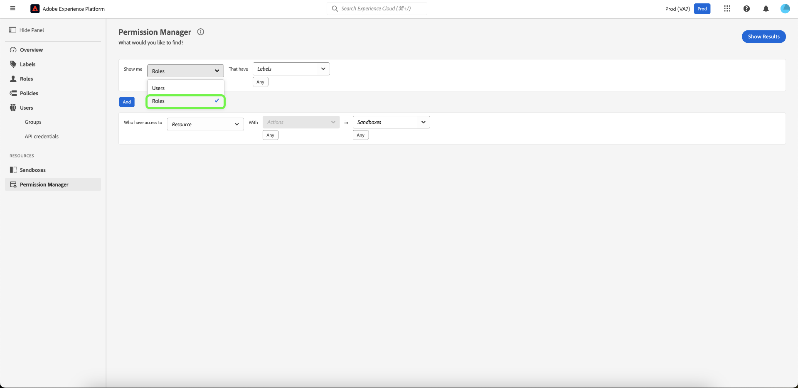
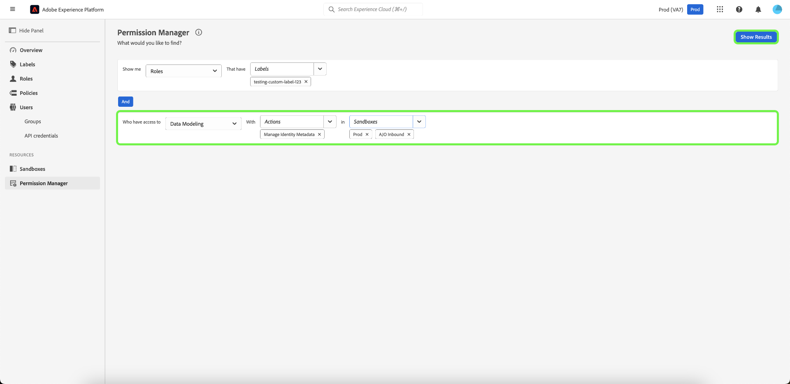

# 權限管理員

>[!NOTE]
>
>若要存取[!UICONTROL 許可權管理員]，您必須是產品管理員。 如果您沒有管理員許可權，請聯絡您的系統管理員以獲得存取權。

在[!UICONTROL 許可權管理員]中使用簡單查詢來建立簡明的報告，協助您瞭解存取管理，並節省驗證多個工作流程和詳細程度層級的存取許可權的時間。 您可以利用[!UICONTROL 許可權管理員]來尋找屬於使用者群組且具有特定存取許可權的使用者，以及具有特定標籤的角色。

## 在指定使用者群組中執行使用者搜尋 {#search-users}

>[!CONTEXTUALHELP]
>id="platform_permission_manager"
>title="權限管理員"
>abstract="使用頁面上的下拉式選單選擇器，可取得不同詳細程度等級之使用者和角色的存取層級報告。"
<!-- >additional-url="https://experienceleague.adobe.com/docs/experience-platform/access-control/abac/permissions-manager/permissions.html" text="Permission manager" -->

使用下拉式清單，選取屬性&#x200B;**[!UICONTROL 使用者]**。

接著，使用下拉式清單選取您要搜尋的&#x200B;**[!UICONTROL 使用者群組]**。

>[!INFO]
>
>[!UICONTROL 使用者群組]不是必要欄位。 您只能為每個報表選取一個使用者群組。

如需更精細的報告，您可以指定具有特定沙箱中動作的資源。 使用下拉式清單選取&#x200B;**[!UICONTROL 資源]**、**[!UICONTROL 動作]**&#x200B;和&#x200B;**[!UICONTROL 沙箱]**，然後選取&#x200B;**[!UICONTROL 顯示結果]**。

>[!INFO]
>
>[!UICONTROL 資源]、[!UICONTROL 動作]和[!UICONTROL 沙箱]不是必要欄位。 在新增動作或沙箱後，選取您要移除的選取專案旁的&#x200B;**&#39;x&#39;**，即可移除動作或沙箱。

系統會根據選取的條件報告使用者清單及其電子郵件地址。 使用左側的篩選功能表來更新屬性和結果。 如需特定使用者的詳細資訊，請從清單中選取使用者名稱。

## 搜尋具有特定標籤的角色 {#search-roles}

使用下拉式清單，選取屬性&#x200B;**[!UICONTROL 角色]**。

>[!INFO]
>
>[!UICONTROL 標籤]不是必要欄位。 您可以選取多個標籤，選取後標籤會列在此下拉式清單下方。 選取動作旁邊的&#x200B;**&#39;x&#39;**，在新增標籤後即可移除標籤。

接著，使用下拉式清單選取您要搜尋的&#x200B;**[!UICONTROL 標籤]**。

如需更精細的報告，您可以指定具有特定沙箱中動作的資源。 使用下拉式清單選取&#x200B;**[!UICONTROL 資源]**、**[!UICONTROL 動作]**&#x200B;和&#x200B;**[!UICONTROL 沙箱]**，然後選取&#x200B;**[!UICONTROL 顯示結果]**。

>[!INFO]
>
>[!UICONTROL 資源]、[!UICONTROL 動作]和[!UICONTROL 沙箱]不是必要欄位。 每個報表只能選取一個[!UICONTROL 資源]。 在新增動作或沙箱後，選取您要移除的選取專案旁的&#x200B;**&#39;x&#39;**，即可移除動作或沙箱。

系統會根據選取的條件報告角色清單。 使用左側的篩選功能表來更新屬性和結果。 如需特定角色的詳細資訊，請從清單中選取角色。

系統會針對符合條件的各個角色，顯示下列資訊：

| 屬性 | 說明 |
| --- | --- |
| 說明 | 角色的簡短說明。 |
| 標記 | 與角色相關聯的標籤清單。 |
| 沙箱 | 包含此角色的Sanbox清單。 |
| 修改時間 | 上次更新角色時的日期和時間戳記。 |
| 建立時間 | 建立角色時的日期和時間戳記。 |
| 建立者： | 角色建立者的詳細資訊。 |

## 後續步驟

您現在已瞭解如何產生使用者和角色的報告。 若要深入瞭解屬性型存取控制，請參閱[屬性型存取控制總覽](../overview.md)。
