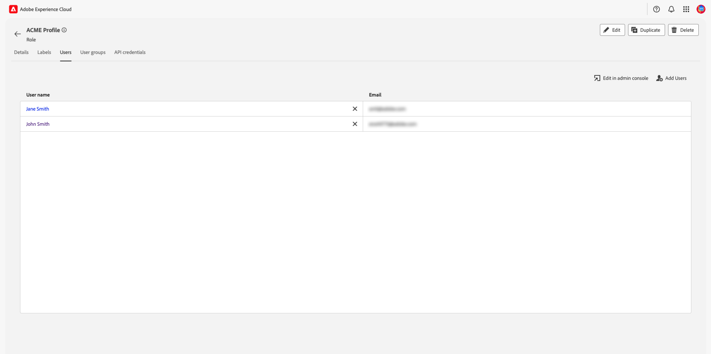

# 管理角色權限 {#manage-role-permissions}

>[!CONTEXTUALHELP]
>id="platform_permissions_roles_about"
>title="什麼是角色？"
>abstract="角色會定義管理員、專家或一般使用者對組織資源的存取權。角色會將與平台執行個體互動的使用者分類，也是存取控制原則的建置區塊。一個角色具有特定一組權限，而您可以根據組織成員所需的檢視範圍或寫入存取權，對成員指派一個或多個角色。"
>additional-url="https://experienceleague.adobe.com/docs/experience-platform/access-control/abac/permissions-ui/roles.html" text="管理角色"

>[!IMPORTANT]
>
>存取控制使用使用者ID （指派給使用者的內部唯一ID）來授予許可權。 當組織從Adobe ID移轉至Business ID時，為其使用者設定的所有許可權都將遺失，因為使用者ID變更和存取控制將使用新產生的使用者ID。 如果您的組織移轉至Business ID，請聯絡您的Adobe代表，將您的使用者ID從Adobe ID移轉至Business ID。

許可權是Experience Cloud的區域，管理員可以在其中定義使用者角色和存取原則，以管理產品應用程式內功能和物件的存取許可權。

透過「許可權」，您可以建立和管理角色，並為這些角色指派所需的資源許可權。 權限也可讓您管理與特定角色相關聯的標籤、沙箱和使用者。

在[建立新角色](#create-a-new-role)之後，您立即返回&#x200B;**[!UICONTROL 角色]**&#x200B;標籤。 如果您正在編輯現有角色的許可權，請從「**[!UICONTROL 角色]**」標籤中選取該角色。 或者，使用篩選選項來篩選結果以尋找角色。

## 篩選角色

選取漏斗圖示（）以顯示篩選控制項清單，以協助縮小結果範圍。

UI中的角色可使用下列篩選器：

| 篩選器 | 說明 |
| --- | --- |
| [!UICONTROL 建立時間介於]之間 | 選取開始日期和/或結束日期，以定義篩選結果的日期範圍。 |
| [!UICONTROL 建立者：] | 從下拉式清單中選取使用者，依角色建立者篩選。 |
| [!UICONTROL 修改時間介於]之間 | 選取開始日期和/或結束日期，以定義篩選結果的日期範圍。 |
| [!UICONTROL 修改者] | 從下拉式清單中選取使用者，依角色修飾元篩選。 |

若要移除濾鏡，請針對有問題的濾鏡選取藥丸圖示上的「X」，或選取&#x200B;**[!UICONTROL 全部清除]**&#x200B;以移除所有濾鏡。

![許可權UI中的[角色]儀表板，在選取的篩選器上反白顯示X和[清除所有選取專案]。](../../images/flac-ui/flac-clear-filters.png)

## 角色詳細資訊 {#role-details}

>[!CONTEXTUALHELP]
>id="platform_permissions_roles_details"
>title="角色概觀"
>abstract="角色概觀對話框顯示角色詳細資訊，包括特定角色可存取的資源和沙箱。您可以導覽至角色工作區內相對應的標籤來管理標籤、使用者、使用者群組和 API 認證。"
>additional-url="https://experienceleague.adobe.com/zh-hant/docs/experience-platform/access-control/abac/permissions-ui/permissions#manage-labels-for-a-role" text="管理角色的標籤"
>additional-url="https://experienceleague.adobe.com/zh-hant/docs/experience-platform/access-control/abac/permissions-ui/permissions#manage-users-for-a-role" text="管理角色的使用者"

從&#x200B;**[!UICONTROL 角色]**&#x200B;標籤中選取角色，這會開啟角色的[!UICONTROL 詳細資料]儀表板。

[!UICONTROL 詳細資料]儀表板提供角色的概觀。 概觀會顯示角色名稱、說明、建立者、上次修改者，以及建立和修改日期。 它也會顯示附加至角色的許可權，以及指派的沙箱清單。 如有需要，可修改角色名稱和說明。

## 管理角色的標籤

選取&#x200B;**[!UICONTROL 標籤]**&#x200B;標籤以開啟角色標籤工作區，然後選取&#x200B;**[!UICONTROL 新增標籤]**&#x200B;以指派標籤給角色。

顯示&#x200B;**[!UICONTROL 套用存取權和資料控管標籤]**&#x200B;對話方塊，顯示標籤清單。 清單會顯示標簽名稱、易記名稱、類別及其說明。

從清單中選取您要新增至角色的標籤，然後選取&#x200B;**[!UICONTROL 儲存]**

![已選取標籤的[套用存取權和資料控管標籤]對話方塊。](../../images/flac-ui/flac-add-labels.png)

新增的標籤會顯示在&#x200B;**[!UICONTROL 標籤]**&#x200B;標籤下。

若要從角色移除標籤，請選取標籤，然後選取&#x200B;**[!UICONTROL 移除標籤]**。

## 管理角色的沙箱

選取「**[!UICONTROL 詳細資料]**」標籤，並導覽至「**[!UICONTROL 沙箱]**」區段。 選取「檢視全部&#x200B;**[!UICONTROL 」]**&#x200B;以檢視新增至角色的沙箱完整清單。

若要新增更多沙箱至角色，請從UI的右上角選取&#x200B;**[!UICONTROL 編輯]**。

![角色的[詳細資訊]工作區中反白顯示[編輯]選項。](../../images/flac-ui/flac-add-sandboxes.png)

下一個畫面會提示您使用下拉式清單，選擇要包含在角色中的沙箱資源。 完成時，請選取&#x200B;**[!UICONTROL 儲存]**，然後選取&#x200B;**[!UICONTROL 關閉]**。

## 管理角色的使用者

選取&#x200B;**[!UICONTROL 使用者]**&#x200B;索引標籤以開啟角色[!UICONTROL 使用者]工作區，然後選取&#x200B;**[!UICONTROL 新增使用者]**&#x200B;以將使用者指派給角色。

**[!UICONTROL 新增使用者]**&#x200B;對話方塊出現。 從清單中選取您想要新增至角色的使用者。 或者，使用搜尋列輸入使用者的名稱或電子郵件地址來搜尋使用者，然後選取&#x200B;**[!UICONTROL 儲存]**

![[新增使用者]對話方塊中選取了使用者，且搜尋列和儲存選項反白顯示。](../../images/flac-ui/flac-add-users.png)

新增的使用者會出現在&#x200B;**[!UICONTROL 使用者]**&#x200B;標籤下。

若要從角色中移除使用者，請選取使用者名稱旁的&#x200B;**X**&#x200B;圖示。

以下影片旨在協助您瞭解如何建立新角色及管理該角色的使用者。

>[!VIDEO](https://video.tv.adobe.com/v/336081/?learn=on)

## 管理角色的API認證 {#manage-api-credentials-for-role}

>[!IMPORTANT]
>
> 若要在[!UICONTROL 許可權]中使用和管理API認證，使用者必須擁有系統管理員許可權。

若要以使用者或開發人員的身分使用Experience Platform API，系統管理員除了角色的特定許可權集以外，還需要新增API認證。 如需建立和指派API認證以及所需許可權的完整指南，請參閱[驗證及存取Experience Platform API](../../../landing/api-authentication.md#generate-credentials)中的逐步教學課程。

選取&#x200B;**[!UICONTROL API認證]**&#x200B;標籤以開啟角色API認證工作區，然後選取&#x200B;**[!UICONTROL 新增API認證]**&#x200B;以指派API認證給角色。

![角色的API認證工作區中，[新增認證]選項已反白顯示。](../../images/flac-ui/flac-api-credentials.png)

**[!UICONTROL 新增API認證]**&#x200B;對話方塊就會顯示。 從清單中選取API認證以新增至角色，然後選取[儲存] ****

![已選取[新增API認證]對話方塊，並反白顯示[儲存]選項。](../../images/flac-ui/flac-add-api-credentials.png)

新增的API認證會出現在&#x200B;**[!UICONTROL API認證]**&#x200B;標籤下。

若要從角色中移除API認證，請選取API認證名稱旁的&#x200B;**X**&#x200B;圖示。

**[!UICONTROL 移除API認證]**&#x200B;對話方塊會出現，提示您確認刪除。 選取&#x200B;**[!UICONTROL 確認]**&#x200B;以完成移除選取的認證。

![[移除認證]彈出視窗提示您確認移除認證。](../../images/flac-ui/flac-confirm-api-credentials-delete.png)

您將會返回&#x200B;**[!UICONTROL API認證]**&#x200B;標籤。

## 管理角色的使用者群組

使用者群組是多個使用者，這些使用者已分組在一起，並且擁有執行相同功能的存取權。

選取&#x200B;**[!UICONTROL 使用者群組]**&#x200B;索引標籤以開啟角色的使用者群組工作區，然後選取&#x200B;**[!UICONTROL 新增群組]**&#x200B;以將使用者群組指派給角色。

![角色的使用者群組工作區包含[新增群組]選項](../../images/flac-ui/flac-user-groups.png)

**[!UICONTROL 新增群組]**&#x200B;對話方塊就會顯示。 從清單中選取您想要新增至角色的使用者群組。 或者，使用搜尋列來搜尋使用者群組，方法是輸入群組名稱，然後選取&#x200B;**[!UICONTROL 儲存]**

![已選取[新增群組]對話方塊，且已反白顯示[搜尋並儲存]選項。](../../images/flac-ui/flac-add-user-groups.png)

新增的使用者群組會出現在&#x200B;**[!UICONTROL 使用者群組]**&#x200B;標籤下。

若要從角色中移除使用者群組，請選取使用者群組名稱旁的&#x200B;**X**&#x200B;圖示。

**[!UICONTROL 移除使用者群組]**&#x200B;對話方塊隨即顯示，提示您確認刪除。 選取&#x200B;**[!UICONTROL 確認]**&#x200B;以移除選取的使用者群組。

您將會返回&#x200B;**[!UICONTROL 使用者群組]**&#x200B;標籤。

## 將使用者新增至Experience Platform

作為系統管理員，您可以授予開發人員存取權給使用者，讓他們可以在Adobe Developer Console中[建立整合](../../../landing/api-authentication.md#generate-credentials)。

若要新增使用者Experience Platform，請登入[Admin Console](https://adminconsole.adobe.com)並選取&#x200B;**[!UICONTROL 新增使用者]**。

![反白顯示[新增使用者]選項的Adobe Admin Console儀表板。](../../images/flac-ui/product-profile-add-users.png)

「**[!UICONTROL 將使用者新增到您的團隊]**」對話框會隨即顯示。輸入使用者的電子郵件地址、名字（選用）和姓氏（選用）。 然後選取&#x200B;**[!UICONTROL 產品]**。

![[新增使用者至團隊]對話方塊中反白顯示使用者欄位和產品選項。](../../images/flac-ui/product-profile-add-users-to-your-team.png)

**[!UICONTROL 選取產品]**&#x200B;對話方塊就會顯示。 選取&#x200B;**[!UICONTROL Adobe Experience Platform]**。

**[!UICONTROL 選取產品設定檔]**&#x200B;對話方塊就會顯示。 選取&#x200B;**[!UICONTROL AEP-Default-All-Users]**，然後選取&#x200B;**[!UICONTROL 儲存]**。

檢閱資訊，然後選取&#x200B;**[!UICONTROL 儲存]**&#x200B;以新增使用者。

![新增使用者至您的團隊對話方塊，其中包含使用者資訊和選取的選取專案，以及反白顯示的[儲存]選項。，](../../images/flac-ui/product-profile-save-user.png)

## 後續步驟

建立許可權後，您可以繼續下一步以[管理使用者](users.md)。
