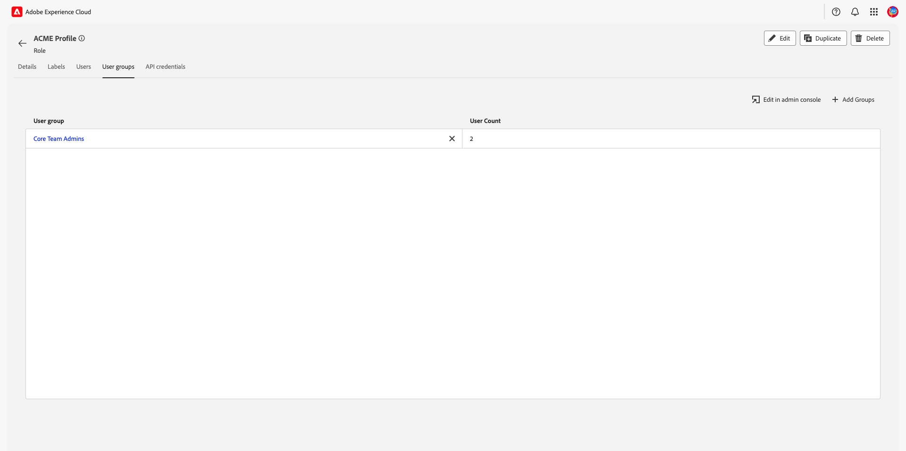

# 管理角色的許可權

>[!IMPORTANT]
>
>存取控制使用使用者ID （指派給使用者的內部唯一ID）來授予許可權。 當組織從Adobe ID移轉至Business ID時，為其使用者設定的所有許可權都將遺失，因為使用者ID變更和存取控制將使用新產生的使用者ID。 如果您的組織移轉至Business ID，請聯絡您的Adobe代表，將您的使用者ID從Adobe ID移轉至Business ID。

許可權是Experience Cloud的區域，管理員可以在其中定義使用者角色和存取原則，以管理產品應用程式內功能和物件的存取許可權。

透過「許可權」，您可以建立和管理角色，並為這些角色指派所需的資源許可權。 權限也可讓您管理與特定角色相關聯的標籤、沙箱和使用者。

緊接在 [建立新角色](#create-a-new-role)，您會回到 **[!UICONTROL 角色]** 標籤。 如果您正在編輯現有角色的許可權，請從以下位置選取角色： **[!UICONTROL 角色]** 標籤。 或者，使用篩選選項來篩選結果以尋找角色。

## 篩選角色

選取漏斗圖示()來顯示篩選控制項清單，協助縮小結果範圍。

UI中的角色可使用下列篩選器：

| 篩選器 | 說明 |
| --- | --- |
| [!UICONTROL 建立時間介於] | 選取開始日期和/或結束日期，以定義篩選結果的日期範圍。 |
| [!UICONTROL 建立者] | 從下拉式清單中選取使用者，依角色建立者篩選。 |
| [!UICONTROL 修改時間介於] | 選取開始日期和/或結束日期，以定義篩選結果的日期範圍。 |
| [!UICONTROL 修改者] | 從下拉式清單中選取使用者，依角色修飾元篩選。 |

若要移除篩選條件，請針對有問題的篩選條件，選取藥丸圖示上的「X」，或選取 **[!UICONTROL 全部清除]** 以移除所有篩選器。

## 角色詳細資料

從中選擇角色 **[!UICONTROL 角色]** 標籤，這會開啟角色的詳細資訊頁面。

詳細資訊標籤提供角色的概觀。 此概觀會顯示角色名稱、角色說明、建立和修改角色的使用者名稱、建立和修改角色的時間，以及附加至角色的許可權。 如果需要，可以修改角色名稱和角色說明。

## 管理角色的標籤

選取 **[!UICONTROL 標籤]** 標籤以開啟角色標籤頁面，然後選取 **[!UICONTROL 新增標籤]** 以指派標籤給角色。

標籤會列在此頁面上。 清單會顯示標簽名稱、易記名稱、類別及其說明。

從清單中選取您要新增至角色的標籤，然後選取 **[!UICONTROL 儲存]**

新增的標籤會顯示在下方 **[!UICONTROL 標籤]** 標籤。

若要從角色中移除標籤，請選取 **X** 圖示加以識別。

## 管理角色的沙箱

選取 **[!UICONTROL 沙箱]** 標籤以開啟「角色：沙箱」頁面。 在這裡，您可以看到新增至角色的沙箱清單。

若要新增更多沙箱至角色，請選取 **[!UICONTROL 編輯]**.

下一個畫面會提示您使用下拉式清單，選擇沙箱中要包含在角色中的資源許可權。 完成後，選取 **[!UICONTROL 儲存並退出]**.

## 管理角色的使用者

選取 **[!UICONTROL 使用者]** 標籤以開啟「角色使用者」頁面，然後選取 **[!UICONTROL 新增使用者]** 將使用者指派給角色。

從清單中選取您想要新增至角色的使用者。 或者，使用搜尋列輸入使用者的名稱或電子郵件地址來搜尋使用者，然後選取 **[!UICONTROL 儲存]**

新增的使用者顯示在 **[!UICONTROL 使用者]** 標籤。

若要從角色中移除使用者，請選取 **X** 圖示加以存取（位於使用者名稱旁）。

以下影片旨在協助您瞭解如何建立新角色及管理該角色的使用者。

>[!VIDEO](https://video.tv.adobe.com/v/336081/?learn=on)

## 管理角色的API認證 {#manage-api-credentials-for-role}

選取 **[!UICONTROL API認證]** 標籤以開啟「角色API認證」頁面，然後選取 **[!UICONTROL 新增API認證]** 以指派API認證給角色。

從清單中選取您想要新增至角色的API認證，然後選取 **[!UICONTROL 儲存]**

新增的API憑證會顯示在下方 **[!UICONTROL API認證]** 標籤。

若要從角色中移除API認證，請選取 **X** 圖示加以存取（位於API認證名稱旁）。

此 **[!UICONTROL 移除API認證]** 對話方塊隨即顯示，提示您確認刪除。

您將會返回 **[!UICONTROL API認證]** 標籤。

## 管理角色的使用者群組

使用者群組是多個使用者，這些使用者已分組在一起，並且有權執行相同的功能。

選取 **[!UICONTROL 使用者群組]** 標籤以開啟「角色」使用者群組頁面，然後選取 **[!UICONTROL 新增群組]** 以指派使用者群組給角色。

從清單中選取您想要新增至角色的使用者群組。 或者，使用搜尋列來搜尋使用者群組，方法是輸入群組名稱，然後選取 **[!UICONTROL 儲存]**

新增的使用者群組會出現在 **[!UICONTROL 使用者群組]** 標籤。

若要從角色中移除使用者群組，請選取 **X** 圖示加以存取（位於使用者群組名稱旁）。

此 **[!UICONTROL 移除使用者群組]** 對話方塊隨即顯示，提示您確認刪除。

您將會返回 **[!UICONTROL 使用者群組]** 標籤。

## 透過產品設定檔將使用者新增到 Experience Platform

若要將使用者新增至產品設定檔，請登入Admin Console並選取 **[!UICONTROL 新增使用者]**

此 **[!UICONTROL 將使用者新增至團隊]** 對話方塊隨即顯示。 輸入使用者的電子郵件地址、名字（選用）和姓氏（選用）。

選取鉛筆圖示以選取產品和使用者群組，然後選取 **[!UICONTROL Adobe Experience Platform]**，然後選取 **[!UICONTROL AEP-Default-All-Users]**，然後選取  **[!UICONTROL 儲存]**.

## 後續步驟

建立許可權後，您可以繼續下一步以 [管理使用者](users.md).
