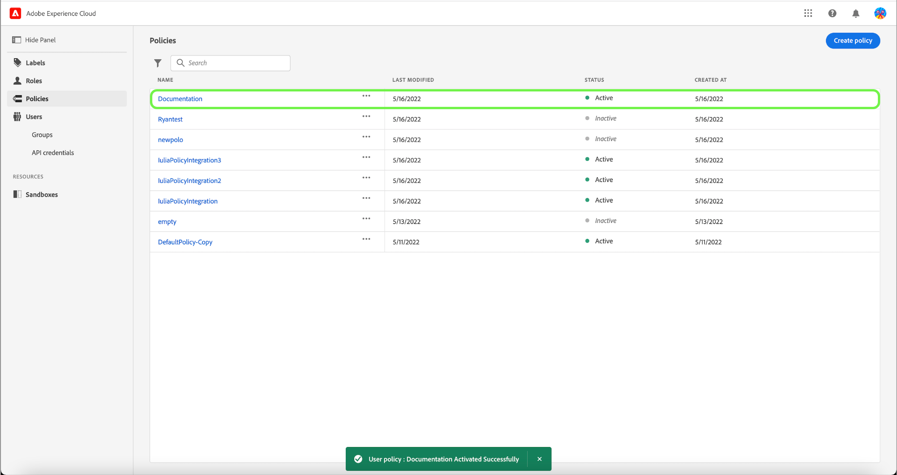
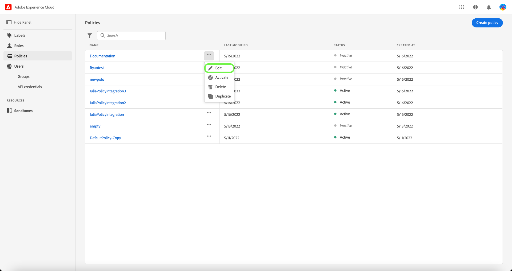
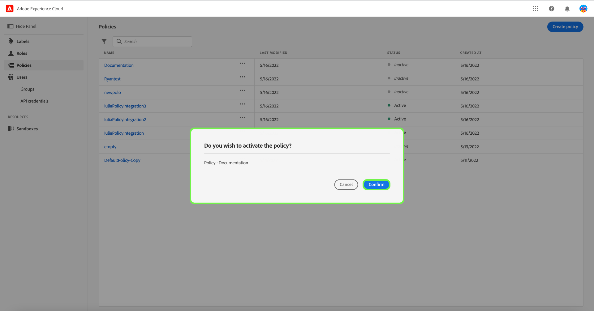

# 管理原則

政策是將屬性集合在一起，以制定允許和不允許的行動的聲明。 策略可以是本地策略或全局策略，也可以覆蓋其他策略。

## 建立新策略

要建立新策略，請選擇 **[!UICONTROL 原則]** 標籤，然後選取 **[!UICONTROL 建立原則]**.

此 **[!UICONTROL 建立新策略]** 對話框出現，提示您輸入名稱和可選說明。 完成後，請選取 **[!UICONTROL 確認]**.

使用下拉式箭頭，選取是否要 **允許存取** ()資源或 **拒絕訪問** ()資源。

接下來，使用下拉菜單和搜索訪問類型（讀或寫）選擇要包含在策略中的資源。

接下來，使用下拉箭頭選擇要應用於此策略的條件， **以下為true** ()或 **以下為false** ()。

選取加號圖示 **新增符合運算式** 或 **新增運算式群組** （針對資源）。

使用下拉式清單，選取 **資源**.

接下來，使用下拉式清單選取 **符合**.

接下來，使用下拉式清單，選取標籤類型(**[!UICONTROL 核心標籤]** 或 **[!UICONTROL 自訂標籤]**)以符合指派給角色中使用者的標籤。

最後，選取 **沙箱** 使用下拉式功能表套用政策條件。

選擇 **新增資源** 以新增更多資源。 完成後，請選取 **[!UICONTROL 儲存並退出]**.

已成功建立新策略，並且會將您重定向到 **[!UICONTROL 原則]** 頁簽中，您將看到新建立的策略出現在清單中。

## 編輯策略

要編輯現有策略，請從 **[!UICONTROL 原則]** 標籤。 或者，使用篩選選項來篩選結果以查找要編輯的策略。

接下來，選取省略號(`…`)旁邊，下拉式清單會顯示編輯、停用、刪除或複製角色的控制項。 從下拉式清單中選取「編輯」 。

此時將顯示策略權限螢幕。 進行更新，然後選取 **[!UICONTROL 儲存並退出]**.

策略已成功更新，系統會將您重定向到 **[!UICONTROL 原則]** 標籤。

## 複製策略

要複製現有策略，請從 **[!UICONTROL 原則]** 標籤。 或者，使用篩選選項來篩選結果以查找要編輯的策略。

接下來，選取省略號(`…`)旁邊，下拉式清單會顯示編輯、停用、刪除或複製角色的控制項。 從下拉式清單中選取「複製」。

此 **[!UICONTROL 重複策略]** 對話框，提示您確認複製。

新策略將作為原始策略的副本顯示在清單中， **[!UICONTROL 原則]** 標籤。

## 刪除策略

要刪除現有策略，請從 **[!UICONTROL 原則]** 標籤。 或者，使用篩選選項篩選結果，以查找要刪除的策略。

接下來，選取省略號(`…`)旁邊，下拉式清單會顯示編輯、停用、刪除或複製角色的控制項。 從下拉式清單中選取「刪除」 。

此 **[!UICONTROL 刪除用戶策略]** 對話框，提示您確認刪除。

您會回到 **[!UICONTROL 原則]** 標籤中，刪除確認彈出窗口隨即顯示。

## 啟用原則

要激活現有策略，請從 **[!UICONTROL 原則]** 標籤。 或者，使用篩選選項篩選結果，以查找要刪除的策略。

接下來，選取省略號(`…`)旁邊，下拉式清單會顯示編輯、啟用、刪除或複製角色的控制項。 從下拉式清單中選取「啟動」 。

此 **[!UICONTROL 激活用戶策略]** 對話框，提示您確認激活。

您會回到 **[!UICONTROL 原則]** 標籤上，並顯示確認啟動快顯視窗。 策略狀態顯示為活動狀態。

## 後續步驟

建立新策略後，您可以繼續執行 [管理角色的權限](permissions.md).
