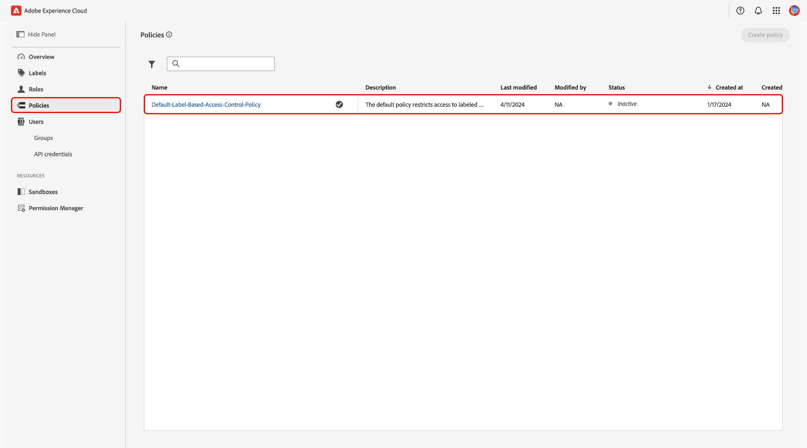

# 管理存取控制原則

存取控制原則是將屬性集合在一起，以建立允許和不允許動作的陳述式。 Adobe提供預設原則，可立即啟動，或您的組織準備好開始根據[標籤](./labels.md){target="_blank"}控制特定物件的存取時啟動。 預設原則&#x200B;**[!UICONTROL Default-Label-Based-Access-Control-Policy]**&#x200B;會利用套用至資源的標籤來拒絕存取，除非使用者在角色中具有相符的標籤。

>[!IMPORTANT]
>
>存取控制原則不應與資料使用原則混淆，後者控制資料在Adobe Experience Platform中的使用方式。 如需詳細資訊，請參閱建立[資料使用原則](../../../data-governance/policies/create.md){target="_blank"}指南。

## 設定沙箱的原則 {#configure-policy}

>[!NOTE]
>
>**[!UICONTROL Default-Label-Based-Access-Control-Policy]**&#x200B;原則是目前唯一可供設定的原則。

若要開始設定原則，請在&#x200B;**[!UICONTROL Permissions]** Adobe Experience Cloud[中導覽至](https://experience.adobe.com/){target="_blank"}。 從左側面板中選取&#x200B;**[!UICONTROL Policies]**。 從清單中選取&#x200B;**[!UICONTROL Default-Label-Based-Access-Control-Policy]**。

{zoomable="yes"}

將會顯示原則的詳細資料工作區。 選取 **[!UICONTROL Sandboxes]**。將顯示與原則關聯的沙箱清單。

{zoomable="yes"}

### 將原則新增至所有沙箱 {#add-policy-to-all}

>[!IMPORTANT]
>
>預設會開啟&#x200B;**[!UICONTROL Auto-include]**，這表示所有目前和未來的沙箱都會自動新增到原則中。

關閉&#x200B;**[!UICONTROL Auto-include]**&#x200B;功能，以停止未來的沙箱自動新增到原則中。 關閉功能&#x200B;**將不會**&#x200B;從原則中移除任何沙箱。

![原則的[沙箱]索引標籤中，[自動包含]切換反白顯示，且處於[關閉]狀態。](../../images/ui/policies/policy-auto-include.png){zoomable="yes"}

如果&#x200B;**[!UICONTROL Auto-include]**&#x200B;在原則中不是作用中，您可以使用切換將其開啟。 **[!UICONTROL Enable Auto-include]**&#x200B;對話方塊會出現，提示您確認您的選擇。 選取&#x200B;**[!UICONTROL Enable]**&#x200B;以完成組態設定。

>[!NOTE]
>
>您從&#x200B;**[!UICONTROL Auto-include]**&#x200B;切換時從原則移除的任何沙箱都將重新新增。

![反白顯示[啟用選項]的[啟用自動包含]對話方塊。](../../images/ui/policies/policy-enable-auto-include.png){zoomable="yes"}

### 手動選取原則的沙箱 {#manually-select-sandboxes}

若要手動新增或移除原則中的沙箱，**[!UICONTROL Auto-include]**&#x200B;切換&#x200B;**必須**&#x200B;關閉。

#### 新增沙箱

若要將沙箱新增至原則，請選取&#x200B;**[!UICONTROL Add Sandboxes]**。

![原則的工作區中，[新增沙箱]選項已反白顯示。](../../images/ui/policies/policy-add-sandboxes.png){zoomable="yes"}

**[!UICONTROL Add Sandboxes]**&#x200B;對話方塊隨即顯示。 選取您要新增至原則的沙箱，然後選取&#x200B;**[!UICONTROL Save]**。

{zoomable="yes"}

>[!NOTE]
>
>如果所有可用的沙箱皆已新增至原則，您會在對話方塊中看到「資料庫中沒有任何專案」訊息。

#### 移除沙箱

若要從原則中移除沙箱，請從清單中找到您要移除的沙箱，然後選取&#x200B;**X**&#x200B;圖示。

{zoomable="yes"}

確認對話方塊隨即顯示。 選取&#x200B;**[!UICONTROL Confirm]**&#x200B;以完成從原則中移除沙箱。

![沙箱的確認對話方塊中反白顯示[確認]選項。](../../images/ui/policies/policy-remove-sandbox-confirmation.png){zoomable="yes"}

## 啟動原則 {#activate-policy}

>[!CONTEXTUALHELP]
>id="platform_permissions_policies_about"
>title="什麼是原則？"
>abstract="策略是將屬性組合在一起的陳述式，用於建立允許和不允許的動作。每個組織都有一個預設原則，您必須啟動該原則才能開始根據標籤控制特定物件的存取權。除非使用者被指派的角色擁有相符的標籤，否則資源所套用的標籤將拒絕使用者存取。您不能編輯或刪除原則，但可以啟動或停用預設原則。"
>additional-url="https://experienceleague.adobe.com/zh-hant/docs/experience-platform/access-control/abac/permissions-ui/labels" text="管理標籤"

若要啟用現有原則，請從&#x200B;**[!UICONTROL Policies]**&#x200B;的&#x200B;**[!UICONTROL Permissions]**&#x200B;索引標籤中選取原則。 原則啟用狀態會顯示在&#x200B;**[!UICONTROL Status]**&#x200B;區段下。

{zoomable="yes"}

將會顯示原則的詳細資料工作區。 選擇「**[!UICONTROL Activate]**」。

![原則詳細工作區的[啟用]選項已反白顯示。](../../images/ui/policies/policy-activate.png){zoomable="yes"}

**[!UICONTROL Activate Policy]**&#x200B;對話方塊隨即顯示。 選取&#x200B;**[!UICONTROL Confirm]**&#x200B;以完成啟用原則。

![反白顯示[確認]選項的[啟動原則]對話方塊。](../../images/ui/policies/policy-activate-confirm.png){zoomable="yes"}

## 後續步驟

啟用原則後，您可以繼續下一步以[管理角色](permissions.md)的許可權。

<!--
Policies are applied at the sandbox level to control which sandboxes enforce label-based access control. By default, the **[!UICONTROL Auto-include]** feature is turned on, which means all current and future sandboxes are automatically added to the policy. When **[!UICONTROL Auto-include]** is turned off, only the sandboxes you manually add will be subject to the policy's access control rules.

To begin configuring a policy's sandboxes, navigate to **[!UICONTROL Permissions]** in [Adobe Experience Cloud](https://experience.adobe.com/){target="_blank"}. Select **[!UICONTROL Policies]** from the left panel, then select the **[!UICONTROL Default-Label-Based-Access-Control-Policy]** from the list.

The policy's details workspace appears. Select the **[!UICONTROL Sandboxes]** tab to view the list of sandboxes associated with the policy and access the sandbox configuration options.

### Manage Auto-include {#manage-auto-include}

To control which sandboxes are included in a policy, you can toggle the **[!UICONTROL Auto-include]** feature on or off. When you toggle off **[!UICONTROL Auto-include]**, future sandboxes will not be automatically added to the policy. However, toggling off the feature **will not** remove any sandboxes that are already included in the policy.

To re-enable **[!UICONTROL Auto-include]**, use the toggle to turn it back on. The **[!UICONTROL Enable Auto-include]** dialog appears prompting you to confirm your selection. Select **[!UICONTROL Enable]** to complete the configuration setting.

>[!NOTE]
>
>When you re-enable **[!UICONTROL Auto-include]**, any sandboxes you previously removed from the policy will be re-added.

### Manually manage sandboxes {#manually-manage-sandboxes}

When **[!UICONTROL Auto-include]**is turned off, you can manually add or remove specific sandboxes from the policy. This gives you precise control over which sandboxes enforce the policy's access control rules.

>[!NOTE]
>
>To manually add or remove sandboxes, the **[!UICONTROL Auto-include]** toggle **must** be off.

**To add sandboxes:**

Select **[!UICONTROL Add Sandboxes]** from the policy's sandbox workspace.

The **[!UICONTROL Add Sandboxes]** dialog appears, displaying your library of available sandboxes. Select the sandbox(es) you wish to add to the policy and then select **[!UICONTROL Save]**.

>[!NOTE]
>
>If all available sandboxes are already included in the policy, you will see a "You have nothing in your library" message within the dialog.

**To remove sandboxes:**

Find the sandbox you wish to remove from the list and select the **X** icon next to its name.

A confirmation dialog will appear. Select **[!UICONTROL Confirm]** to finish removing the sandbox from the policy.

-->