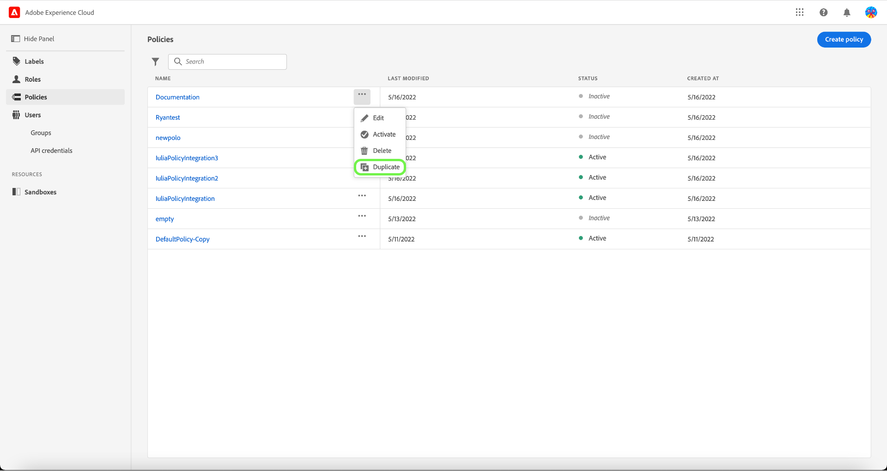

# 管理存取控制原則

存取控制原則是將屬性集合在一起，以建立允許和不允許動作的陳述式。 存取原則可以是本機或全域，並且可以覆寫其他原則。 Adobe提供預設原則，可立即啟動，或當您的組織準備好開始根據標籤控制特定物件的存取權時，隨時啟動。 預設原則會利用套用至資源的標籤來拒絕存取，除非使用者處於具有相符標籤的角色中。

>[!IMPORTANT]
>
>存取原則不應與資料使用原則混淆；資料使用原則會控制資料在Adobe Experience Platform中的使用方式，而非貴組織中的哪些使用者有權存取。 請參閱建立指南 [資料使用原則](../../../data-governance/policies/create.md) 以取得詳細資訊。

<!-- ## Create a new policy

To create a new policy, select the **[!UICONTROL Policies]** tab in the sidebar and select **[!UICONTROL Create Policy]**.

The **[!UICONTROL Create a new policy]** dialog appears, prompting you to enter a name, and an optional description. When finished, select **[!UICONTROL Confirm]**.

Using the dropdown arrow select if you would like to **Permit access to** () a resource or **Deny access to** () a resource.

Next, select the resource that you would like to include in the policy using the dropdown menu and search access type, read or write.

Next, using the dropdown arrow select the condition you would like to apply to this policy, **The following being true** () or **The following being false** ().

Select the plus icon to **Add matches expression** or **Add expression group** for the resource. 

Using the dropdown, select the **Resource**.

Next, using the dropdown select the **Matches**.

Next, using the dropdown, select the type of label (**[!UICONTROL Core label]** or **[!UICONTROL Custom label]**) to match the label assigned to the User in roles.

Finally, select the **Sandbox** that you would like the policy conditions to apply to, using the dropdown menu.

Select **Add resource** to add more resources. Once finished, select **[!UICONTROL Save and exit]**.

The new policy is successfully created, and you are redirected to the **[!UICONTROL Policies]** tab, where you will see the newly created policy appear in the list. 

## Edit a policy

To edit an existing policy, select the policy from the **[!UICONTROL Policies]** tab. Alternatively, use the filter option to filter the results to find the policy you want to edit.

Next, select the ellipsis (`…`) next to the policies name, and a dropdown displays controls to edit, deactivate, delete, or duplicate the role. Select edit from the dropdown.

The policy permissions screen appears. Make the updates then select **[!UICONTROL Save and exit]**.

The policy is successfully updated, and you are redirected to the **[!UICONTROL Policies]** tab.

## Duplicate a policy

To duplicate an existing policy, select the policy from the **[!UICONTROL Policies]** tab. Alternatively, use the filter option to filter the results to find the policy you want to edit.

Next, select the ellipsis (`…`) next to a policies name, and a dropdown displays controls to edit, deactivate, delete, or duplicate the role. Select duplicate from the dropdown.

The **[!UICONTROL Duplicate policy]** dialog appears, prompting you to confirm the duplication. 

The new policy appears in the list as a copy of the original on the **[!UICONTROL Policies]** tab.

## Delete a policy

To delete an existing policy, select the policy from the **[!UICONTROL Policies]** tab. Alternatively, use the filter option to filter the results to find the policy you want to delete.

Next, select the ellipsis (`…`) next to a policies name, and a dropdown displays controls to edit, deactivate, delete, or duplicate the role. Select delete from the dropdown.

The **[!UICONTROL Delete user policy]** dialog appears, prompting you to confirm the deletion. 

You are returned to the **[!UICONTROL policies]** tab and a confirmation of deletion pop over appears.

 -->

## 設定沙箱的原則

>[!IMPORTANT]
>
>根據預設， [!UICONTROL 自動包含] 此功能已對所有客戶開啟，這表示所有沙箱都會新增到原則中。

>[!NOTE]
>
>此 **[!UICONTROL Default-Label-Based-Access-Control-Policy]** 原則是目前唯一可供設定的原則。

若要檢視與原則關聯的沙箱，請從以下位置選取原則： **[!UICONTROL 原則]** 標籤。

接下來，選取原則，然後選取 **[!UICONTROL 沙箱]** 標籤。 將顯示與原則關聯的沙箱清單。

### 將原則新增至所有沙箱

使用 **[!UICONTROL 自動包含]** 切換至 **[!UICONTROL 沙箱]** 標籤以啟用所有沙箱的原則。

![此 [!UICONTROL 沙箱] 標籤顯示 [!UICONTROL 自動包含] 切換。](../../images/flac-ui/abac-policies-auto-include.png)

此 **[!UICONTROL 啟用自動包含]** 對話方塊會出現，提示您確認您的選取。 選取 **[!UICONTROL 啟用]** 以完成組態設定。

![此 [!UICONTROL 啟用自動包含] 對話方塊醒目提示 [!UICONTROL 啟用].](../../images/flac-ui/abac-policies-auto-include-enable.png)

>[!SUCCESS]
>
>此原則已針對所有現有沙箱啟用，並將在任何新沙箱可用時自動新增至沙箱。

### 新增原則以選取沙箱

>[!IMPORTANT]
>
>如果符合以下條件，則未來沙箱將不會預設包含在原則中 [!UICONTROL 自動包含] 切換功能已關閉。 您將需要手動管理沙箱並新增至原則。

使用 **[!UICONTROL 自動包含]** 切換至 **[!UICONTROL 沙箱]** 標籤停用所有沙箱的原則。

![此 [!UICONTROL 沙箱] 標籤顯示 [!UICONTROL 自動包含] 切換。](../../images/flac-ui/abac-policies-auto-include.png)

從 **[!UICONTROL 沙箱]** 索引標籤，選取 **[!UICONTROL 新增沙箱]** 以選取此原則將套用的沙箱。

![此 [!UICONTROL 沙箱] 此索引標籤顯示新增至原則的沙箱清單。](../../images/flac-ui/abac-policies-sandboxes-tab-add.png)

沙箱清單隨即顯示。 從清單中選取您要新增的沙箱。 或者，使用搜尋列來搜尋沙箱。 選取「**[!UICONTROL 儲存]**」。

![此 [!UICONTROL 新增沙箱] 此頁面顯示可新增至原則的現有沙箱清單。](../../images/flac-ui/abac-policies-sandboxes-list.png)

>[!SUCCESS]
>
>選取的沙箱已成功新增到原則中。

### 從原則中移除沙箱

若要移除沙箱，請選取 **X** 圖示加以存取（位於沙箱名稱旁）。

![此 [!UICONTROL 沙箱] 標籤顯示沙箱清單，醒目提示 [!UICONTROL X] 以刪除。](../../images/flac-ui/abac-policies-remove-sandbox-x.png)

此 **[!UICONTROL 移除]** 對話方塊會出現，提示您確認您的選取。 選取 **[!UICONTROL 確認]** 以完成移除。

![此 [!UICONTROL 移除] 對話方塊醒目提示 [!UICONTROL 確認].](../../images/flac-ui/abac-policies-remove-sandbox.png)

>[!SUCCESS]
>
>已成功從原則中移除選取的沙箱。

## 啟用原則

若要啟用現有的原則，請從以下位置選取原則： **[!UICONTROL 原則]** 標籤。

接著，選取省略符號(`…`)旁，下拉式清單會顯示可編輯、啟用、刪除或複製角色的控制項。 從下拉式清單中選取「啟動」 。

此 **[!UICONTROL 啟用原則]** 對話方塊隨即顯示，提示您確認啟動。

您將返回 **[!UICONTROL 原則]** 標籤和啟用確認彈出視窗。 原則狀態會顯示為作用中。

## 後續步驟

在啟用原則後，您可以繼續下一步以 [管理角色的許可權](permissions.md).
