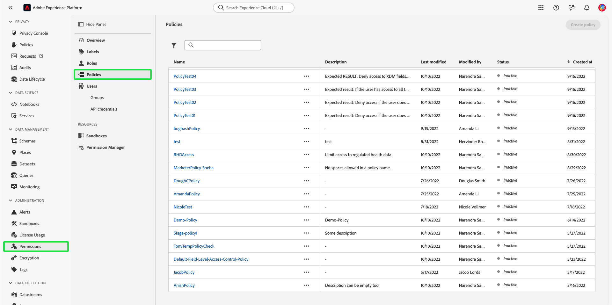

# 管理訪問控制策略

訪問控制策略是將屬性集合在一起以建立允許和不允許的操作的語句。 訪問策略可以是本地策略或全局策略，並且可以覆蓋其他策略。 Adobe提供預設策略，該策略可以立即激活，也可以在您的組織準備開始基於標籤控制對特定對象的訪問時激活。 預設策略利用應用於資源的標籤來拒絕訪問，除非用戶具有具有匹配標籤的角色。

>[!IMPORTANT]
>
>訪問策略不要與資料使用策略混淆，該策略控制資料在Adobe Experience Platform的使用方式，而不是組織中哪些用戶有權訪問資料。 請參閱建立指南 [資料使用策略](../../../data-governance/policies/create.md) 的子菜單。

<!-- ## Create a new policy

To create a new policy, select the **[!UICONTROL Policies]** tab in the sidebar and select **[!UICONTROL Create Policy]**.

The **[!UICONTROL Create a new policy]** dialog appears, prompting you to enter a name, and an optional description. When finished, select **[!UICONTROL Confirm]**.

Using the dropdown arrow select if you would like to **Permit access to** () a resource or **Deny access to** () a resource.

Next, select the resource that you would like to include in the policy using the dropdown menu and search access type, read or write.

Next, using the dropdown arrow select the condition you would like to apply to this policy, **The following being true** () or **The following being false** ().

Select the plus icon to **Add matches expression** or **Add expression group** for the resource. 

Using the dropdown, select the **Resource**.

Next, using the dropdown select the **Matches**.

Next, using the dropdown, select the type of label (**[!UICONTROL Core label]** or **[!UICONTROL Custom label]**) to match the label assigned to the User in roles.

Finally, select the **Sandbox** that you would like the policy conditions to apply to, using the dropdown menu.

Select **Add resource** to add more resources. Once finished, select **[!UICONTROL Save and exit]**.

The new policy is successfully created, and you are redirected to the **[!UICONTROL Policies]** tab, where you will see the newly created policy appear in the list. 

## Edit a policy

To edit an existing policy, select the policy from the **[!UICONTROL Policies]** tab. Alternatively, use the filter option to filter the results to find the policy you want to edit.

Next, select the ellipsis (`…`) next to the policies name, and a dropdown displays controls to edit, deactivate, delete, or duplicate the role. Select edit from the dropdown.

The policy permissions screen appears. Make the updates then select **[!UICONTROL Save and exit]**.

The policy is successfully updated, and you are redirected to the **[!UICONTROL Policies]** tab.

## Duplicate a policy

To duplicate an existing policy, select the policy from the **[!UICONTROL Policies]** tab. Alternatively, use the filter option to filter the results to find the policy you want to edit.

Next, select the ellipsis (`…`) next to a policies name, and a dropdown displays controls to edit, deactivate, delete, or duplicate the role. Select duplicate from the dropdown.

The **[!UICONTROL Duplicate policy]** dialog appears, prompting you to confirm the duplication. 

The new policy appears in the list as a copy of the original on the **[!UICONTROL Policies]** tab.

## Delete a policy

To delete an existing policy, select the policy from the **[!UICONTROL Policies]** tab. Alternatively, use the filter option to filter the results to find the policy you want to delete.

Next, select the ellipsis (`…`) next to a policies name, and a dropdown displays controls to edit, deactivate, delete, or duplicate the role. Select delete from the dropdown.

The **[!UICONTROL Delete user policy]** dialog appears, prompting you to confirm the deletion. 

You are returned to the **[!UICONTROL policies]** tab and a confirmation of deletion pop over appears.

 -->

## 激活策略

要激活現有策略，請從 **[!UICONTROL 策略]** 頁籤。

接下來，選擇省略號(`…`)旁邊，下拉清單顯示用於編輯、激活、刪除或複製角色的控制項。 從下拉清單中選擇「激活」。

的 **[!UICONTROL 激活策略]** 對話框，提示您確認激活。

您返回 **[!UICONTROL 策略]** 的子菜單。 策略狀態顯示為活動狀態。

## 後續步驟

激活策略後，您可以繼續下一步， [管理角色的權限](permissions.md)。
