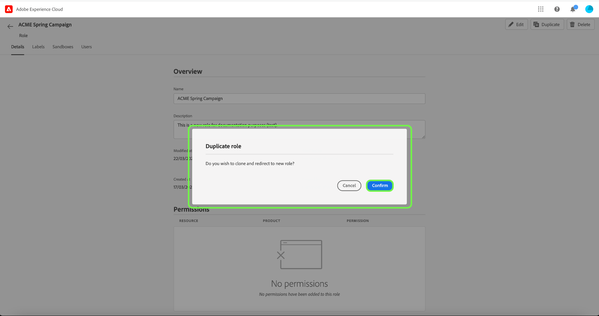

# 管理角色

角色會定義管理員、專家或一般使用者對組織資源的存取權。在基於角色的存取控制環境中，使用者存取布建是透過共同責任和需求進行分組。 一個角色具有特定一組權限，而您可以根據組織成員所需的檢視範圍或寫入存取權，對成員指派一個或多個角色。

## 建立新角色 {#create-new-role}

>[!CONTEXTUALHELP]
>id="platform_permissions_roles_about_create"
>title="建立新角色"
>abstract="建立新角色，改善與 Experience Platform 執行個體互動的使用者之分類方式。例如，您可以為內部行銷團隊建立角色並對該角色套用受監管的健康資料 (RHD) 標籤，讓您的內部行銷團隊可存取受保護的健康資訊 (PHI)。或者，您也可以為外部機構建立角色，而且該角色不會套用 RHD 標籤，藉此拒絕該角色存取 PHI 資料。"
>additional-url="https://experienceleague.adobe.com/docs/experience-platform/access-control/abac/permissions-ui/roles.html" text="管理角色"
>additional-url="https://experienceleague.adobe.com/zh-hant/docs/experience-platform/access-control/abac/end-to-end-guide#label-roles" text="將標籤套用至角色"

若要建立新角色，請選取側邊欄中的&#x200B;**[!UICONTROL 角色]**&#x200B;索引標籤，然後選取&#x200B;**[!UICONTROL 建立角色]**。

**[!UICONTROL 建立新角色]**&#x200B;對話方塊隨即顯示，提示您輸入名稱及選擇性說明。

完成後，選取&#x200B;**[!UICONTROL 確認]**。

接下來，使用下拉式選單選取您要包含在角色中的資源許可權。

若要新增其他資源，請從顯示資源清單的左側導覽面板中選取&#x200B;**[!UICONTROL Adobe Experience Platform]**。 或者，在左側導覽面板的搜尋列中輸入資源名稱。

按一下並拖曳相關資源，放置到主面板。

使用下拉式選單選取您要包含在角色中的資源許可權。 對要納入角色的所有資源重複此步驟。 完成時，選取&#x200B;**[!UICONTROL 儲存並結束]**。

已成功建立新角色，您被重新導向至&#x200B;**[!UICONTROL 角色]**&#x200B;頁面，您會在其中看到新建立的角色出現在清單中。

請參閱[管理角色](#manage-permissions-for-a-role)的許可權的相關章節，以取得建立角色許可權後如何管理角色的詳細資訊。

以下影片旨在協助您瞭解如何建立新角色及管理該角色的使用者。

>[!VIDEO](https://video.tv.adobe.com/v/336081/?learn=on)

## 複製角色

若要複製現有角色，請從&#x200B;**[!UICONTROL 角色]**&#x200B;標籤中選取角色。 或者，使用篩選選項來篩選結果，以尋找您要複製的角色。

接著，從熒幕右上角選取&#x200B;**[!UICONTROL 複製]**。

出現&#x200B;**[!UICONTROL 重複角色]**&#x200B;對話方塊，提示您確認複製。

接著，您會進入角色的詳細資訊頁面，您可在此變更角色的名稱和許可權。 詳細資訊、標籤和沙箱會與先前的角色重複。 需要透過使用者索引標籤新增使用者。 您可以檢視角色](permissions.md)檔案的[管理許可權，以進一步瞭解將詳細資料、標籤、沙箱和使用者新增至角色。

按一下向左箭號返回&#x200B;**[!UICONTROL 角色]**&#x200B;標籤。

新角色將出現在&#x200B;**[!UICONTROL 角色]**&#x200B;頁面的清單中。

## 刪除角色

選取角色名稱旁的省略符號(`…`)，下拉式清單會顯示要編輯、刪除或複製角色的控制項。 從下拉式清單中選取刪除。

**[!UICONTROL 刪除使用者角色]**&#x200B;對話方塊會出現，提示您確認刪除。

您將會返回&#x200B;**[!UICONTROL 角色]**&#x200B;標籤。

## 後續步驟

建立新角色後，您可以繼續下一步以[管理角色](permissions.md)的許可權。
