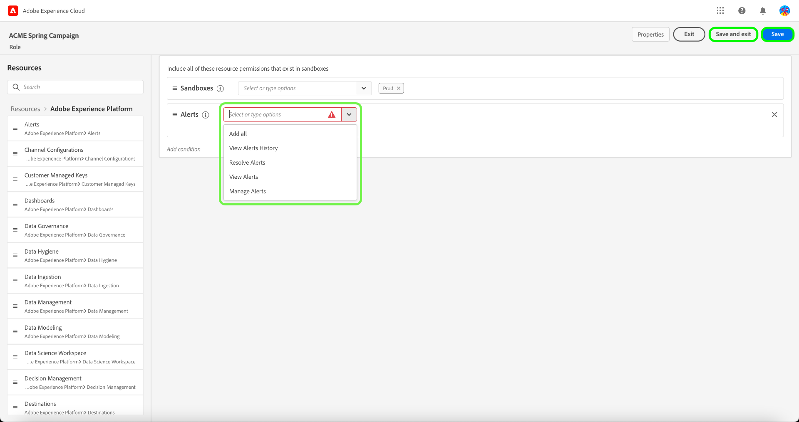

# 管理角色

角色定義管理員、專家或一般使用者對您組織中資源的存取權。 在基於角色的訪問控制環境中，用戶訪問配置是通過共同的責任和需求進行分組的。 角色具有一組指定的權限，而您組織的成員可以根據其所需的檢視或寫入存取範圍，指派給一或多個角色。

## 建立新角色

若要建立新角色，請選取 **[!UICONTROL 角色]** 標籤，然後選取 **[!UICONTROL 建立角色]**.

此 **[!UICONTROL 建立新角色]** 對話框出現，提示您輸入名稱和可選說明。

完成後，請選取 **[!UICONTROL 確認]**.

接下來，使用下拉式功能表，選取您要納入角色的資源權限。

若要新增其他資源，請選取 **[!UICONTROL Adobe Experience Platform]** 從左側導覽面板，其中顯示資源清單。 或者，在左側導覽面板的搜尋列中輸入資源名稱。

按一下並拖曳相關資源，並拖曳至主面板。

使用下拉式功能表，選取您要納入角色的資源權限。 對您要包含該角色的所有資源重複執行此操作。 完成後，請選取 **[!UICONTROL 儲存並退出]**.

新角色已成功建立，系統會將您重新導向至 **[!UICONTROL 角色]** 頁面中，新建立的角色將出現在清單中。

請參閱 [管理角色的權限](#manage-permissions-for-a-role) 有關建立角色權限後如何管理這些權限的詳細資訊。

## 複製角色

若要複製現有角色，請從 **[!UICONTROL 角色]** 標籤。 或者，使用篩選選項來篩選結果，以尋找您要複製的角色。

下一步，選擇 **[!UICONTROL 複製]** 從畫面右上角。

此 **[!UICONTROL 重複角色]** 對話框，提示您確認複製。

接下來，您將進入角色的詳細資訊頁面，您可在此變更角色的名稱和權限。 詳細資料、標籤和沙箱會與先前角色重複。 需要透過「使用者」索引標籤來新增使用者。 您可以檢視 [管理角色的權限](permissions.md) 檔案，以進一步了解如何將詳細資料、標籤、沙箱和使用者新增至角色。

按一下左箭頭以返回 **[!UICONTROL 角色]** 標籤。

新角色會出現在 **[!UICONTROL 角色]** 頁面。

## 刪除角色

選取省略號(`…`)旁邊，下拉式清單會顯示編輯、刪除或複製角色的控制項。 從下拉式清單中選取「刪除」 。

此 **[!UICONTROL 刪除用戶角色]** 對話框，提示您確認刪除。

您將會返回 **[!UICONTROL 角色]** 標籤。

## 後續步驟

建立新角色後，您可以繼續進行下一個步驟： [管理角色的權限](permissions.md).
