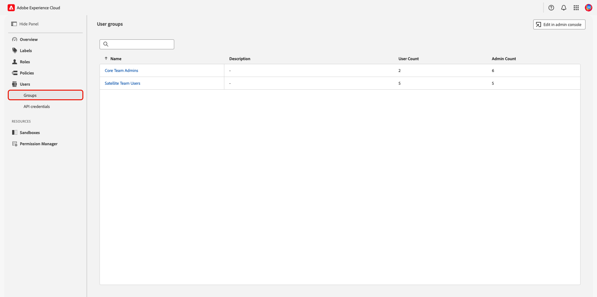
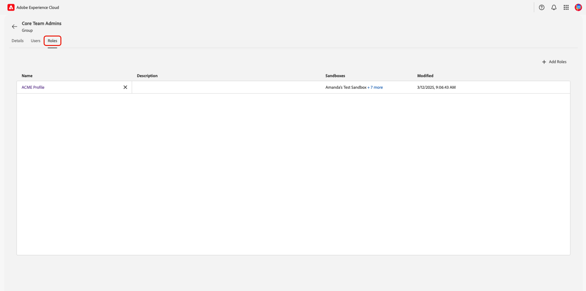
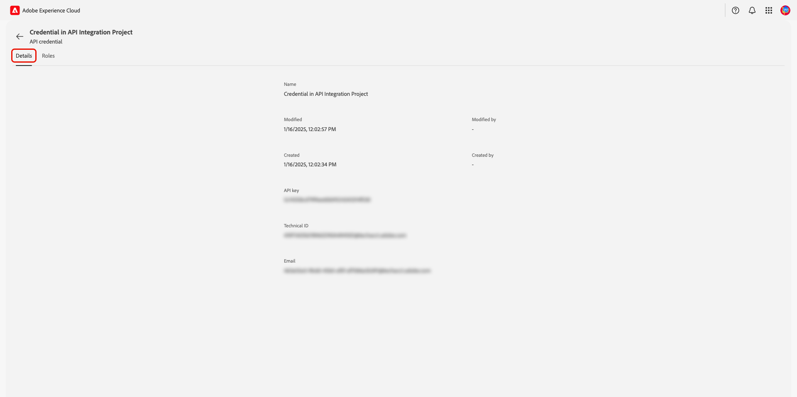
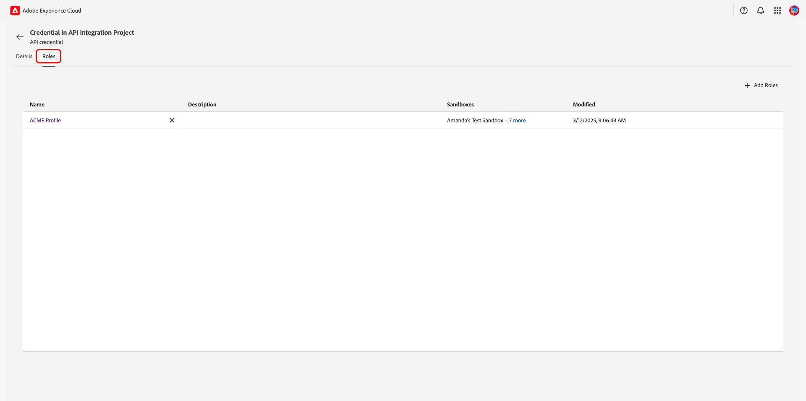

# 管理使用者及新增使用者群組 {#manage-users}

>[!CONTEXTUALHELP]
>id="platform_permissions_users_about"
>title="什麼是使用者？"
>abstract="使用者是擁有 Experience Platform 存取權的個體。個人使用者存取組織資源的權限須按照角色進行管理。"
>additional-url="https://experienceleague.adobe.com/zh-hant/docs/experience-platform/access-control/abac/permissions-ui/roles" text="管理角色"

使用者是指有權存取Adobe Experience Platform的個人。 個別使用者對組織資源的存取權是透過[角色](./roles.md){target="_blank"}管理的。 一個組織也可以建立[使用者群組](#user-groups)，以同時提供多個使用者的順暢存取權。 使用者在Admin Console中進行管理，而與Adobe Experience Platform產品卡相關聯的使用者會顯示為Experience Platform使用者清單的一部分。

## 管理使用者

<!-- ADD LINKS INTO IMPORTANT NOTE BELOW
>[!IMPORTANT]
>
>[!UICONTROL Permissions] manages access control for existing Experience Platform users. To add users to Experience Platform, navigate to Adobe Admin Console through the **[!UICONTROL Edit in admin console]** option. To learn how to add users through the Admin Console, follow the [adding users to Experience Platform](...){#target="_blank"} guide.
-->

若要檢視您組織的使用者，請在&#x200B;**[!UICONTROL Permissions]** Adobe Experience Cloud[中導覽至](https://experience.adobe.com/){target="_blank"}。 在左側面板中選取&#x200B;**[!UICONTROL Users]**。

{zoomable="yes"}

使用者清單隨即顯示。 從清單中選取您要檢視的使用者。 或者，使用搜尋列輸入使用者的名稱或電子郵件地址來搜尋使用者。

**[!UICONTROL Details]**&#x200B;索引標籤提供使用者的概觀。 總覽會顯示使用者的&#x200B;**[!UICONTROL Name]**、**[!UICONTROL Preferred languages]**、**[!UICONTROL Account Type]**、**[!UICONTROL Authentication ID]**、**[!UICONTROL Email]**、**[!UICONTROL Email verified]**&#x200B;狀態、**[!UICONTROL Country code]**&#x200B;和&#x200B;**[!UICONTROL Phone number]**。

{zoomable="yes"}

選取&#x200B;**[!UICONTROL Roles]**&#x200B;索引標籤以檢視指派給使用者的角色。

{zoomable="yes"}

### 為使用者新增角色 {#add-user-role}

若要新增角色給使用者，請選取&#x200B;**[!UICONTROL Add Roles]**。

![反白顯示[新增角色]選項的使用者角色工作區。](../../images/ui/users/user-add-roles.png){zoomable="yes"}

**[!UICONTROL Add Roles]**&#x200B;對話方塊隨即顯示。 選取您要新增到使用者的角色，然後選取&#x200B;**[!UICONTROL Save]**。

![已選取角色並反白儲存選項的[新增角色]對話方塊。](../../images/ui/users/user-roles-add-roles-confirm.png){zoomable="yes"}

### 從使用者中移除角色 {#remove-user-role}

若要從使用者移除角色，請選取該角色名稱旁的&#x200B;**X**。

<!-- ADD LINKS INTO IMPORTANT NOTE BELOW

>[!NOTE]
>
>Role's that have been added to a user through a user group cannot be removed through the user's role workspace. Role's that have been added through a user group will have an [!Info icon](/help/images/icons/info.png) beside the **X** containing information about the associated user group. To remove the role, the role would need to be [removed from the user group](#remove-user-group-role).
-->

{zoomable="yes"}

確認對話方塊隨即顯示。 選取&#x200B;**[!UICONTROL Confirm]**&#x200B;以完成移除角色。

![確認對話方塊，移除反白顯示[確認]選項的角色。](../../images/ui/users/user-roles-remove.png){zoomable="yes"}

## 管理使用者群組 {#user-groups}

使用者群組是多個使用者，這些使用者已分組在一起，並且有權執行相同的功能。

<!-- ADD LINKS INTO IMPORTANT NOTE BELOW
>[!IMPORTANT]
>
>[!UICONTROL Permissions] manages access control for existing Experience Platform user groups. To add user groups to Experience Platform, navigate to Admin Console through the **[!UICONTROL Edit in admin console]** option. To learn how to add user groups in the Admin Console, follow the [adding user groups to Experience Platform](...){#target="_blank"} guide.
 -->

若要檢視您組織的使用者，請在&#x200B;**[!UICONTROL Permissions]** Adobe Experience Cloud[中導覽至](https://experience.adobe.com/){target="_blank"}。從左側面板的&#x200B;**[!UICONTROL Groups]**&#x200B;區段中選取&#x200B;**[!UICONTROL Users]**。

{zoomable="yes"}

使用者群組清單隨即顯示。 從清單中選取您要檢視的群組。

**[!UICONTROL Details]**&#x200B;索引標籤提供使用者群組的概觀。 總覽會顯示群組的&#x200B;**[!UICONTROL Name]**、**[!UICONTROL Description]**、**[!UICONTROL User Count]**&#x200B;和&#x200B;**[!UICONTROL Admin count]**。

{zoomable="yes"}

選取&#x200B;**[!UICONTROL Users]**&#x200B;索引標籤以檢視指派給群組的使用者清單。

{zoomable="yes"}

選取&#x200B;**[!UICONTROL Roles]**&#x200B;索引標籤以檢視目前指派給群組的角色清單。

{zoomable="yes"}

### 將角色新增至使用者群組 {#add-user-group-role}

若要新增角色至群組，請選取&#x200B;**[!UICONTROL Add Roles]**。

![反白顯示[新增角色]選項的使用者群組角色工作區。](../../images/ui/users/user-group-add-roles.png){zoomable="yes"}

**[!UICONTROL Add Roles]**&#x200B;對話方塊隨即顯示。 選取您要新增的角色，然後選取&#x200B;**[!UICONTROL Save]**。 將會為屬於該使用者群組的所有使用者新增角色。

![已選取角色且[儲存]選項反白顯示的[新增角色]對話方塊。](../../images/ui/users/user-group-add-roles-select.png){zoomable="yes"}

### 從使用者群組移除角色 {#remove-user-group-role}

若要從使用者群組移除角色，請選取該角色名稱旁的&#x200B;**X**。

{zoomable="yes"}

確認對話方塊隨即顯示。 選取&#x200B;**[!UICONTROL Confirm]**&#x200B;以完成移除角色。

![確認對話方塊，移除反白顯示[確認]選項的角色。](../../images/ui/users/user-group-remove-role-confirm.png){zoomable="yes"}

## API認證

>[!IMPORTANT]
>
>只有系統管理員才能在「許可權」中檢視和管理API認證。

若要以使用者或開發人員的身分使用Experience Platform API，系統管理員除了角色的特定許可權集以外，還需要新增API認證。 許可權可讓您將先前建立的API認證指派給Experience Platform產品給角色。 如需建立和指派API認證以及所需許可權的完整指南，請參閱[驗證及存取Experience Platform API](/help/landing/api-authentication.md){target="_blank"}中的逐步教學課程。

若要檢視與Experience Platform相關聯的組織API認證，請在&#x200B;**[!UICONTROL Permissions]** Adobe Experience Cloud[中導覽至](https://experience.adobe.com/){target="_blank"}。 從左側面板的&#x200B;**[!UICONTROL API Credentials]**&#x200B;區段中選取&#x200B;**[!UICONTROL Users]**。

{zoomable="yes"}

>[!NOTE]
>
> 若要檢視貴組織所有產品的API認證，或如需認證的詳細資訊，請選取&#x200B;**[!UICONTROL Edit in admin console]**。

API認證清單隨即顯示。 從清單中選取您要檢視的API認證。

**[!UICONTROL Details]**&#x200B;標籤提供API認證的概觀。 總覽會顯示認證的&#x200B;**[!UICONTROL Name]**、**[!UICONTROL Modified]**&#x200B;日期、**[!UICONTROL Modified By]**&#x200B;屬性、**[!UICONTROL Created]**&#x200B;日期、**[!UICONTROL Created by]**&#x200B;屬性、**[!UICONTROL API key]**、**[!UICONTROL Technical ID]**&#x200B;和&#x200B;**[!UICONTROL Email]**。

{zoomable="yes"}

選取 **[!UICONTROL Roles]** 索引標籤。與API認證相關的角色清單隨即顯示。

{zoomable="yes"}

### 將角色新增至API認證 {#add-api-credential-role}

若要將角色新增至API認證，請選取&#x200B;**[!UICONTROL Add Roles]**。

![API認證的工作區中，[新增角色]選項已反白顯示。](../../images/ui/users/api-credential-add-roles.png){zoomable="yes"}

**[!UICONTROL Add Roles]**&#x200B;對話方塊隨即顯示。 選取您要新增到使用者的角色，然後選取&#x200B;**[!UICONTROL Save]**。

![已選取角色並反白儲存選項的[新增角色]對話方塊。](../../images/ui/users/api-credential-add-roles-select.png){zoomable="yes"}

### 從API認證中移除角色 {#remove-api-credential-role}

若要從API認證移除角色，請選取API認證名稱旁的&#x200B;**X**。

{zoomable="yes"}

確認對話方塊隨即顯示。 選取&#x200B;**[!UICONTROL Confirm]**&#x200B;以完成移除角色。

![確認對話方塊，移除反白顯示[確認]選項的角色。](../../images/ui/users/api-credential-remove-role-confirm.png){zoomable="yes"}

## 後續步驟

您現在知道如何檢視使用者、使用者群組和API認證的詳細資訊和角色。 若要深入瞭解屬性型存取控制，請參閱[屬性型存取控制總覽](../overview.md)。

<!--
The following video is intended to support your understanding of developer and API credentials.

>[!VIDEO](https://video.tv.adobe.com/v/3426407/?learn=on)
-->