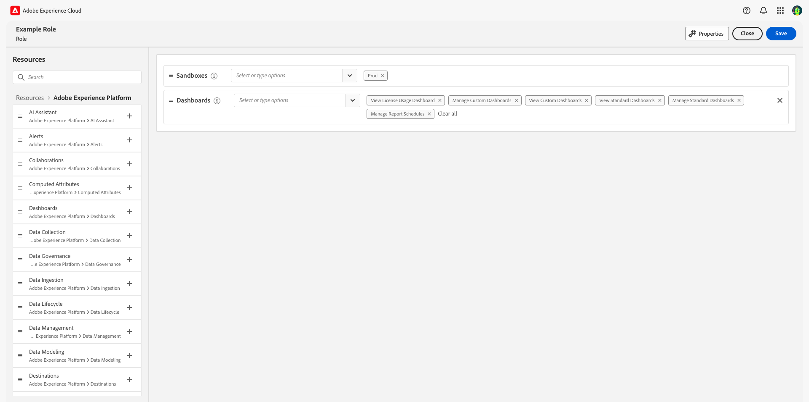

# 存取控制概觀

透過&#x200B;**[!UICONTROL Permissions]** Adobe Experience Cloud[中的](https://experience.adobe.com/)提供Adobe Experience Platform的存取控制。 此功能利用角色和原則，將使用者與許可權和沙箱連結。

## 存取控制階層與工作流程

若要設定Experience Platform的存取控制，您必須對擁有Experience Platform產品的組織具有系統或產品管理員許可權。 可授予或撤銷許可權的最低角色為產品管理員。 可以管理許可權的其他管理員角色是系統管理員（無限制）。 如需詳細資訊，請參閱[管理角色](https://helpx.adobe.com/enterprise/using/admin-roles.html)上的Adobe說明中心文章。

>[!NOTE]
>
>從此刻起，本檔案中任何提及「管理員」的詞語，都會提及產品管理員或以上人員（如上所述）。

取得及指派存取許可權的高階工作流程可概述如下：

- 授權Adobe Experience Platform或使用Experience Platform的應用程式/應用程式服務後，會傳送電子郵件給授權期間指定的管理員。
- 管理員登入[Adobe Admin Console](#adobe-admin-console)，並從總覽頁面的產品清單中選取&#x200B;**Adobe Experience Platform**。
- 若要授與Experience Platform的存取權，建議管理員將使用者新增至預設產品設定檔： `AEP-Default-All-Users`。
- 在Experience Platform許可權中，管理員可以建立新角色，或編輯任何現有角色的許可權和使用者。
- 在建立或編輯角色時，管理員會使用&#x200B;**[!UICONTROL users]**&#x200B;標籤將使用者新增至角色，並透過編輯角色的許可權來授予這些使用者（例如&quot;[!UICONTROL Read Datasets]&quot;或&quot;[!UICONTROL Manage Schemas]&quot;）的許可權。 同樣地，管理員可以使用相同的編輯選項指派存取權給沙箱。
- 使用者登入Experience Platform使用者介面時，其對Experience Platform功能的存取是由上一步驟中已授予的許可權所驅動。 例如，如果使用者沒有[!UICONTROL View Datasets]許可權，該使用者將無法看到側邊功能表中的&#x200B;**[!UICONTROL Datasets]**&#x200B;索引標籤。

如需如何在Experience Platform中管理存取控制的詳細步驟，請參閱[存取控制使用手冊](./ui/overview.md)。

對Experience Platform API的所有呼叫都會驗證許可權，如果在目前的使用者內容中找不到適當的許可權，則會傳回錯誤。 在UI中，元素會根據授予目前使用者的許可權而隱藏或變更。

## 權限 {#platform-permissions}

[!UICONTROL Permissions]提供管理貴組織Experience Platform存取許可權的集中位置。 透過[!UICONTROL Permissions]，您可以授與使用者群組各種Experience Platform功能的存取許可權，例如[!UICONTROL Manage Datasets]、[!UICONTROL View Datasets]或[!UICONTROL Manage Profiles]。

### 角色

在[!UICONTROL Roles]區段中，許可權會透過使用角色指派給使用者。 角色可讓您將許可權授予一或多個使用者，同時也包含他們透過角色指派給他們的沙箱範圍的存取權。 您可以將使用者指派給屬於您組織的一或多個角色。

### 預設角色

Experience Platform隨附兩個預先設定的預設角色。 下表概述每個預設設定檔中提供的內容，包括他們授予存取權的沙箱，以及他們在該沙箱範圍內授予的許可權。

| 角色 | 沙箱存取 | 權限 |
| --- | --- | --- |
| 預設的生產所有存取權 | Prod | 適用於Experience Platform的所有許可權，「沙箱管理」許可權除外。 |
| 沙箱管理員 | 不適用 | 提供`Prod`沙箱的存取權以及沙箱管理許可權。 |

## 沙箱和許可權

非生產沙箱是資料虛擬化的一種形式，可讓您將資料與其他沙箱隔離，通常用於開發實驗、測試或試用。 角色的許可權可讓角色的使用者在他們有權存取的沙箱環境中存取Experience Platform功能。 預設Experience Platform授權會授予您5個沙箱（一個生產環境和4個非生產環境）。 您可以新增10個非生產沙箱的套件，最多總共75個沙箱。 如需詳細資訊，請聯絡貴組織的管理員或您的Adobe銷售代表。

如需Experience Platform中沙箱的詳細資訊，請參閱[沙箱總覽](../sandboxes/home.md)。

### 存取沙箱

沙箱的存取權透過角色進行管理。 如需如何啟用角色存取沙箱的詳細步驟，請參閱[屬性型存取控制角色指南](./abac/ui/roles.md)。

可授予使用者角色中一或多個沙箱的存取權。 如果兩個或更多角色中包含一個使用者，則該使用者將可存取這些角色中包含的所有沙箱。

「沙箱管理」許可權可讓使用者管理、檢視或重設沙箱。

### 資源許可權 {#permissions}

資源許可權可授予存取特定Experience Platform功能的許可權。 資源會劃分為包含一組相關許可權的類別，這些許可權可個別指派給角色。

在[!UICONTROL Permissions]中，角色的資源工作區會顯示該角色的有效沙箱和許可權：

下表概述了Experience Platform和透過許可權管理之應用程式的可用資源類別：

| 類別 | 說明 |
| --- | --- |
| [!DNL Adobe Mix Modeler] | 設定、管理及檢視[!DNL Adobe Mix Modeler]的許可權。 |
| [!DNL AI Assistant] | 設定[!DNL AI Assistant]的許可權。 |
| [!DNL Alerts] | 設定管理、解決和檢視警示和警示歷史記錄的許可權。 |
| [!DNL B2B Account Lists] | 設定B2B帳戶清單的管理、檢視和發佈許可權，包括帳戶清單的新增、移除、匯入和刪除帳戶等動作。 |
| [!DNL B2B Admin Configurations] | 設定管理和檢視B2B管理設定的許可權，包括數位資產管理連線、資產存放庫和事件。 |
| [!DNL B2B Assets] | 設定B2B資產的管理和檢視許可權，包括電子郵件、簡訊、登入頁面、片段、範本和影像。 |
| [!DNL B2B Buying Groups] | 設定B2B購買群組的管理和檢視許可權，包括解決方案興趣、角色範本和購買群組狀態等功能。 |
| [!DNL B2B Channel Configurations] | 設定B2B通道設定的管理和檢視許可權，包括通訊限制、API認證和安全性設定等設定。 |
| [!DNL B2B Dashboards] | 設定B2B儀表板的檢視許可權，包括帳戶參與度、購買群組階段、飆升帳戶和聯絡人涵蓋範圍等功能。 |
| [!DNL B2B Journeys] | 設定B2B歷程的管理、檢視和發佈許可權，包括帳戶和人員動作、事件接聽程式及分割路徑等功能。 |
| [!DNL Campaigns] | 在Journey Optimizer中設定行銷活動的管理、發佈和檢視許可權。 |
| [!DNL Channel Configurations] | 設定管理、檢視和匯出通道設定功能，例如子網域、IP集區、訊息預設集、PTR記錄、隱藏清單、登陸頁面設定、簡訊設定和檔案路由。 |
| [!DNL Collaborations] | 設定管理和檢視Real-time Customer Data Profile Collaboration功能的許可權。 |
| [!DNL Computed Attributes] | 設定管理和檢視草稿或發佈之計算屬性的許可權。 |
| [!DNL Customer Managed Keys] | 設定客戶自控金鑰的管理許可權。 |
| [!DNL Dashboards] | 設定對標準、自訂和授權控制面板的管理和檢視許可權。 |
| [!DNL Data Collection] | 設定管理和檢視資料串流的許可權。 |
| [!DNL Data Governance] | 設定管理、套用和檢視資料管理功能的許可權，例如標籤、原則和活動記錄。 |
| [!DNL Data Ingestion] | 設定管理和檢視資料擷取功能的許可權，例如來源和受眾共用。 |
| [!DNL Data Lifecycle] | 設定管理和檢視資料衛生功能的許可權。 |
| [!DNL Data Management] | 設定資料集和監控資料集及資料流等資料管理功能的管理和檢視許可權。 |
| [!DNL Data Modeling] | 設定資料模型功能（例如結構描述、關係和身分中繼資料）的管理與檢視許可權。 |
| [!DNL Data Science Workspace] | 設定[!DNL Data Science Workspace]的管理許可權。 |
| [!DNL Decision Management] | 在決策管理中設定管理和檢視決策、優惠和排名策略功能的許可權。 |
| [!DNL Destinations] | 設定管理和檢視目標的許可權，包括目標的啟用和製作SDK等功能。 |
| [!DNL Federated Data] | 設定管理和檢視同盟資料功能的許可權。 |
| [!DNL Identity Management] | 設定管理及檢視Identity Service功能（例如身分名稱空間及身分圖表）的許可權。 |
| [!DNL Intelligent Service] | 設定在Intelligent Service中管理和檢視Attribution AI和Customer AI的許可權。 |
| [!DNL IP Warmup Configurations] | 設定管理和檢視IP熱身計畫的許可權，以及檢視檢視IP熱身報告的許可權。 |
| [!DNL Journey Optimizer Library] | 在Adobe Journey Optimizer中設定程式庫專案的管理許可權。 |
| [!DNL Journey Optimizer Rules] | 在Adobe Journey Optimizer中設定頻率規則的管理和檢視許可權。 |
| [!DNL Journeys] | 設定管理、發佈和檢視歷程的許可權，包括歷程報告、事件、資料來源和動作等功能。 |
| [!DNL Messages] | 設定管理、發佈和檢視訊息的許可權，包括訊息預覽和測試等功能。 |
| [!DNL Privacy Service] | 設定管理和檢視Privacy Service功能的許可權。 |
| [!DNL Profile Management] | 設定管理、檢視、匯出和評估設定檔服務功能的許可權，例如對象、設定檔和合併原則。 |
| [!DNL Prospects] | 設定對潛在客戶結構描述、設定檔和對象的管理和檢視許可權，包括檢視潛在客戶摺疊式功能表等功能。 |
| [!DNL Query Service] | 設定查詢服務功能（例如不會到期的認證和結構化SQL查詢）的管理許可權。 |
| [!DNL Reports] | 設定管道報表的檢視許可權。 |
| [!DNL Run and Operate] | 設定執行與操作功能的檢視許可權，例如健康狀態檢查和工作排程。 |
| [!DNL Sandbox Administration] | 管理沙箱時設定管理、檢視和重設許可權。 |
| [!DNL Traits Configuration] | 透過計算屬性UI設定管理和檢視特徵。 |
| [!DNL Translation Services] | 針對專案、任務、評論、內部、設定和提供者，設定翻譯服務的管理和檢視許可權。 |

下表概述角色中Experience Platform的可用許可權，以及使用者授予存取權的特定Experience Platform功能說明。 如需有關如何將許可權新增至角色的詳細步驟，請參閱[基於屬性的存取控制角色指南](./abac/ui/roles.md)。

| 類別 | 權限 | 說明 |
| --- | --- | --- |
| [!DNL Adobe Mix Modeler] | [!UICONTROL Manage Adobe Mix Modeler Harmonized Data] | 檢視和修改協調資料的能力。 |
| [!DNL Adobe Mix Modeler] | [!UICONTROL View Adobe Mix Modeler Harmonized Data] | 以唯讀方式存取協調的資料。 |
| [!DNL Adobe Mix Modeler] | [!UICONTROL Manage Adobe Mix Modeler Models Configurations] | 檢視和修改模型組態的功能。 |
| [!DNL Adobe Mix Modeler] | [!UICONTROL View Adobe Mix Modeler Models Configurations] | 以唯讀方式存取模型設定。 |
| [!DNL Adobe Mix Modeler] | [!UICONTROL Manage Adobe Mix Modeler Models Plans Configurations] | 檢視與修改計畫組態的功能。 |
| [!DNL Adobe Mix Modeler] | [!UICONTROL View Adobe Mix Modeler Models Plans Configurations] | 計畫組態的唯讀存取權。 |
| [!DNL AI Assistant] | [!UICONTROL Enable AI Assistant] | 能夠提出[[!DNL [AI assistant]]](../ai-assistant/access.md)個問題。 |
| [!DNL AI Assistant] | [!UICONTROL View Operational Insights] | 存取以取得[操作性深入分析](../ai-assistant/home.md##operational-insights)查詢的回應。 |
| [!DNL AI Assistant] | [!UICONTROL Generate Content] | 讓使用者能夠使用[!DNL AI Assistant]產生內容。 |
| [!DNL AI Assistant] | [!UICONTROL Manage Brand Kit] | 讓使用者能夠使用[!DNL AI Assistant]建立品牌指引。 |
| [!DNL Alerts] | [!UICONTROL View Alerts History] | 警示歷程記錄的唯讀存取權。 |
| [!DNL Alerts] | [!UICONTROL Resolve Alerts] | 讀取、編輯和刪除警示的存取權。 |
| [!DNL Alerts] | [!UICONTROL View Alerts] | 警示的唯讀存取權。 |
| [!DNL Alerts] | [!UICONTROL Manage Alerts] | 讀取、建立、編輯和刪除警示的存取權。 |
| [!DNL B2B Account Lists] | [!UICONTROL Manage B2B Account Lists] | 可在左側導覽中檢視及存取&#x200B;**[!UICONTROL Account Lists]**。 有權存取&#x200B;**[!UICONTROL Account Lists]**&#x200B;的使用者應該有權存取所有帳戶清單CRUD功能： `/accounts-list`。 |
| [!DNL B2B Admin Configurations] | [!UICONTROL Manage B2B Admin Configurations] | 可在左側導覽中檢視及存取&#x200B;**[!UICONTROL B2B Admin Configurations]**。 有權存取&#x200B;**[!UICONTROL B2B Admin Configurations]**&#x200B;的使用者應該有權存取所有SMS API認證CRUD功能： `/admin-configs`。 |
| [!DNL B2B Assets] | [!UICONTROL Manage B2B Assets] | 可在左側導覽中檢視及存取&#x200B;**[!UICONTROL Assets]**。 有權存取&#x200B;**[!UICONTROL Assets]**&#x200B;的使用者應該有權存取所有Assets CRUD功能： `/assets-listing`。 |
| [!DNL B2B Assets] | [!UICONTROL Manage B2B Templates] | 可在左側導覽中檢視及存取&#x200B;**[!UICONTROL Templates]**。 有權存取&#x200B;**[!UICONTROL Templates]**&#x200B;的使用者應該有權存取所有範本CRUD功能： `/b2b-content-templates`。 |
| [!DNL B2B Assets] | [!UICONTROL Manage B2B Fragments] | 可在左側導覽中檢視及存取&#x200B;**[!UICONTROL Fragments]**。 有權存取&#x200B;**[!UICONTROL Fragments]**&#x200B;的使用者應該有權存取所有片段CRUD函式： `/fragments`。 |
| [!DNL B2B Buying Groups] | [!UICONTROL Manage B2B Buying Groups] | 可在左側導覽中檢視及存取&#x200B;**[!UICONTROL Buying Groups]**。 有權存取&#x200B;**[!UICONTROL Buying Groups]**&#x200B;的使用者應該有權存取所有購買群組CRUD功能： `/buying-groups`。 |
| [!DNL B2B Dashboards] | [!UICONTROL Manage B2B Engagement Dashboards] | 可在左側導覽中檢視及存取&#x200B;**[!UICONTROL Dashboard]**。 有權存取&#x200B;**[!UICONTROL Dashboards]**&#x200B;的使用者應該有權存取所有儀表板CRUD功能： `/insights-dashboard`。 |
| [!DNL B2B Channel Configurations] | [!UICONTROL Manage B2B Channels Configurations] | 可在左側導覽中檢視及存取&#x200B;**[!UICONTROL Channels]**。 有權存取&#x200B;**[!UICONTROL Channels]**&#x200B;的使用者應該有權存取所有管道CRUD功能： `/channels-config`。 |
| [!DNL B2B Journeys] | [!UICONTROL Manage B2B Account Journeys] | 可在左側導覽中檢視及存取&#x200B;**[!UICONTROL Account Journeys]**。 有權存取&#x200B;**[!UICONTROL Account Journeys]**&#x200B;的使用者應該有權存取所有帳戶歷程CRUD功能： `/account-journeys`。 |
| [!DNL Campaigns] | [!UICONTROL Manage Campaigns] | 讀取、建立、編輯和刪除行銷活動的存取權。 |
| [!DNL Campaigns] | [!UICONTROL Approve and Publish Campaigns] | 核准和發佈行銷活動的功能。 |
| [!DNL Campaigns] | [!UICONTROL Publish Campaigns] | 發佈行銷活動的功能。 |
| [!DNL Campaigns] | [!UICONTROL View Campaigns] | 行銷活動的唯讀存取權。 |
| [!DNL Campaigns] | [!UICONTROL View Campaigns Report] | 對行銷活動報告的唯讀存取權。 |
| [!DNL Channel Configurations] | [!UICONTROL View Messages General Settings] | 對訊息一般設定的唯讀存取權。 |
| [!DNL Channel Configurations] | [!UICONTROL Manage Subdomains Delegations] | 讀取、建立、編輯和刪除子網域委派的存取權。 |
| [!DNL Channel Configurations] | [!UICONTROL Manage IP Pools] | 讀取、建立和編輯IP集區的存取權。 |
| [!DNL Channel Configurations] | [!UICONTROL Manage Messages General Settings] | 存取讀取、建立、編輯和刪除訊息的一般設定。 |
| [!DNL Channel Configurations] | [!UICONTROL Manage Messages Presets] | 存取讀取、建立、編輯和刪除訊息預設集。 |
| [!DNL Channel Configurations] | [!UICONTROL View Messages Presets] | 訊息預設集的唯讀存取權。 |
| [!DNL Channel Configurations] | [!UICONTROL Manage PTR Records] | 讀取和編輯PTR記錄的存取權。 |
| [!DNL Channel Configurations] | [!UICONTROL View PTR Records] | 對PTR記錄的唯讀存取權。 |
| [!DNL Channel Configurations] | [!UICONTROL Manage Suppression] | 讀取、建立、編輯和刪除隱藏規則的存取權。 |
| [!DNL Channel Configurations] | [!UICONTROL View Suppression List] | 隱藏清單的唯讀存取權。 |
| [!DNL Channel Configurations] | [!UICONTROL Export Suppression List] | 存取隱藏清單匯出為CSV檔案。 |
| [!DNL Channel Configurations] | [!UICONTROL Manage Landing Page Settings] | 存取讀取、建立、編輯和刪除登入頁面設定。 |
| [!DNL Channel Configurations] | [!UICONTROL Manage SMS Settings] | 存取讀取、建立、編輯和刪除簡訊設定。 |
| [!DNL Channel Configurations] | [!UICONTROL Manage SMS Subdomains] | 讀取、建立、編輯和刪除SMS子網域的存取權。 |
| [!DNL Channel Configurations] | [!UICONTROL Manage File Routing] | 讀取、建立、編輯和刪除檔案製程的存取權。 |
| [!DNL Channel Configurations] | [!UICONTROL View File Routing] | 檔案製程的唯讀存取權。 |
| [!DNL Channel Configurations] | [!UICONTROL Manage Seedlist] | 建立及編輯Seedlist的功能。 |
| [!DNL Channel Configurations] | [!UICONTROL Manage Language Settings] | 能夠建立和編輯語言設定。 |
| [!DNL Channel Configurations] | [!UICONTROL Manage Web Subdomains] | 建立及編輯CJM Web子網域的功能。 |
| [!DNL Channel Configurations] | [!UICONTROL Manage Push Credentials] | 建立、編輯和刪除推送認證的功能。 |
| [!DNL Collaborations] | [!UICONTROL Manage Collaboration Instances] | 檢視、建立、更新及刪除組織的共同作業執行個體。 探索其他組織的共同作業執行個體。 |
| [!DNL Collaborations] | [!UICONTROL Read Collaboration Instances] | 讀取組織的共同作業執行個體並探索其他組織的共同作業執行個體。 |
| [!DNL Collaborations] | [!UICONTROL Manage Connection Invites] | 檢視、建立及刪除貴組織所起始的連線邀請。 接受並拒絕其他組織所起始的連線邀請。 |
| [!DNL Collaborations] | [!UICONTROL Read Connection Invites] | 以唯讀方式存取連線邀請。 |
| [!DNL Collaborations] | [!UICONTROL Manage Collaboration Connections] | 廣告商可以檢視、建立和更新設定，以及提交和刪除連線。 發行者可以檢視、接受或拒絕連線。 |
| [!DNL Collaborations] | [!UICONTROL Read Collaboration Connections] | 對連線的唯讀存取。 |
| [!DNL Collaborations] | [!UICONTROL Manage Audience Data] | 入門和探索對象。 更新公開、私人和自訂對象，並管理對象詳細目錄中繼資料設定。 |
| [!DNL Collaborations] | [!UICONTROL Read Audience Data] | 閱讀和探索對象。 |
| [!DNL Collaborations] | [!UICONTROL Manage Measurement Data] | 上線、更新及刪除測量資料。 |
| [!DNL Collaborations] | [!UICONTROL Read Measurement Data] | 以唯讀方式存取測量資料。 |
| [!DNL Collaborations] | [!UICONTROL Manage Projects] | 檢視、建立、更新和刪除任何探索、共用、啟用和測量活動的專案。 |
| [!DNL Collaborations] | [!UICONTROL Read Projects] | 檢視任何探索、共用、啟用和測量活動的專案。 |
| [!DNL Collaborations] | [!UICONTROL Read User Activities] | 對使用者活動的唯讀存取權。 |
| [!DNL Collaborations] | [!UICONTROL Export User Activities] | 匯出使用者活動。 |
| [!DNL Collaborations] | [!UICONTROL Read Collaboration Credit Monitoring] | 組織與執行環境層次的信用監控。 |
| [!DNL Computed Attributes] | [!UICONTROL View Computed attributes] | 計算屬性標籤、詳細目錄和詳細資料的唯讀存取權。 |
| [!DNL Computed Attributes] | [!UICONTROL Manage Computed attributes] | 讀取、建立、刪除草稿及停用計算屬性的存取權。 |
| [!DNL Customer Managed Keys] | [!UICONTROL Manage Customer Managed Keys] | 存取以檢視及設定客戶自控金鑰。 |
| [!DNL Dashboards] | [!UICONTROL View License Usage Dashboard] | 唯讀存取權，可檢視授權使用儀表板。 |
| [!DNL Dashboards] | [!UICONTROL Manage Standard Dashboards] | 新增尚未在Data Warehouse的自訂屬性。 |
| [!DNL Dashboards] | [!UICONTROL View Standard Dashboards] | 對「設定檔」、「目的地」和「區段」控制面板的唯讀存取權。 也可讓您存取左側導覽中的儀表板，以及儀表板詳細目錄和整合索引標籤。 |
| [!DNL Dashboards] | [!UICONTROL Manage Custom Dashboards] | 存取以建立或編輯控制面板。 |
| [!DNL Dashboards] | [!UICONTROL View Custom Dashboards] | 對使用者定義控制面板的唯讀存取權。 |
| [!DNL Dashboards] | [!UICONTROL Manage Report Schedules] | 建立排程的功能。 |
| [!DNL Dashboards] | [!UICONTROL Export Dashboard Data] | 控制使用者從查詢專業模式儀表板匯出表格資料的能力。 |
| [!DNL Data Collection] | [!UICONTROL Manage Datastreams] | 讀取、建立和編輯資料串流的存取權。 |
| [!DNL Data Collection] | [!UICONTROL View Datastreams] | 資料串流的唯讀存取權。 |
| [!DNL Data Governance] | [!UICONTROL Manage Usage Labels] | 存取讀取、建立和刪除使用標籤。 |
| [!DNL Data Governance] | [!UICONTROL Manage Data Usage Policies] | 讀取、建立、編輯和刪除資料使用原則的存取權。 |
| [!DNL Data Governance] | [!UICONTROL View Data Usage Policies] | 屬於您組織的資料使用原則的唯讀存取權。 |
| [!DNL Data Governance] | [!UICONTROL View User Activity Log] | 唯讀存取權，可檢視Experience Platform活動中記錄的[稽核記錄](../landing/governance-privacy-security/audit-logs/overview.md)。 |
| [!DNL Data Governance] | [!UICONTROL View Privacy Console] | 對隱私權主控台的唯讀存取。 |
| [!DNL Data Ingestion] | [!UICONTROL Manage Sources] | 讀取、建立、編輯和停用來源的存取權。 |
| [!DNL Data Ingestion] | [!UICONTROL View Sources] | 對&#x200B;**[!UICONTROL Catalog]**&#x200B;索引標籤中的可用來源及&#x200B;**[!UICONTROL Browse]**&#x200B;索引標籤中的已驗證來源具有唯讀存取權。 |
| [!DNL Data Ingestion] | [!DNL Manage Audience Share Connections] | 存取建立、接受和拒絕夥伴共用，以連線兩個組織並啟用[!DNL Segment Match]流程。 |
| [!DNL Data Ingestion] | [!DNL Manage Audience Share] | 存取使用中夥伴讀取、建立、編輯和發佈[!DNL Segment Match]摘要。 |
| [!DNL Data Lifecycle] | [!UICONTROL View Data Lifecycle] | 資料生命週期的唯讀存取。 |
| [!DNL Data Lifecycle] | [!UICONTROL Manage Data Lifecycle] | 讀取、建立、編輯和刪除資料生命週期的存取權。 |
| [!DNL Data Modeling] | [!UICONTROL Manage Schemas] | 讀取、建立、編輯和刪除結構描述和相關資源的存取權。 |
| [!DNL Data Modeling] | [!UICONTROL View Schemas] | 對結構描述和相關資源的唯讀存取權。 |
| [!DNL Data Modeling] | [!UICONTROL Manage Relationships] | 讀取、建立、編輯和刪除綱要關係的存取權。 |
| [!DNL Data Modeling] | [!UICONTROL Manage Identity Metadata] | 存取讀取、建立、編輯和刪除結構描述的中繼資料。 |
| [!DNL Data Management] | [!UICONTROL Manage Datasets] | 存取讀取、建立、編輯和刪除資料集。 結構描述的唯讀存取權。 |
| [!DNL Data Management] | [!UICONTROL View Datasets] | 資料集和結構描述的唯讀存取權。 |
| [!DNL Data Management] | [!UICONTROL Data Monitoring] | 監督資料集和資料流的唯讀存取權。 |
| [!DNL Data Science Workspace] | [!UICONTROL Manage Data Science Workspace] | 在[!DNL Data Science Workspace]中讀取、建立、編輯和刪除的存取權。 |
| [!DNL Decision Management] | [!UICONTROL Manage Experience Decisioning] | 管理體驗決策實體的功能。 |
| [!DNL Decision Management] | [!UICONTROL View Experience Decisioning] | 唯讀存取體驗決策實體。 |
| [!DNL Decision Management] | [!UICONTROL Manage Decisions] | 存取讀取、建立、編輯和刪除決策實體。 |
| [!DNL Decisions Management] | [!UICONTROL View Decisions] | 決策實體的唯讀存取權。 |
| [!DNL Decision Management] | [!UICONTROL Manage Offers] | 存取以讀取、建立、編輯和刪除所有優惠方案和元件。 決策和集合的唯讀存取權。 |
| [!DNL Decsion Management] | [!UICONTROL Manage Ranking Strategies] | 存取讀取、建立、編輯和刪除自訂報告，以及使用動作功能。 |
| [!DNL Destinations] | [!UICONTROL View Destinations] | 以唯讀方式存取&#x200B;**[!UICONTROL Catalog]**&#x200B;標籤中的可用目的地和&#x200B;**[!UICONTROL Browse]**&#x200B;標籤中的已驗證目的地。 |
| [!DNL Destinations] | [!UICONTROL Manage Destinations] | 讀取、建立和刪除目的地連線和目的地帳戶的存取權。 |
| [!DNL Destinations] | [!UICONTROL Activate Destinations] | 啟用資料至已建立之作用中目的地的功能。 此許可權也要求將[!UICONTROL View Destinations]或[!UICONTROL Manage Destinations]授與將啟用目的地的使用者。 |
| [!DNL Destinations] | [!UICONTROL Activate Segment without Mapping] | 能夠啟用現有目的地的對象，而不顯示[對應步驟](../destinations/ui/activate-batch-profile-destinations.md#mapping)。 使用者可以在啟動工作流程中新增和移除對象，但無法新增或移除對應的屬性或身分。 此許可權也需要將[!UICONTROL View Destinations]許可權授與將啟用目的地資料的使用者。 |
| [!DNL Destinations] | [!UICONTROL Manage and Activate Dataset Destinations] | 可讀取、建立、編輯和停用資料集匯出流程。 還能對已建立的作用中資料集啟用資料。 此許可權也需要將[!UICONTROL View Destinations]許可權授與將啟用目的地資料的使用者。 |
| [!DNL Destinations] | [!UICONTROL Destination Authoring] | 能夠使用[Adobe Experience Platform Destination SDK](../destinations/destination-sdk/overview.md)編寫目的地。 |
| [!DNL Federated Data] | [!UICONTROL Manage Federated Data] | 能夠存取所有同盟資料功能，例如建立結構描述、模型和組合。 |
| [!DNL Identity Management] | [!UICONTROL Manage Identity Namespaces] | 讀取、建立、編輯和刪除身分名稱空間的存取權。 |
| [!DNL Identity Management] | [!UICONTROL View Identity Namespaces] | 身分識別名稱空間的唯讀存取權。 |
| [!DNL Identity Management] | [!UICONTROL View Identity Graph] | 身分圖表的唯讀存取權。 |
| [!DNL Identity Management] | [!UICONTROL Manage Identity Settings] | 讀取、建立和編輯身分設定的存取權。 |
| [!DNL Identity Management] | [!UICONTROL View Identity Settings] | 以唯讀方式存取身分設定。 |
| [!DNL Intelligent Services] | [!UICONTROL View Attribution AI] | Attribution AI設定和深入分析的唯讀存取權。 |
| [!DNL Intelligent Services] | [!UICONTROL Manage Attribution AI] | 存取讀取、建立、編輯和刪除Attribution AI模型。 |
| [!DNL Intelligent Services] | [!UICONTROL View Customer AI] | 存取以讀取或檢視Customer AI模型。 |
| [!DNL Intelligent Services] | [!UICONTROL Manage Customer AI] | 存取以建立、更新、刪除、啟用或停用Customer AI模型。 |
| [!DNL IP Warmup Configurations] | [!UICONTROL View IP Warmup Plans] | 對IP熱身計畫的唯讀存取權。 |
| [!DNL IP Warmup Configurations] | [!UICONTROL Manage IP Warmup Plans] | 管理IP熱身計畫的功能。 |
| [!DNL IP Warmup Configurations] | [!UICONTROL View IP Warmup Reports] | 對IP熱身報告的唯讀存取權。 |
| [!DNL Journeys] | [!UICONTROL Manage Journeys] | 讀取、建立、編輯和刪除歷程的存取權。 |
| [!DNL Journeys] | [!UICONTROL View Journeys] | 歷程的唯讀存取權。 |
| [!DNL Journeys] | [!UICONTROL View Journeys Report] | 對歷程報告的唯讀存取權。 |
| [!DNL Journeys] | [!UICONTROL Manage Journeys Events, Data Sources and Actions] | 讀取、建立、編輯和刪除事件、資料來源或動作的存取權。 |
| [!DNL Journeys] | [!UICONTROL View Journeys Events, Data Sources and Actions] | 以唯讀方式存取事件、資料來源或動作。 |
| [!DNL Journeys] | [!UICONTROL Approve and Publish Journeys] | 在套用原則時核准和發佈歷程的功能。 |
| [!DNL Journeys] | [!UICONTROL Publish Journeys] | 發佈歷程的功能。 |
| [!DNL Journey Optimizer Library] | [!UICONTROL Manage Library Items] | 新增和刪除已儲存運算式的功能。 |
| [!DNL Journey Optimizer Library] | [!UICONTROL Publish Fragments] | 發佈內容片段的功能。 |
| [!DNL Journey Optimizer Library] | [!UICONTROL Simulate Content] | 存取模擬內容選項以進行預覽和校樣。 |
| [!DNL Journey Optimizer Rules] | [!UICONTROL View Frequency Rules] | 頻率規則的唯讀存取權。 |
| [!DNL Journey Optimizer Rules] | [!UICONTROL Manage Frequency Rules] | 讀取、建立、編輯或刪除頻率規則的存取權。 |
| [!DNL Messages] | [!UICONTROL Manage Messages] | 讀取、建立、編輯和刪除訊息的存取權。 |
| [!DNL Messages] | [!UICONTROL View Messages] | 訊息的唯讀存取權。 |
| [!DNL Messages] | [!UICONTROL View Messages Report] | 存取以讀取和編輯訊息報告。 |
| [!DNL Messages] | [!UICONTROL Publish Messages] | 發佈訊息的功能。 |
| [!DNL Messages] | [!UICONTROL Manage Messages Preview and Test] | 在套用原則時核准和發佈訊息的功能。 |
| [!DNL Privacy Service] | [!UICONTROL Manage Privacy Service] | 存取讀取和寫入隱私權工作流程。 |
| [!DNL Privacy Service] | [!UICONTROL View Privacy Service] | 隱私權工作流程的唯讀存取權。 |
| [!DNL Profile Management] | [!UICONTROL Manage Profiles] | 存取讀取、建立、編輯和刪除用於客戶設定檔的資料集。 對可用設定檔的唯讀存取權。 |
| [!DNL Profile Management] | [!UICONTROL View Profiles] | 對可用設定檔的唯讀存取權。 |
| [!DNL Profile Management] | [!UICONTROL Manage Segments] | 讀取、建立、編輯和刪除對象的存取權。 |
| [!DNL Profile Management] | [!UICONTROL View Segments] | 可用對象的唯讀存取權。 |
| [!DNL Profile Management] | [!UICONTROL Manage Merge Policies] | 讀取、建立、編輯和刪除合併原則的存取權。 |
| [!DNL Profile Management] | [!UICONTROL View Merge Policies] | 可用合併原則的唯讀存取權。 |
| [!DNL Profile Management] | [!UICONTROL Import Audiences] | 能夠使用CSV上傳工作流程匯入新對象。 |
| [!DNL Profile Management] | [!UICONTROL Export Audience Segment] | 能夠將評估的對象匯出至資料集。 |
| [!DNL Profile Management] | [!UICONTROL Evaluate a Segment to an Audience] | 透過評估區段定義來為對象產生設定檔的功能。 |
| [!DNL Profile Management] | [!UICONTROL View B2B AI] | 以唯讀方式存取所有B2B AI/ML服務的設定和組態。 |
| [!DNL Profile Management] | [!UICONTROL Manage B2B AI] | 存取以讀取、建立、編輯和刪除所有B2B AI/ML服務的設定和組態。 |
| [!DNL Profile Management] | [!UICONTROL View B2B Profile] | 以唯讀方式存取B2B實體設定檔（例如Account、Opportunity等）、所有B2B AI/ML服務的設定和組態，以及B2B儀表板Widget。 |
| [!DNL Profile Management] | [!UICONTROL Manage B2B Profile] | 讀取、建立、編輯和刪除B2B實體設定檔（例如Account、Opportunity等）的存取權。 所有B2B AI/ML服務和B2B儀表板Widget之設定和設定的唯讀存取權。 |
| [!DNL Profile Management] | [!UICONTROL Manage Lookalikes] | 建立或刪除相似受眾的功能。 |
| [!DNL Profile Management] | [!UICONTROL View B2B Experience] | 可檢視B2B設定檔和屬性。 |
| [!DNL Profile Management] | [!UICONTROL View Profile Settings] | 所有設定檔設定的唯讀存取權。 |
| [!DNL Profile Management] | [!UICONTROL Manage Profile Settings] | 存取以讀取及編輯所有設定檔設定。 |
| [!DNL Prospects] | [!UICONTROL View Prospects] | 對潛在客戶結構描述、設定檔、對象和潛在客戶摺疊式功能表的唯讀存取權。 |
| [!DNL Prospects] | [!UICONTROL Manage Prospects] | 能夠建立和管理潛在客戶結構、設定檔和對象。 潛在客戶設定追蹤的唯讀存取權。 |
| [!DNL Query Service] | [!UICONTROL Manage Queries] | 存取Experience Platform資料的讀取、建立、編輯和刪除結構化SQL查詢。 |
| [!DNL Query Service] | [!UICONTROL Manage Query Service Integration] | 存取以建立、更新和刪除不會到期的認證以進行查詢服務存取。 |
| [!DNL Query Service] | [!UICONTROL Manage Query Sessions] | 能夠逐出現有會議。 |
| [!DNL Query Service] | [!UICONTROL Manage Allow List] | 能夠管理組織的IP限制。 |
| [!DNL Reports] | [!UICONTROL View Channel Reports] | 檢視和修改管道報表的功能。 |
| [!DNL Run and Operate] | [!UICONTROL View Health Checks] | 狀況檢查的唯讀存取權。 |
| [!DNL Run and Operate] | [!UICONTROL View Job Schedules] | 工作排程的唯讀存取權。 |
| [!DNL Sandbox Administration] | [!UICONTROL Manage Sandboxes] | 存取讀取、建立、編輯和刪除沙箱。 |
| [!DNL Sandbox Administration] | [!UICONTROL View Sandboxes] | 屬於您組織的沙箱的唯讀存取權。 |
| [!DNL Sandbox Administration] | [!UICONTROL Reset a Sandbox] | 重設沙箱的功能。 |
| [!DNL Sandbox Administration] | [!UICONTROL Manage Packages] | 存取以建立、匯入或匯出套件。 |
| [!DNL Sandbox Administration] | [!UICONTROL Share Packages] | 在不同組織間共用套件的存取權。 |
| [!DNL Traits Configurations] | [!UICONTROL View Traits] | 特徵的唯讀存取權。 |
| [!DNL Traits Configurations] | [!UICONTROL Manage Traits] | 存取權以管理特徵。 |
| [!DNL Translation Service] | [!UICONTROL Manage Translation Projects] | 管理翻譯專案的功能。 |
| [!DNL Translation Service] | [!UICONTROL View Translation Projects] | 對翻譯專案的唯讀存取權。 |
| [!DNL Translation Service] | [!UICONTROL Manage Translation Tasks] | 管理翻譯任務的能力。 |
| [!DNL Translation Service] | [!UICONTROL View Translation Tasks] | 對翻譯任務的唯讀存取權。 |
| [!DNL Translation Service] | [!UICONTROL Manage Translation Reviews] | 管理翻譯稽核的功能。 |
| [!DNL Translation Service] | [!UICONTROL View Translation Reviews] | 對翻譯評論的唯讀存取權。 |
| [!DNL Translation Service] | [!UICONTROL Manage Translation In-house] | 內部管理翻譯的能力。 |
| [!DNL Translation Service] | [!UICONTROL View Translation In-house] | 內部翻譯的唯讀存取權。 |
| [!DNL Translation Service] | [!UICONTROL Manage Translation Settings] | 管理員管理翻譯設定的功能。 |
| [!DNL Translation Service] | [!UICONTROL Manage Translation Providers] | 管理翻譯提供者的功能。 |

## 後續步驟

閱讀本指南後，您已經瞭解Experience Platform中的存取控制主要原則。 您現在可以繼續參閱[以屬性為基礎的存取控制使用手冊](./abac/overview.md)，以取得有關如何使用Experience Cloud為Experience Platform建立角色和指派許可權的詳細步驟。
