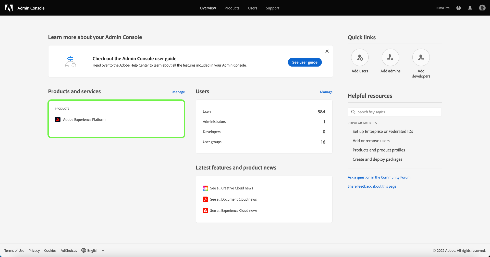

# 選取產品設定檔以管理其存取控制許可權

為了設定存取控制 [!DNL Experience Platform] 透過Adobe Admin Console，您必須是擁有訂閱之組織的管理員 [!DNL Experience Platform]. 雖然Adobe支援組織的彈性管理員階層，但您必須擁有系統管理員、產品管理員或產品設定檔管理員許可權，才能設定存取控制。 請參閱以下文章中的Adobe Help Center： [管理角色](https://helpx.adobe.com/enterprise/using/admin-roles.html) 以取得詳細資訊。

如果您沒有管理員許可權，請聯絡您的系統管理員以獲得存取權。

取得管理員許可權後，請前往 [Adobe Admin Console](https://adminconsole.adobe.com) 並使用您的Adobe憑證登入。 登入後， **[!UICONTROL 概觀]** 頁面會針對您擁有管理員許可權的組織顯示。 此頁面顯示您的組織已訂閱的產品，以及用於將使用者和管理者新增到整個組織的其他控制項。 選取 **[!UICONTROL Adobe Experience Platform]** 以開啟Platform整合的存取控制工作區。

Adobe Experience Platform的存取控制工作區隨即出現，並開啟於 **[!UICONTROL 產品設定檔]** 標籤。 此索引標籤可讓您檢視所有產品設定檔，並管理本檔案中概述的各種設定。

本使用手冊著重於說明如何使用 [!DNL Admin Console] 以指派Platform的存取許可權。 如需如何導覽的詳細一般資訊，請參閱 [!DNL Admin Console]，請參閱 [Admin Console使用手冊](https://helpx.adobe.com/tw/enterprise/using/admin-console.html).

## 後續步驟

在您導覽存取控制工作區後，請繼續進行下一個步驟： [建立新的產品設定檔](create-profile.md)
