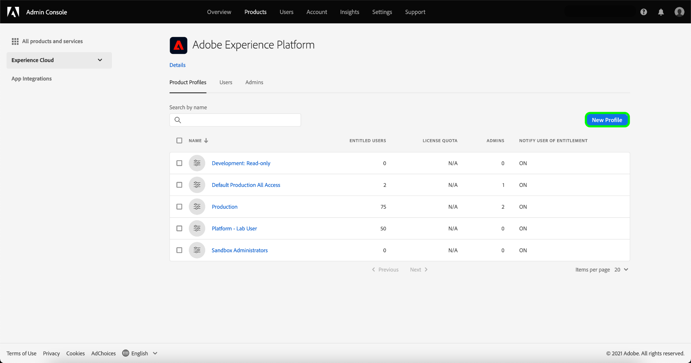

# 在Adobe Admin Console中建立新的產品設定檔

若要開始建立新設定檔，請導覽至 **[!UICONTROL 產品設定檔]** 索引標籤和選取 **[!UICONTROL 新設定檔]**.

此 **[!UICONTROL 建立新的產品設定檔]** 對話框，提示您輸入配置檔案、可選顯示名稱和可選說明。 在 **[!UICONTROL 使用者通知]**，您可以切換將使用者從設定檔新增或移除時，使用者是否會收到電子郵件通知。

完成後，請選取 **[!UICONTROL 下一個]**.

下一個畫面會提示您選擇要包含在設定檔中的平台服務。 選取服務旁的切換按鈕以加以停用。 如果停用服務，指派給此產品設定檔的使用者將無法使用與該服務相關聯的所有功能。 完成後，請選取 **[!UICONTROL 儲存]**.

有權使用B2B或B2P版本的客戶可存取B2B UI。 可透過 [!UICONTROL 啟用服務菜單]. 選取旁邊的切換 [!UICONTROL B2B UI] 為特定產品配置檔案啟用服務，然後選擇 **[!UICONTROL 儲存]**.

B2B UI切換可讓使用者檢視與管理帳戶和機會相關的B2B工作流程，以及建立B2B相關區段。 如需詳細資訊，請參閱 [[!DNL Adobe Real-Time Customer Data Platform B2B Edition]](../../rtcdp/b2b-overview.md).

新產品設定檔已成功建立，系統會將您重新導向至設定檔的 [編輯權限頁面](#edit-permissions). 請參閱 [管理權限](#manage-permissions-for-a-product-profile) 和 [管理使用者](#manage-users-for-a-product-profile) 如需建立產品設定檔後如何管理這些設定檔的詳細資訊。

## 後續步驟

建立新產品設定檔後，您可以繼續進行下一個步驟： [管理產品設定檔的權限](permissions.md)
