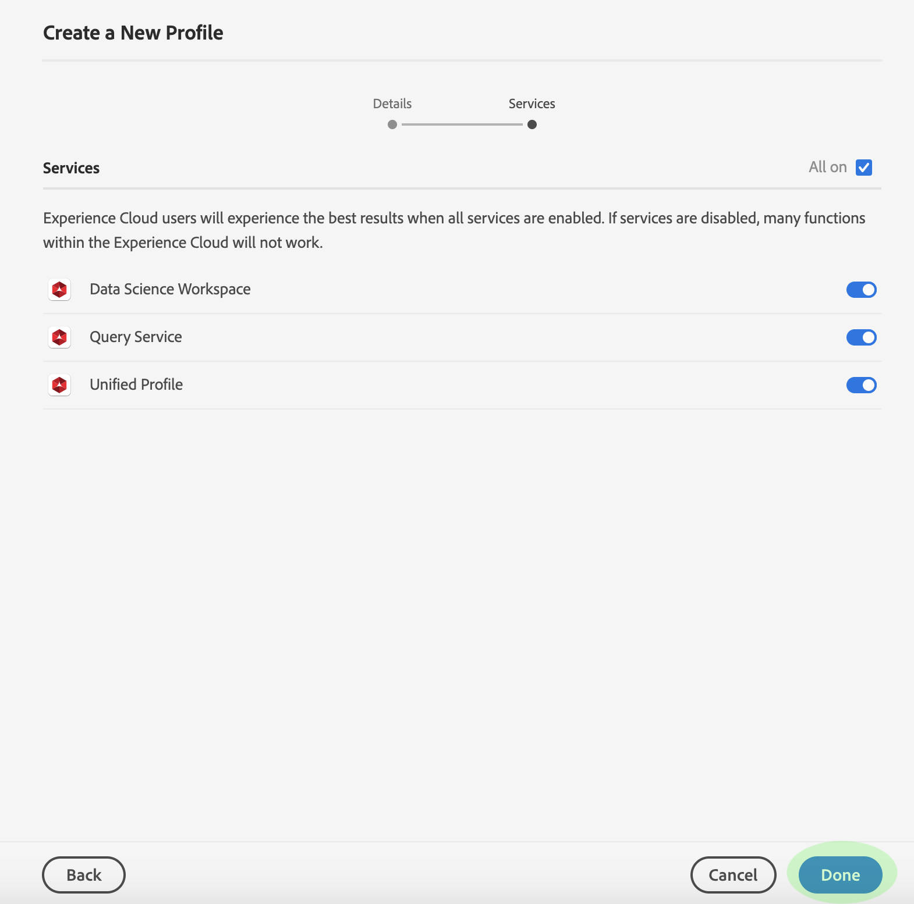

# 在Adobe Admin Console中建立新的產品設定檔

要開始建立新配置檔案，請導航至&#x200B;**[!UICONTROL 產品配置檔案]**&#x200B;頁籤，然後按一下&#x200B;**[!UICONTROL 新建配置檔案]**。

此時將顯示「建立新配置檔案」對話框，提示您輸入新配置檔案的配置檔案名稱和說明。 ****&#x200B;如果希望配置檔案的顯示名稱不同，請取消選中「與配置檔案名稱相同」**[!UICONTROL ，然後在顯示的文本框中輸入顯示名稱。]**&#x200B;在&#x200B;**[!UICONTROL 使用者通知]**&#x200B;下，您可以切換當使用者新增或從描述檔移除時，是否會收到電子郵件通知。

完成後，按一下&#x200B;**[!UICONTROL Next]**。

下一個螢幕提示您選擇要在配置式中包含的[!DNL Platform]服務。 按一下服務旁的切換按鈕以停用它。 如果服務被禁用，則與該服務關聯的所有功能將無法提供給分配給此產品配置檔案的用戶。 完成後，按一下&#x200B;**[!UICONTROL Done]**。

新產品描述檔已成功建立，您會重新導向至描述檔的[編輯權限頁面](#edit-permissions)。 請參閱[管理權限](#manage-permissions-for-a-product-profile)和[管理使用者](#manage-users-for-a-product-profile)的章節，以取得建立產品描述檔後如何管理的詳細資訊。

## 後續步驟

建立新的產品設定檔後，您可以繼續下一步至[管理產品設定檔的權限](permissions.md)