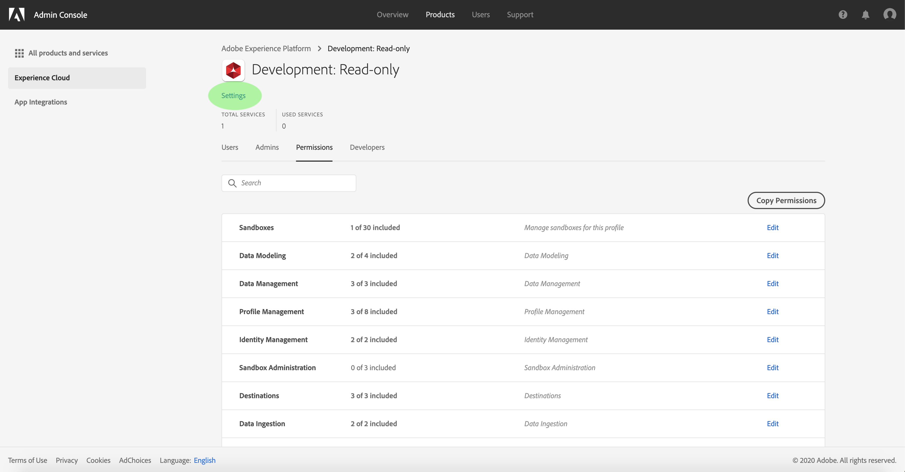

# 管理產品設定檔的詳細資訊和其他服務

您可以從&#x200B;**[!UICONTROL Profile Settings]**&#x200B;功能表中設定描述檔的詳細資訊並存取其他服務。 若要存取功能表，請從&#x200B;**[!UICONTROL Product Profile]**&#x200B;頁面按一下&#x200B;**[!UICONTROL Settings]**。

出現&#x200B;**[!UICONTROL Profile Settings]**&#x200B;菜單，從&#x200B;**[!UICONTROL Details]**&#x200B;頁籤開始。 此標籤可讓您輸入和編輯您的描述檔名稱和說明。 您也可以修改您帳戶的顯示名稱以及電子郵件通知設定。

按一下&#x200B;**[!UICONTROL Services]**&#x200B;訪問&#x200B;**[!UICONTROL Services]**&#x200B;頁。

**[!UICONTROL Services]**&#x200B;菜單允許您修改配置檔案對建立配置檔案時最初配置的其他[!DNL Platform]服務的訪問。 視您的[!DNL Platform]訂閱而定，這些服務可包含：

- [!DNL Data Science Workspace]
- [!DNL Query Service]
- [!DNL Real-Time Customer Data Platform] UI（僅用於即時CDP）

按一下特定服務右側的切換以啟用或禁用該服務。 您也可以按一下&#x200B;**[!UICONTROL All on]**&#x200B;核取方塊，以啟用或停用所有列出的服務。

完成後，按一下 **[!UICONTROL Save]**。

