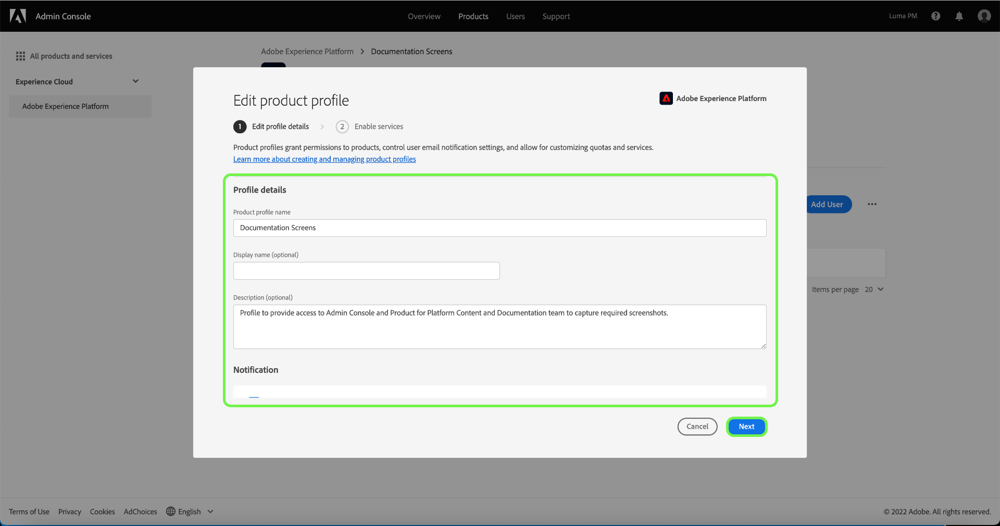

# 管理產品設定檔的詳細資訊和其他服務

您可以從&#x200B;**[!UICONTROL 設定檔設定]**&#x200B;功能表設定設定檔的詳細資訊並存取其他服務。 若要存取功能表，請從&#x200B;**[!UICONTROL 產品設定檔]**&#x200B;頁面選取&#x200B;**[!UICONTROL 設定]**。

從&#x200B;**[!UICONTROL Edit profile details]**&#x200B;標籤開始，將顯示「**[!UICONTROL 編輯產品配置檔案]**」菜單。 此索引標籤可讓您輸入及編輯設定檔名稱和說明。 您也可以修改您的顯示名稱以及帳戶的電子郵件通知設定。

選擇&#x200B;**[!UICONTROL Next]**&#x200B;以訪問&#x200B;**[!UICONTROL 啟用服務]**&#x200B;頁。

**[!UICONTROL 啟用服務]**&#x200B;菜單允許您修改配置檔案對最初建立配置檔案時配置的其他[!DNL Platform]服務的訪問。 根據您的[!DNL Platform]訂閱，這些服務可以包括：

- [!DNL Data Science Workspace]
- [!DNL Query Service]
- [!DNL Real-Time Customer Data Platform] UI（僅適用於Real-time CDP）
- B2B UI

按一下特定服務右側的切換按鈕，以啟用或停用它。 您也可以選取&#x200B;****&#x200B;上的全部核取方塊，以啟用或停用所有列出的服務。

完成後，選擇&#x200B;**[!UICONTROL Save]**。

有權使用B2B或B2P版本的客戶可存取B2B UI。 可透過[!UICONTROL 啟用服務功能表]為使用者布建B2B UI。 選取[!UICONTROL B2B UI]旁的切換按鈕，以啟用特定產品設定檔的服務，然後選取&#x200B;**[!UICONTROL 儲存]**。

B2B UI切換可讓使用者檢視與管理帳戶和機會相關的B2B工作流程，以及建立B2B相關區段。 如需詳細資訊，請參閱[[!DNL Real-time Customer Data Platform B2B Edition]](../../rtcdp/b2b-overview.md)上的檔案。

