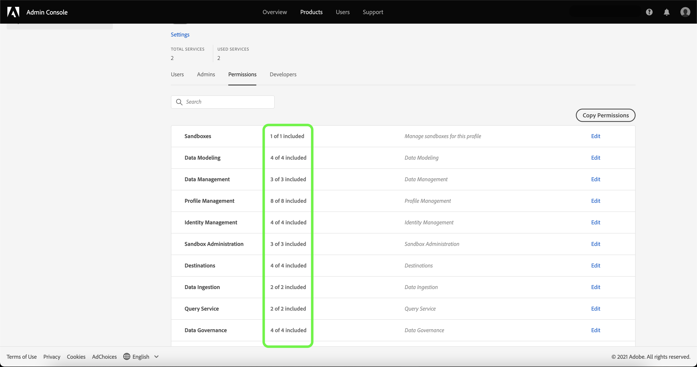

# 管理產品設定檔的許可權

在[建立新的產品設定檔](#create-a-new-product-profile)之後，會立即提示您設定設定檔的許可權。 如果您正在編輯現有設定檔的許可權，請從&#x200B;**[!UICONTROL 產品設定檔]**&#x200B;標籤中選取設定檔，以開啟設定檔的詳細資訊頁面，然後選取&#x200B;**[!UICONTROL 許可權]**。

許可權分為不同類別，並列於本頁面。 清單會顯示類別名稱、其包含的許可權數（以及有效數量）及其說明。 請參考[資源許可權](/help/access-control/home.md#permissions)中的表格，瞭解每個角色可用的許可權劃分。

在清單中選取任何類別以開啟&#x200B;**[!UICONTROL 編輯許可權]**&#x200B;頁面。

**[!UICONTROL 編輯許可權]**&#x200B;頁面提供工作區，可在選取的產品設定檔中新增及移除許可權。 畫面左側會顯示許可權類別的清單。 選取類別會變更&#x200B;**[!UICONTROL 可用許可權專案]**&#x200B;下顯示的許可權。

例如，若要更新「資料模型」的許可權，請選取&#x200B;**[!UICONTROL 資料模型]**。

若要新增許可權，請選取許可權名稱旁的加號&#x200B;**(+)**&#x200B;圖示。 或者，您可以選取&#x200B;**[!UICONTROL 全部新增]**，以將目前類別下的所有許可權新增至設定檔。 新增的許可權會顯示在&#x200B;**[!UICONTROL 包含的許可權專案]**&#x200B;下。

>[!NOTE]
>
>**[!UICONTROL 包含的許可權專案]**&#x200B;清單只會顯示目前所選類別的新增許可權。

若要移除許可權，請選取許可權名稱旁的&#x200B;**X**&#x200B;圖示，或選取&#x200B;**[!UICONTROL 全部移除]**&#x200B;以移除目前類別下的所有許可權。 已移除的許可權會重新出現在&#x200B;**[!UICONTROL 可用的許可權專案]**&#x200B;下。

繼續瀏覽可用類別並新增任何所需許可權。 完成後，選取&#x200B;**[!UICONTROL 儲存]**。

產品設定檔的&#x200B;**[!UICONTROL 許可權]**&#x200B;索引標籤會重新出現，並顯示選取的許可權現在為使用中。

## 後續步驟

建立許可權後，您可以繼續下一步以[管理產品設定檔的詳細資料和服務](details-and-services.md)
