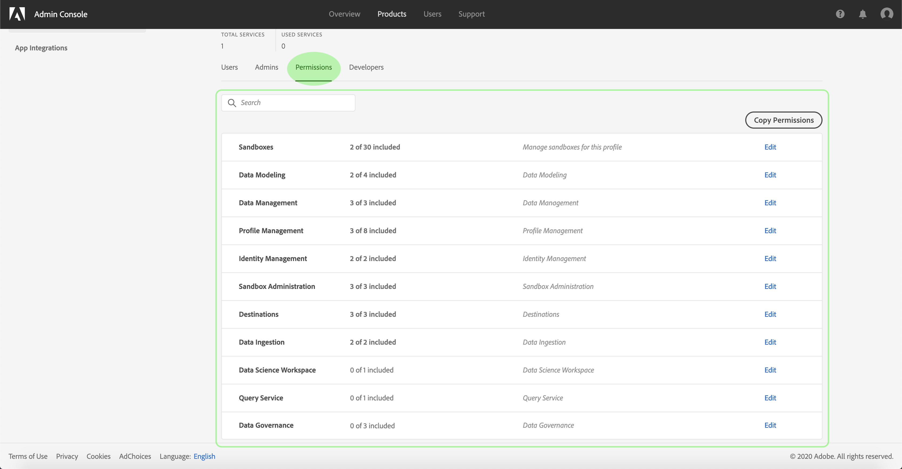

# 管理產品設定檔的權限

在[建立新產品描述檔](#create-a-new-product-profile)後，系統會提示您設定描述檔的權限。 如果要編輯現有配置檔案的權限，請從&#x200B;**[!UICONTROL Product Profiles]**&#x200B;頁籤中選擇配置檔案以開啟配置檔案的詳細資訊頁面，然後按一下&#x200B;**[!UICONTROL Permissions]**。

權限分為類別並列在本頁。 清單會顯示類別名稱、其包含的權限數目（以及作用中的權限數目）及其說明。

在清單中選擇任何類別以開啟&#x200B;**[!UICONTROL Edit Permissions]**&#x200B;頁。

**[!UICONTROL Edit Permissions]**&#x200B;頁面提供工作區，以新增和移除所選產品設定檔的權限。 畫面的左側會顯示權限類別清單。 選擇類別會變更顯示在&#x200B;**[!UICONTROL Available Permissions Items]**&#x200B;下方的權限。

若要新增權限，請選取權限名稱旁的&#x200B;**加號(+)**&#x200B;圖示。 或者，您可以選擇&#x200B;**[!UICONTROL Add all]**&#x200B;將當前類別下的所有權限添加到配置檔案中。 新增的權限會顯示在&#x200B;**[!UICONTROL Included Permission Items]**&#x200B;下方。

>[!NOTE]
>
>**[!UICONTROL Included Permissions Items]**&#x200B;清單只會顯示目前選取類別中新增的權限。

要刪除權限，請選擇權限名稱旁的&#x200B;**X**&#x200B;表徵圖，或選擇&#x200B;**[!UICONTROL Remove all]**&#x200B;以刪除當前類別下的所有權限。 移除的權限會重新出現在&#x200B;**[!UICONTROL Available Permission Items]**&#x200B;下。

繼續檢視可用類別，並新增任何所需的權限。 完成後，選擇&#x200B;**[!UICONTROL Save]**。

產品設定檔的&#x200B;**[!UICONTROL Permissions]**&#x200B;標籤會重新出現，並顯示選取的權限現在已啟用。

## 後續步驟

在建立權限後，您可以繼續下一步，以[管理產品設定檔的詳細資訊和服務](details-and-services.md)
