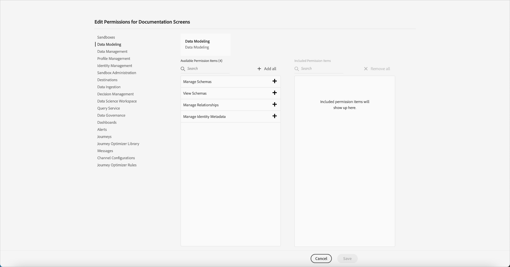

# 管理產品設定檔的權限

建立新 [產品描述檔後](#create-a-new-product-profile)，會立即提示您設定描述檔的權限。 如果您正在編輯現有配置式的權限，請從「產品配置式」頁籤中選擇該配置式以開啟配置式的詳細資訊頁面，然後按一下「 *權限」*****。

權限分為類別並列在本頁。 清單會顯示類別名稱、其包含的權限數目（以及作用中的權限數目）及其說明。

按一下清單上的任何類別，以開啟「編 *輯權限* 」頁面。

「編 *輯權限* 」頁面提供工作區，以新增和移除所選產品設定檔的權限。 畫面的左側會顯示權限類別清單。 按一下類別會變更「可用權限項目」下方 *顯示的權限*。

若要新增權限，請按一 **下權限名稱旁的加號(+)** 圖示。 或者，您也可以按一 **下「全部新增** 」，將目前類別下的所有權限新增至描述檔。 新增的權限會顯示在「已包含 *的權限項目」下*。

>[!NOTE] 「包 *含的權限項目* 」清單只會顯示目前選取類別中新增的權限。

若要移除權限，請按一下權限名稱旁的 **X** 圖示，或選取「全部移除 **** 」以移除目前類別下的所有權限。 移除的權限會重新出現在「可 *用權限項目」下*。

繼續檢視可用類別，並新增任何所需的權限。 完成時，按一下&#x200B;**「儲存」**。

產品 *設定檔的* 「權限」標籤會重新出現，並顯示選取的權限現在已啟用。

## 後續步驟

在建立權限後，您可以繼續下一步，以管 [理產品設定檔的詳細資訊和服務](details-and-services.md)