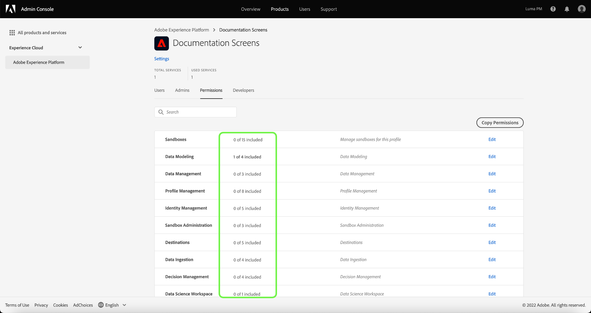

# 管理產品設定檔的權限

緊接在 [建立新產品設定檔](#create-a-new-product-profile)，系統會提示您設定設定檔的權限。 如果您正在編輯現有設定檔的權限，請從 **[!UICONTROL 產品設定檔]** 頁簽以開啟設定檔的詳細資訊頁面，然後選取 **[!UICONTROL 權限]**.

權限分為類別，並列於本頁。 清單會顯示類別名稱、其包含的權限數（以及作用中的權限數）及其說明。

在清單中選取任何類別以開啟 **[!UICONTROL 編輯權限]** 頁面。

此 **[!UICONTROL 編輯權限]** 「 」頁面提供工作區，可從選取的產品設定檔新增和移除權限。 畫面左側會顯示權限類別清單。 選取類別會變更下方顯示的權限 **[!UICONTROL 可用權限項目]**.

例如，若要更新資料模型的權限，請選取 **[!UICONTROL 資料模型]**.

若要新增權限，請選取加號 **(+)** 表徵圖。 或者，您也可以選取 **[!UICONTROL 全部新增]** 將目前類別下的所有權限新增至設定檔。 新增的權限會顯示在 **[!UICONTROL 包含的權限項目]**.

>[!NOTE]
>
>此 **[!UICONTROL 包含的權限項目]** 清單只會顯示目前所選類別中新增的權限。

若要移除權限，請選取 **X** 表徵圖，或選擇 **[!UICONTROL 全部移除]** 移除目前類別下的所有權限。 移除的權限會重新出現在 **[!UICONTROL 可用權限項目]**.

繼續檢視可用類別，並新增任何需要的權限。 完成後，請選取 **[!UICONTROL 儲存]**.

此 **[!UICONTROL 權限]** 頁簽，此時產品設定檔會重新顯示，並顯示所選權限現在處於作用中狀態。

## 後續步驟

建立權限後，您可以繼續進行下一個步驟： [管理產品設定檔的詳細資訊和服務](details-and-services.md)
