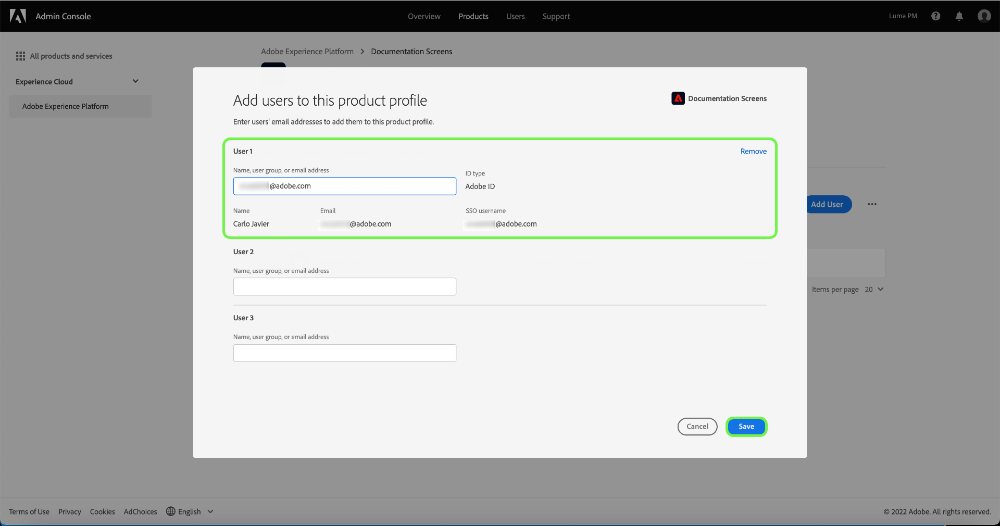

# 管理產品設定檔的使用者

若要從產品設定檔指派或移除使用者，請開啟設定檔的詳細資訊頁面，並導覽至 **[!UICONTROL 使用者]** 標籤。 從此處，選擇 **[!UICONTROL 添加用戶]**.

此 **[!UICONTROL 添加用戶]** 對話框。 使用搜尋欄位，您可以查詢使用者，以依名稱或電子郵件新增。 當您鍵入時，匹配的用戶將出現在文本框下的自動完成窗口中。

>[!NOTE]
>
>如果用戶未出現在自動完成窗口中，請在搜索欄中輸入其完整的電子郵件地址。 系統會傳送邀請至電子郵件，附上設定Adobe ID帳戶的指示。

選取使用者後，請選取 **[!UICONTROL 儲存]** 將其新增至產品設定檔。

## 後續步驟

現在，您已了解如何透過 [!DNL Admin Console]，請參閱 [存取控制概觀](../home.md) 深入了解其所存取的每個個人權限和Platform功能。
