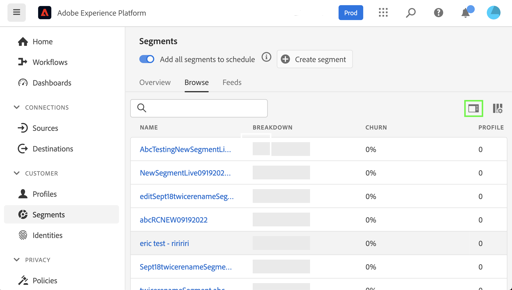

# 針對Experience Platform的自訂協助工具解決方案

Adobe Experience Platform不斷得到增強，以滿足所有類型用戶的需求，並遵守包括視覺、聽覺、移動性或其他損傷個人在內的全球標準。 本檔案概述Experience Platform使用者介面中的自訂協助工具解決方案。

## 首頁和UI概述

Experience Platform用戶介面滿足普通文本、圖形和UI元件所需的對比度。 使用者介面的顏色也已選擇，以支援所有使用者的協助工具，包括視覺障礙使用者。

在Platform中，可點按或透過指標操作的UI元素也可使用鍵盤來參與。 這包括左側導覽、視訊播放器、表格等。

Experience Platform致力達到國際無障礙標準，包括網頁內容無障礙指引2.1 A級和AA級，以及網頁無障礙計畫 — 無障礙網際網路應用程式(WAI-ARIA)網頁標準。

## 左側導覽

Experience PlatformUI中的左側導覽可供鍵盤存取，且在一般、暫留和選取狀態中提供符合協助工具標準的色彩對比。

從主畫面，使用者可以在左側導覽中進行標籤。 選取 **Shift + Tab** 將用戶返回到主螢幕。

在左側導航處於焦點時， **標籤** 將使用者帶至展開和折疊互動。 展開或折疊左側導覽的功能會以 **輸入（返回）**.

在左側導航處於焦點中時，向上和向下箭頭鍵將導航到導航中的每個項目並連續循環（換句話說，在用戶頁簽遠離左側導航之前，焦點不會移開）。 選取時，會針對導覽項目顯示焦點。 當前選項將以突出顯示和粗體文本顯示。 選取左側導覽項目時， **輸入（返回）** 會在右側面板中開啟選取的UI項目，不過，在使用者索引標籤消失前，焦點仍會保留在左側導覽中。

Platform中的部分功能並未針對所有使用者啟用。 這些項目會顯示在導覽中，但無法選取。 使用鍵盤導覽時，箭頭導覽期間會略過這些項目，且無法使用 **輸入（返回）**.

## 內嵌視訊對話方塊

使用鍵盤導覽來反白標示並選取可用的視訊連結，即可在Experience Platform內檢視視訊。 這會開啟Platform UI中的內嵌視訊對話方塊。

## 視頻對話框鍵盤輔助工具

您也可以使用鍵盤導覽內嵌視訊對話方塊。 下表概述了嵌入式視頻對話框中可用的完整鍵盤導航。

| 對話方塊元素 | 鍵盤協助工具 | 說明 |
|---|---|---|
| 播放和暫停 | 標籤 空格鍵 | 使用 **標籤** 來設定「觀看」按鈕。 **空格鍵** 開始視訊播放及暫停視訊播放。 |
| 洗滌器 | 標籤 左箭頭 右箭頭 | 播放視訊時，請使用 **標籤** 聚焦洗滌器。 在清洗器正在聚焦的情況下， **向左鍵和向右鍵** 分別提前和後5秒跳過視頻播放。 |
| 靜音 | 標籤 空格鍵 | 使用 **標籤** 來聚焦靜音音量元素。 使用 **空格鍵** 靜音或取消靜音視訊播放。 |
| 卷 | 標籤 左箭頭 右箭頭 | 使用 **標籤** 聚焦於音量元素。 **向左和向右方向鍵** 分別上下移動卷。 |
| [!UICONTROL 隱藏式字幕] (&quot;cc&quot;) | 標籤 輸入 向上鍵 向下箭頭 | **標籤** to [!UICONTROL 隱藏式字幕] (「cc」)元素。 使用 **輸入** 開啟菜單， **向上鍵和向下鍵** 來選擇標題的語言。 **輸入** 確認您的選擇。 |
| [!UICONTROL 品質] | 標籤 輸入 向上鍵 向下箭頭 | 使用 **標籤** 聚焦 [!UICONTROL 品質] 元素。 使用 **輸入** 以開啟功能表和 **向上鍵和向下鍵** 來選取視訊品質。 **輸入** 確認您的選擇。 |
| 全螢幕 | 標籤 空格鍵或Enter 逸出 | 使用 **標籤** 聚焦全螢幕元素。 使用 **空格鍵或Enter** 啟用全螢幕檢視。 **逸出** (「esc」)退出全螢幕模式。 |
| 關閉 | 標籤 空格鍵或Enter | 使用 **標籤** 來聚焦關閉按鈕。 使用 **空格鍵或Enter** 鍵退出視訊對話方塊。 |

>[!NOTE]
>
>播放期間，隨時都可使用逸出(&quot;esc&quot;)鍵來關閉內嵌的視訊對話方塊。

## 檔案拖放

在Experience Platform中，所有檔案選取拖放區域都可鍵盤存取。 使用 **標籤** 加亮 **[!UICONTROL 選擇檔案]** 和使用 **輸入或空格鍵** 要選擇，將調用作業系統的檔案選擇UI。

上傳檔案後，刪除圖示會變成鍵盤導覽，以移除選取的檔案並上傳新檔案。 使用者可使用 **標籤** 將焦點放在刪除圖示和 **輸入或空格鍵** 來選取。 移除檔案後， **[!UICONTROL 選擇檔案]** 會自動在焦點中且可供選取。

或者，如果上傳的檔案格式不正確，則會顯示錯誤圖示以及錯誤訊息，且 **[!UICONTROL 選擇檔案]** 按鈕在焦點中且可選取。

使用滑鼠來選擇拖放區域也會調用檔案選擇UI，或者滑鼠用戶可以選擇檔案並拖動到區域以開始上載。

## 表瀏覽

Experience Platform用戶介面中的所有表均可鍵盤訪問。 您可以透過一系列鍵盤快速鍵來瀏覽及與表格列和欄互動：

* 在表格標題中，使用 **向下箭頭** 來瀏覽表格。 透過導覽時，可選取表格標題 **標籤**，而您可以使用 **空格鍵**.
* **向上和向下箭頭鍵** 上下移動表格中的列。
* 選取列或觀看中時，請使用 **輸入** 列上的右側邊欄提供詳細資料。
* 選取或觀看中的列時，請使用 **箭頭鍵** 來移動行中的每個項。
* 使用 **輸入** 來選擇行中的項。 如果必須開啟新視窗，系統會提醒螢幕助讀程式的使用者。
* 當您縮放至200%或以上時，您會看到 **邊欄檢查器** 圖示，以便為表格提供更多檢視空間。

### 瀏覽表鍵盤輔助工具

| 鍵盤協助工具 | 說明 |
|---|---|
| HOME（函式+左箭頭） | 聚焦行時，會將用戶帶到行中的第一個項 |
| END（函式+向右箭頭） | 聚焦行時，會將用戶帶到行中的最後一個項 |
| 向上頁面 | 往表格中的10列遍歷（每頁） |
| 向下頁面 | 向下遍歷表中的10行（每頁） |
| Control + HOME | 移至表格中的第一列 |
| Control + END | 轉至每頁表中的第一個 |

## 結構編輯器UI

可透過下列功能存取結構編輯器UI:

* 架構編輯器支援鍵盤導覽，包括使用 **標籤** 來導覽UI元素。
* **標籤** 輸入搜索欄位，然後進入架構樹。
* 架構樹支援使用箭頭鍵瀏覽架構樹UI
   * **向上和向下箭頭** 可以用來遍歷樹。
   * **向左和向右箭頭** 可用來展開和折疊節點，或在架構樹上的內嵌動作之間移動。
* **輸入（返回）** 在右側的詳細資訊面板中激活單個節點詳細資訊。
* 此 **首頁** 鍵返回樹的頂部。
* 此 **結束** 鍵導航到樹底部。
* 結構樹還包含螢幕閱讀器的ARIA標籤。

## 區段產生器UI

使用區段產生器UI來建立、編輯Experience Platform內的區段並與之互動時，下列功能可改善協助工具：

* 您可透過鍵盤導覽存取區段產生器UI。
* 螢幕助讀程式應可辨識標題的標籤標籤，並可隨其層級宣佈標題。
* 其他輔助技術可使用適當編碼的標題來顯示大綱或替代視圖，來變更頁面的視覺顯示。

您現在可以折疊或展開區段產生器畫布的左右側邊欄，以獲得更多螢幕空間。 此功能特別實用，因為它提供200%縮放的完整功能。

## 查詢服務編輯器

查詢服務編輯器提供下列協助工具功能：

* 查詢服務編輯器UI中的色彩對比符合協助工具規範。
* 編輯器UI外部支援鍵盤導覽。 編輯器UI是內嵌的程式碼鏡像。

## 來源和目標中的「系統檢視」標籤

瀏覽 **[!UICONTROL 系統視圖]** 在來源和目的地中，下列功能可改善協助工具：

* **標籤** 將焦點設定在第一源連接卡上
   * **標籤** 再次將焦點放在卡片內的按鈕上
   * 選擇 **輸入** 啟用卡片內的「呼叫動作」按鈕
* 選取 **輸入** 在「連線」卡上也會在右側邊欄中啟用更多詳細資訊
   * 啟動右側邊欄時，焦點會設為該區域。 **標籤** 聚焦 **關閉** ，即可取得Advertising Cloud的說明。 選取 **標籤** 再次透過右側邊欄面板移動焦點
   * 如果有多個源連接卡， **標籤** 在連接中移動
   * 使用 **方向鍵（上、下、左和右）** 在源清單中移動
   * 選擇 **標籤** 將焦點設定在右側邊欄面板
