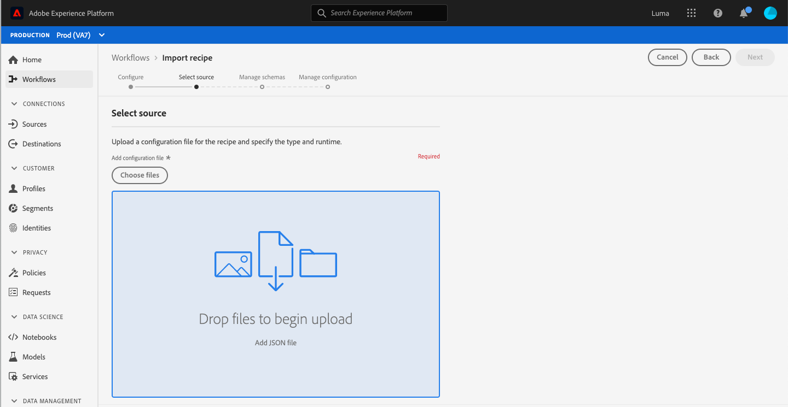

# 定製的輔助功能解決方案，用於Experience Platform

Adobe Experience Platform不斷得到增強，以滿足所有類型用戶的需求，並遵守包括視覺、聽覺、移動性或其他損傷者在內的全球標準。 本文檔概述了Experience Platform用戶介面中的自定義輔助功能解決方案。

## 首頁和UI概述

Experience Platform用戶介面滿足普通文本、圖形和UI元件所需的對比度。 還選擇了用戶介面的顏色，以支援包括視覺殘疾用戶在內的所有用戶的無障礙。

在平台中，還可以使用鍵盤來啟用可按一下或可操作的UI元素。 這包括左側導航、視頻播放器、表格等。

Experience Platform努力達到國際無障礙標準，包括Web內容無障礙准則2.1 A級和AA級和Web無障礙倡議 — 無障礙富網際網路應用(WAI-ARIA)Web標準。

## 左側導覽

Experience PlatformUI中的左導航可以使用鍵盤，並在符合輔助功能標準的正常、懸停和選擇狀態中提供顏色對比度。

在「首頁」螢幕中，用戶可以在左側導航中開啟標籤。 選擇 **Shift +頁籤** 將用戶返回到「首頁」螢幕。

左側導航聚焦後， **頁籤** 引導用戶進行展開和折疊交互。 將激活擴展或折疊左導航的功能 **輸入（返回）**。

在左導航處於焦點中時，向上和向下箭頭鍵將導航到導航中的每個項目並連續循環（換句話說，在用戶頁籤遠離左導航之前，焦點不會移開）。 選中時，將顯示導航項的焦點。 當前所選內容將顯示加亮和粗體文本。 選擇左導航項時， **輸入（返回）** 在右面板中開啟選定的UI項，但焦點仍保留在左導航中，直到用戶頁籤消失。

平台中的某些功能未為所有用戶啟用。 這些項目顯示在導航中，但無法選擇。 使用鍵盤導航時，箭頭導航期間會跳過這些項目，無法使用 **輸入（返回）**。

## 嵌入式視頻對話框

通過使用鍵盤導航來突出顯示和選擇可用視頻連結，可以在Experience Platform中查看視頻。 這將開啟平台UI中的嵌入式視頻對話框。

## 視頻對話框鍵盤輔助功能

還可以使用鍵盤導航嵌入的視頻對話框。 下表概述了嵌入式視頻對話框中可用的完整鍵盤導航。

| 對話框元素 | 鍵盤協助工具 | 說明 |
|---|---|---|
| 播放和暫停 | 頁籤 空格鍵 | 使用 **頁籤** 來設定播放按鈕的焦點。 **空格鍵** 開始視頻播放並暫停視頻播放。 |
| 洗滌器 | 頁籤 左箭頭 右箭頭 | 播放視頻時，使用 **頁籤** 聚焦洗滌器。 隨著洗滌器的聚焦， **左箭頭鍵和右箭頭鍵** 分別提前和後5秒跳過視頻播放。 |
| 靜音 | 頁籤 空格鍵 | 使用 **頁籤** 來聚焦靜音體元素。 使用 **空格鍵** 靜音或取消靜音視頻播放。 |
| 卷 | 頁籤 左箭頭 右箭頭 | 使用 **頁籤** 來關注體積塊元素。 **左右箭頭鍵** 分別上下移動卷。 |
| [!UICONTROL 隱藏字幕] (&quot;cc&quot;) | 頁籤 輸入 上箭頭 向下箭頭 | **頁籤** 至 [!UICONTROL 隱藏字幕] (「cc」)元素。 使用 **輸入** 開啟菜單， **上下箭頭鍵** 的子菜單。 **輸入** 確認您的選擇。 |
| [!UICONTROL 質量] | 頁籤 輸入 上箭頭 向下箭頭 | 使用 **頁籤** 聚焦 [!UICONTROL 質量] 的子菜單。 使用 **輸入** 開啟菜單， **上下箭頭鍵** 選擇視頻質量。 **輸入** 確認您的選擇。 |
| 全屏 | 頁籤 空格鍵或Enter 逃生 | 使用 **頁籤** 聚焦全屏元素。 使用 **空格鍵或Enter** 以激活全屏視圖。 **逃生** (「esc」)退出全屏模式。 |
| 關閉 | 頁籤 空格鍵或Enter | 使用 **頁籤** 按鈕。 使用 **空格鍵或Enter** 鍵退出視頻對話框。 |

>[!NOTE]
>
>在回放期間的任何時間，都可以使用轉義(「esc」)鍵關閉嵌入的視頻對話框。

## 檔案拖放

在Experience Platform中，所有檔案選擇拖放區域都可以通過鍵盤訪問。 使用 **頁籤** 加亮 **[!UICONTROL 選擇檔案]** 使用 **輸入或空格鍵** 調用作業系統的檔案選擇UI。

上載檔案後，刪除表徵圖將變為可鍵盤導航的，以刪除所選檔案並上載新檔案。 用戶可以使用 **頁籤** 以關注刪除表徵圖和 **輸入或空格鍵** 來修改標籤元素的屬性。 檔案被刪除後， **[!UICONTROL 選擇檔案]** 自動處於焦點中，並且能夠被選中。

或者，如果上載的檔案的格式不正確，則會顯示錯誤表徵圖以及錯誤消息， **[!UICONTROL 選擇檔案]** 按鈕處於焦點中且可選。

使用滑鼠選擇拖放區域還會調用檔案選擇UI，或者滑鼠用戶可以選擇檔案並拖到區域開始上載。

## 表瀏覽

Experience Platform用戶介面中的所有表都可通過鍵盤訪問。 通過一系列鍵盤快捷鍵，可以瀏覽和與表行和列交互：

* 在表標題中，使用 **向下箭頭** 按鈕。 通過導航時可選擇表頭 **頁籤**，並且可以使用 **空格鍵**。
* **上下箭頭鍵** 在表格的行中上下移動。
* 選擇行或焦點時，使用 **輸入** 右欄上提供了詳細資訊。
* 選擇行或焦點時，使用 **箭頭鍵** 以在行中的每個項中移動。
* 使用 **輸入** 框中，選擇「預設值」。 如果必須開啟新窗口，則會向具有螢幕閱讀器的用戶發出警報。
* 當縮放到200%或更多時，您可以看到 **軌道檢查器** 表徵圖，以為表格提供更多的查看空間。

### 瀏覽表鍵盤輔助功能

| 鍵盤協助工具 | 說明 |
|---|---|
| HOME（函式+左箭頭） | 聚焦行時，將用戶帶到行中的第一個項 |
| END（函式+右箭頭） | 聚焦行時，將用戶帶到行中的最後一個項 |
| 上頁 | 向上遍歷表中的10行（每頁） |
| 向下頁 | 向下遍歷表中的10行（每頁） |
| 控制項+首頁 | 轉到表中的第一行 |
| 控制項+結束 | 轉到每頁表中的第一個工作 |

## 架構編輯器UI

可通過以下功能訪問架構編輯器UI:

* 架構編輯器支援鍵盤導航，包括使用 **頁籤** 導航到UI元素。
* **頁籤** 輸入搜索欄位，然後進入架構樹。
* 架構樹支援使用箭頭鍵在架構樹UI中導航
   * **上箭頭和下箭頭** 可以用來遍歷樹。
   * **左箭頭和右箭頭** 可用於展開和折疊節點或在架構樹上的內聯操作之間移動。
* **輸入（返回）** 在右側的詳細資訊面板中激活各個節點詳細資訊。
* 的 **首頁** 鍵返回樹的頂部。
* 的 **結束** 鍵導航到樹的底部。
* 模式樹還包括螢幕閱讀器的ARIA標籤。

## 段生成器UI

使用段生成器UI建立、編輯和與Experience Platform內的段交互時，以下功能可提高可訪問性：

* 可通過鍵盤導航訪問段生成器UI。
* 螢幕閱讀器應識別標題的標籤標籤，並可以宣佈標題及其級別。
* 其他輔助技術可以更改頁面的視覺顯示，使用正確編碼的標題來顯示大綱或替代視圖。

現在，您可以折疊或展開段生成器畫布的左滑軌和右滑軌，以獲得更多螢幕空間。 此功能特別有用，因為它在200%縮放時提供了全功能功能。

## 查詢服務編輯器

「查詢服務」編輯器中提供了以下輔助功能：

* 查詢服務編輯器UI中的顏色對比度符合輔助功能要求。
* 編輯器UI外部支援鍵盤導航。 編輯器UI是嵌入式代碼鏡像。

## 源和目標中的「系統視圖」頁籤

瀏覽 **[!UICONTROL 系統視圖]** 在源和目標中，以下功能可提高可訪問性：

* **頁籤** 將焦點放在第一源連接卡上
   * **頁籤** 再次聚焦卡內的按鈕
   * 選擇 **輸入** 激活卡內的「呼叫操作」按鈕
* 選擇 **輸入** 在連接卡上還會在右欄中激活更多詳細資訊
   * 當激活右滑軌時，焦點被設定到該區域。 **頁籤** 重點 **關閉** 右欄窗格。 選擇 **頁籤** 再次將焦點移過右滑軌面板
   * 如果有多個源連接卡， **頁籤** 穿過連接
   * 使用 **箭頭鍵（上、下、左和右）** 在源清單中移動
   * 選擇 **頁籤** 將焦點設定在右滑軌面板上
