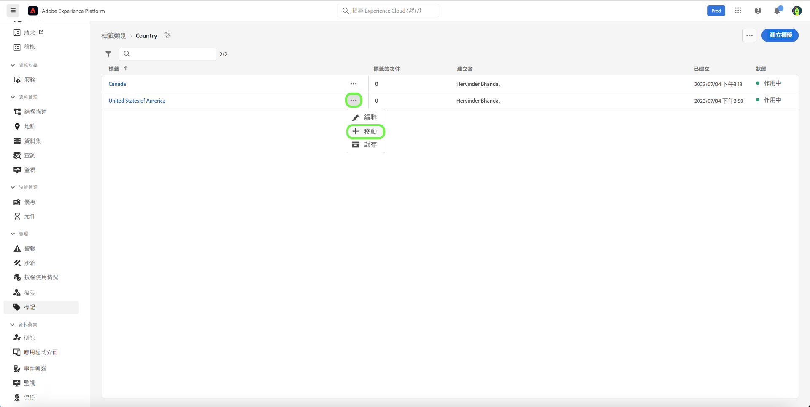

# 管理標籤指南

標籤允許您管理元資料分類，以便對業務對象進行分類，以便更輕鬆地發現和分類。 標籤有助於識別團隊將處理之對象的重要分類屬性，讓他們能更快速找到對象，也能跨描述元將共同對象分組。 您應該識別常見的標籤類別，例如地理區域、業務單位、產品線、專案、團隊、時間範圍（季度、月份、年份），或其他有助於為您的團隊套用意義並簡化受眾探索的項目。 

## 建立標籤 {#create-tag}

若要建立新標籤，請選取 **[!UICONTROL 標籤]** 在左側導覽中，然後選取所需的標籤類別。

選擇 **[!UICONTROL 建立標籤]** 來建立新標籤。

此 **[!UICONTROL 建立標籤]** 對話框，提示您輸入唯一的標籤名稱。 完成後，請選擇 **[!UICONTROL 儲存]**.

新標籤會成功建立，系統會將您重新導向至標籤畫面，此時您會看到新建立的標籤出現在清單中。

## 編輯標籤 {#edit-tag}

當拼寫錯誤、命名慣例更新或術語更新時，編輯標籤有幫助。 編輯標籤會維持標籤與目前套用之任何物件的關聯。

若要編輯現有標籤，請在標籤類別清單中選取省略號(`...`)。 下拉式清單會顯示可編輯、移動或封存標籤的控制項。 選擇 **[!UICONTROL 編輯]** 中。

此 **[!UICONTROL 編輯標籤]** 對話框，提示您編輯標籤名稱。 完成後，請選擇 **[!UICONTROL 儲存]**.

標籤名稱已成功更新，系統會將您重新導向至標籤畫面，您會在畫面中看到更新後的標籤出現在清單中。

## 在類別之間移動標籤 {#move-tag}

標籤可移至其他標籤類別。 移動標籤將維持標籤與目前套用標籤的任何物件的關聯。

若要移動現有標籤，請在標籤類別清單中選取省略號(`...`)。 下拉式清單會顯示可編輯、移動或封存標籤的控制項。 選擇 **[!UICONTROL 編輯]** 中。

此 **[!UICONTROL 移動標籤]** 對話框，提示您選擇應將選定標籤移入的標籤類別。

您可以捲動並從清單中選取，或者使用搜索功能輸入類別名稱。 完成後，請選擇 **[!UICONTROL 移動]**.

標籤已成功移動，系統會將您重新導向至標籤畫面，畫面會顯示更新的標籤清單，而標籤不再出現。

標籤現在會出現在先前選取的標籤類別中。

## 封存標籤 {#archive-tag}

標籤的狀態可在使用中和封存之間切換。 封存的標籤不會從已套用的物件中移除，但無法再套用至新物件。 對於每個標籤，所有對象中都會反映相同的狀態。 如果您想要維持目前的標籤物件關聯，但不想日後使用標籤，這個方法就特別實用。

若要封存現有標籤，請在標籤類別清單中選取省略號(`...`)。 下拉式清單會顯示可編輯、移動或封存標籤的控制項。 選擇 **[!UICONTROL 封存]** 中。

此 **[!UICONTROL 封存標籤]** 對話框，提示您確認標籤存檔。 選擇 **[!UICONTROL 封存]**.

標籤已成功封存，系統會將您重新導向至標籤畫面。 您現在會看到更新的標籤清單，將標籤的狀態顯示為 `Archived`.

## 還原已封存的標籤 {#restore-archived-tag}

如果您想要套用 `Archived` 標籤至新物件時，標籤必須位於 `Active` 狀態。 還原封存的標籤會將標籤傳回至 `Active` 狀態。

若要還原已封存的標籤，請在標籤類別清單中選取省略號(`...`)。 下拉式清單會顯示用以還原或刪除標籤的控制項。 選擇 **[!UICONTROL 還原]** 中。

此 **[!UICONTROL 還原標籤]** 對話框，提示您確認標籤還原。 選擇 **[!UICONTROL 還原]**.

標籤已成功還原，系統會將您重新導向至標籤畫面。 您現在會看到更新的標籤清單，將標籤的狀態顯示為 `Active`.

## 刪除標籤 {#delete-tag}

>[!NOTE]
>
>只有 `Archived` 可以刪除狀態和未與任何對象關聯。

刪除標籤會將其從系統中完全移除。

若要刪除已封存的標籤，請在標籤類別清單中選取省略號(`...`)。 下拉式清單會顯示用以還原或刪除標籤的控制項。 選擇 **[!UICONTROL 刪除]** 中。

此 **[!UICONTROL 刪除標籤]** 對話框，提示您確認標籤刪除。 選取「**[!UICONTROL 刪除]**」。

已成功刪除標籤，系統會將您重新導向至標籤畫面。 標籤不再出現在清單中，且已完全移除。

## 查看標籤對象 {#view-tagged}

每個標籤都有一個詳細資訊頁面，可從標籤詳細目錄中存取。 此頁面列出目前已套用該標籤的所有物件，讓使用者可在單一檢視中查看來自不同應用程式和功能的相關物件。

要查看標籤對象清單，請在標籤類別中查找標籤，然後選擇標籤。

此 [!UICONTROL 標籤對象] 頁面，顯示已標籤對象的清單。

## 後續步驟

您現在已學習如何管理標籤。 如需Experience Platform中標籤的高階概觀，請參閱 [標籤概述檔案](../overview.md).
