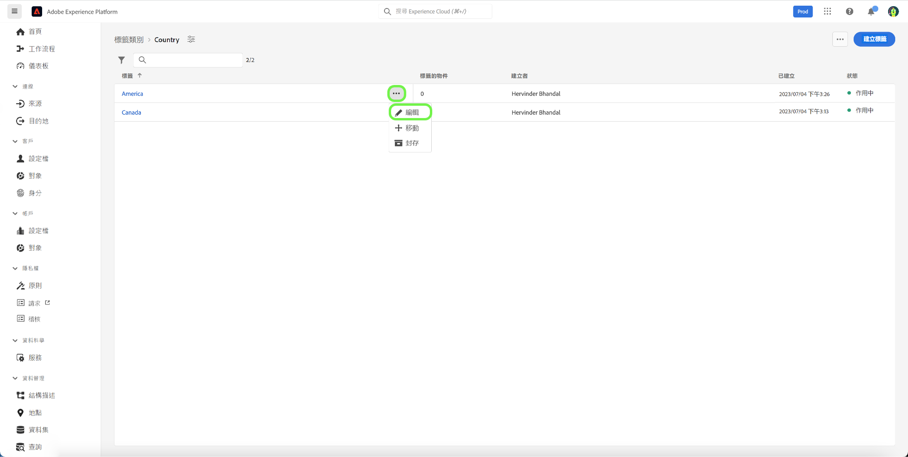
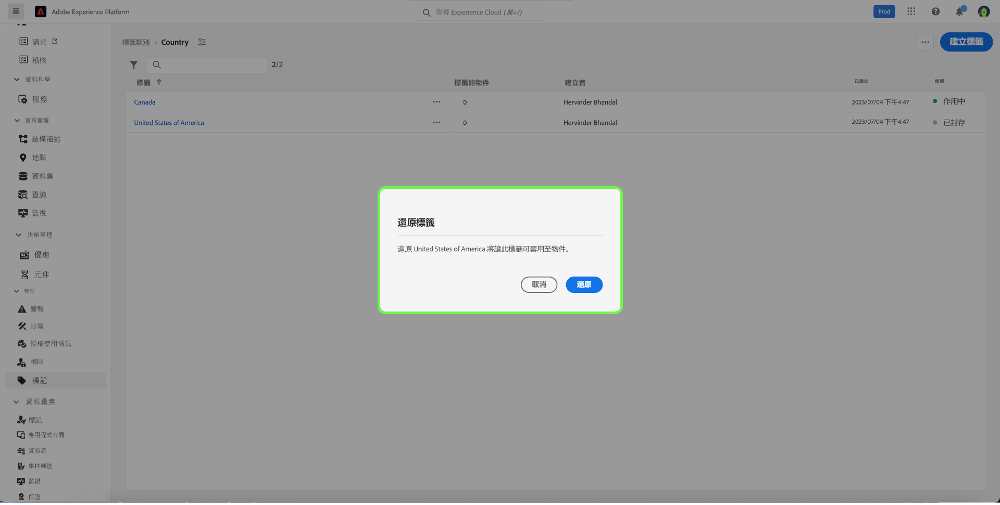

# 管理標籤指南

標籤可讓您管理中繼資料分類，以便分類業務物件，以便於探索和分類。 標籤可協助識別您的團隊將會合作的對象的重要分類屬性，以便更快地找到它們，也可以跨描述項將共同對象分組在一起。 您應該識別常見的標籤類別，例如地理區域、業務單位、產品線、專案、團隊、時間範圍（季、月、年），或任何其他有助於套用意義並輕鬆找到團隊對象的類別。 

## 建立標籤 {#create-tag}

若要建立新標籤，請選取「 」 **[!UICONTROL 標籤]** 在左側導覽中，然後選取所需的標籤類別。

選取 **[!UICONTROL 建立標籤]** 以建立新標籤。

此 **[!UICONTROL 建立標籤]** 對話方塊隨即顯示，提示您輸入唯一的標籤名稱。 完成後，選取 **[!UICONTROL 儲存]**.

新標籤已成功建立，而您被重新導向至標籤畫面，您會在其中看到新建立的標籤出現在清單中。

## 編輯標籤 {#edit-tag}

當拼字錯誤、命名慣例更新或術語更新時，編輯標籤會有所幫助。 編輯標籤會維持標籤與目前套用標籤的任何物件的關聯。

若要編輯現有標籤，請在標籤類別清單中選取省略符號(`...`)，位於您要編輯的標籤名稱旁。 下拉式清單會顯示用於編輯、移動或封存標籤的控制項。 選取 **[!UICONTROL 編輯]** 下拉式清單中的。

此 **[!UICONTROL 編輯標籤]** 對話方塊隨即顯示，提示您編輯標籤名稱。 完成後，選取 **[!UICONTROL 儲存]**.

標籤名稱已成功更新，而您被重新導向至標籤畫面，您會在其中看到更新的標籤出現在清單中。

## 在類別之間移動標籤 {#move-tag}

標籤可以移至其他標籤類別。 移動標籤會維持標籤與目前套用標籤的任何物件的關聯。

若要移動現有標籤，請在標籤類別清單中選取省略符號(`...`)，位於您要移動的標籤名稱旁。 下拉式清單會顯示用於編輯、移動或封存標籤的控制項。 選取 **[!UICONTROL 編輯]** 下拉式清單中的。

此 **[!UICONTROL 移動標籤]** 對話方塊隨即顯示，提示您選取選取的標籤應移至哪個標籤類別。

您可以捲動並從清單中選取，或者使用搜尋功能輸入類別名稱。 完成後，選取 **[!UICONTROL 移動]**.

標籤已成功移動，您會重新導向至標籤畫面，您會在其中看到更新的標籤清單，標籤不再顯示。

標籤現在會顯示在先前選取的標籤類別中。

## 封存標籤 {#archive-tag}

標籤的狀態可在使用中及封存之間切換。 封存的標籤不會從已套用的物件中移除，但無法再套用至新物件。 對於每個標籤，相同的狀態會反映在所有物件中。 如果您想要維持目前的標籤物件關聯，但日後不想使用標籤，這個功能會特別實用。

若要封存現有標籤，請在標籤類別清單中選取省略符號(`...`)，位於您要封存的標籤名稱旁。 下拉式清單會顯示用於編輯、移動或封存標籤的控制項。 選取 **[!UICONTROL 封存]** 下拉式清單中的。

此 **[!UICONTROL 封存標籤]** 對話方塊隨即顯示，提示您確認標籤封存。 選取 **[!UICONTROL 封存]**.

標籤已成功封存，您會被重新導向至標籤畫面。 您現在會看到更新的標籤清單，將標籤的狀態顯示為 `Archived`.

## 還原已封存的標籤 {#restore-archived-tag}

如果您想要套用 `Archived` 標籤到新物件，標籤必須在 `Active` 州別。 還原已封存的標籤會將標籤傳回 `Active` 州別。

若要還原已封存的標籤，請在標籤類別清單中選取省略符號(`...`)的標簽名稱。 下拉式清單會顯示要還原或刪除標籤的控制項。 選取 **[!UICONTROL 還原]** 下拉式清單中的。

此 **[!UICONTROL 還原標籤]** 對話方塊隨即顯示，提示您確認標籤復原。 選取 **[!UICONTROL 還原]**.

標籤已成功還原，您會被重新導向至標籤畫面。 您現在會看到更新的標籤清單，將標籤的狀態顯示為 `Active`.

## 刪除標籤 {#delete-tag}

>[!NOTE]
>
>僅限位於以下位置的標籤： `Archived` 與任何物件無關聯的狀態與關聯可以刪除。

刪除標籤會將其從系統中完全移除。

若要刪除已封存的標籤，請在標籤類別清單中選取省略符號(`...`)，位於您要刪除的標籤名稱旁。 下拉式清單會顯示要還原或刪除標籤的控制項。 選取 **[!UICONTROL 刪除]** 下拉式清單中的。

此 **[!UICONTROL 刪除標籤]** 對話方塊隨即顯示，提示您確認標籤刪除。 選取「**[!UICONTROL 刪除]**」。

標籤已成功刪除，您被重新導向至標籤畫面。 標籤不再出現在清單中，且已完全移除。

## 檢視標籤的物件 {#view-tagged}

每個標籤都有一個詳細資訊頁面，可從標籤詳細目錄存取。 此頁面列出目前已套用該標籤的所有物件，讓使用者在單一檢視中檢視不同應用程式和功能中的相關物件。

若要檢視標籤物件清單，請在標籤類別中尋找標籤，然後選取標籤。

此 [!UICONTROL 已標籤的物件] 頁面隨即顯示，顯示已標籤物件的詳細目錄。

## 後續步驟

您現已瞭解如何管理標籤。 如需Experience Platform中標籤的整體概觀，請參閱 [標籤總覽檔案](../overview.md).
