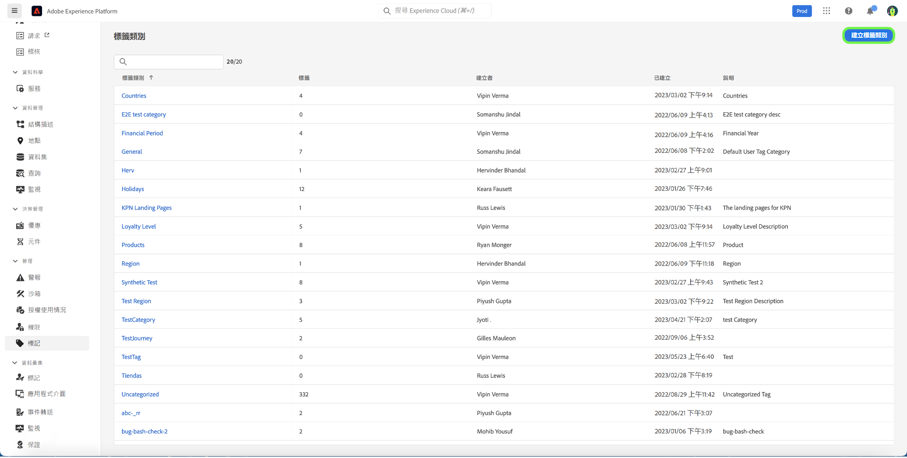
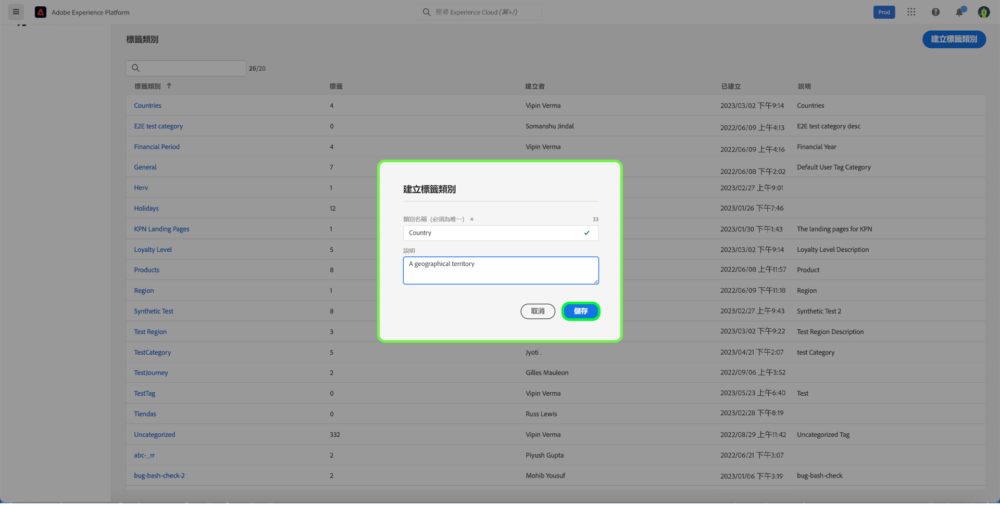
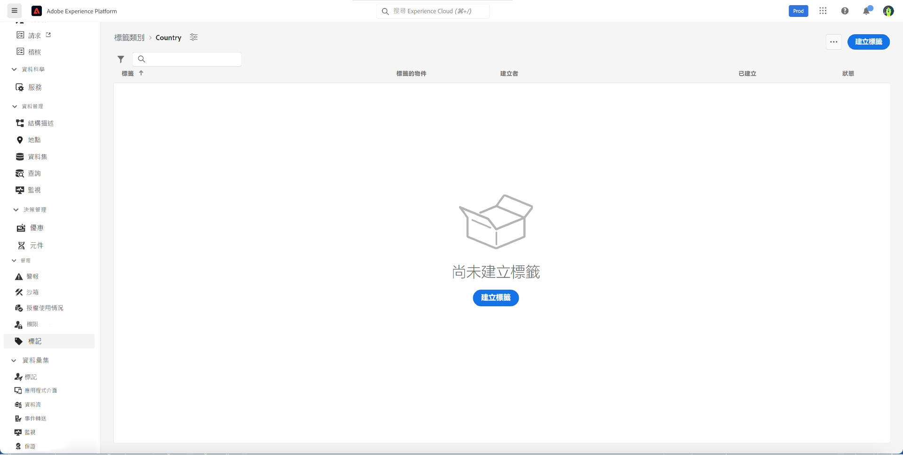
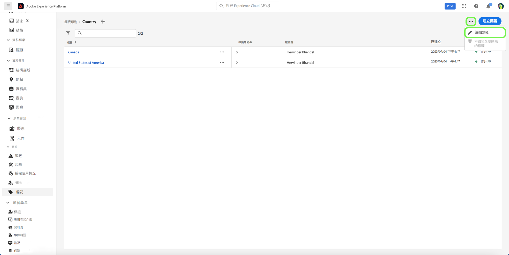
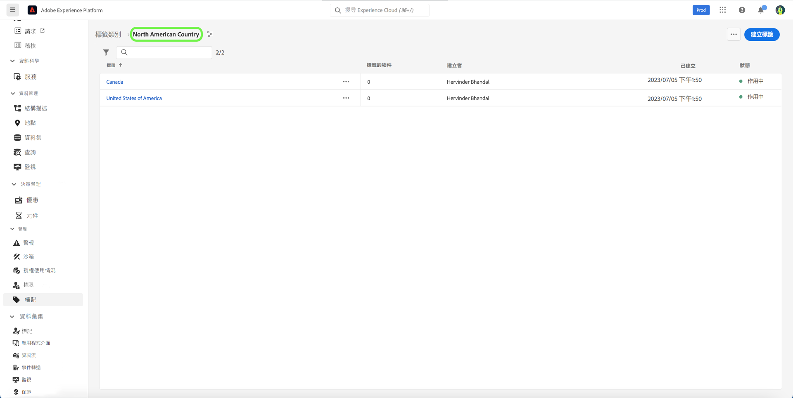
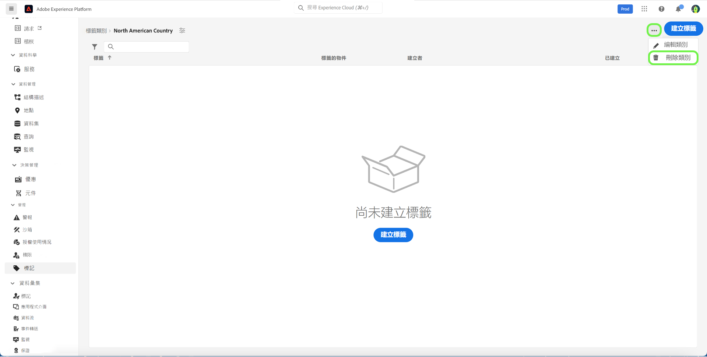
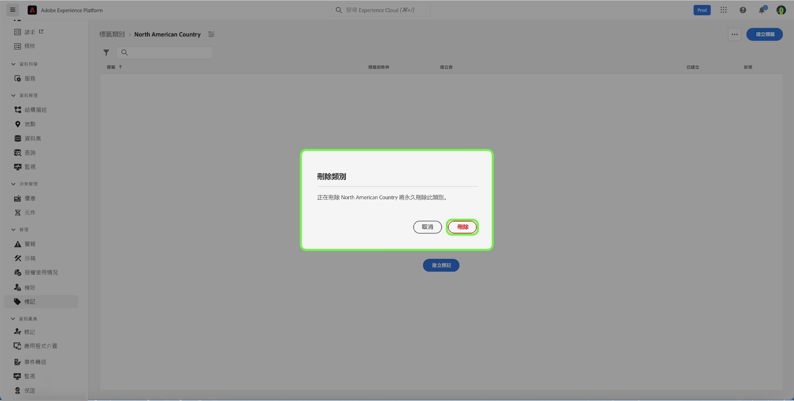

# 標籤類別指南

標籤類別會將標籤分組為有意義的集合，以提供更多上下文並更好地釐清標籤的用途。 任何具有類別的標籤都會在標籤名稱前面加上類別名稱，然後是冒號。

## 建立標籤類別 {#create-tag-category}

若要建立新類別，請選取 **[!UICONTROL 標籤]** 在左側導覽中，然後選取 [!UICONTROL 建立標籤類別].

此 **[!UICONTROL 建立標籤類別]** 對話方塊就會顯示，提示您輸入唯一的「類別」名稱和選擇性說明。 完成後，選取 **[!UICONTROL 儲存]**.

新標籤類別已成功建立，而您被重新導向至標籤建立頁面，您可以在其中指派新標籤。 如需建立標籤的詳細資訊，請參閱 [管理標籤](./managing-tags.md#create-a-tag-create-tag) 檔案。

## 編輯標籤類別 {#edit-tag-category}

>[!NOTE]
>
>編輯或重新命名標籤類別可維持標籤與目前套用標籤的任何物件的關聯。

若要編輯標籤類別，請選取「 」 **[!UICONTROL 標籤]** 在左側導覽中，然後選取您要編輯的標籤類別。

在標籤類別中，選取省略符號(`...`)旁邊 [!UICONTROL 建立標籤]. 下拉式清單會顯示要編輯類別或刪除的控制項，請選取 **[!UICONTROL 編輯類別]**.

此 **[!UICONTROL 編輯類別]** 對話方塊隨即顯示，提示您更新類別名稱和選擇性說明。 完成後，選取 **[!UICONTROL 儲存]**.

標籤類別已成功更新，而您被重新導向至標籤類別。

## 刪除標籤類別 {#delete-tag-category}

>[!NOTE]
>
>在可以刪除標籤類別之前，它必須是空的並且沒有標籤。

若要刪除標籤類別，請選取 **[!UICONTROL 標籤]** 在左側導覽中，然後選取您要刪除的標籤類別。

在標籤類別中，選取省略符號(`...`)旁邊 [!UICONTROL 建立標籤]. 下拉式清單會顯示要編輯類別或刪除的控制項，請選取 **[!UICONTROL 刪除類別]**.

此 **[!UICONTROL 刪除類別]** 對話方塊隨即顯示，提示您確認刪除標籤類別。 選取 **[!UICONTROL 刪除]** 以確認。

標籤類別已成功刪除，而您被重新導向至標籤類別詳細目錄頁面。 標籤類別不再出現在清單中，且已完全移除。

## 後續步驟

您現已瞭解如何管理標籤類別。 您可以繼續進行下一個步驟，以 [管理標籤](./managing-tags.md).
