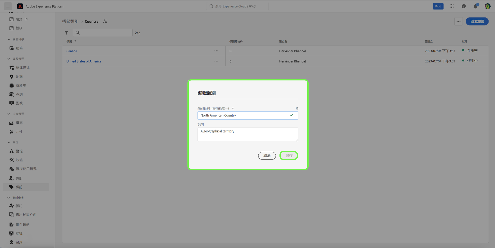

# 標籤類別指南

標籤類別會將標籤分組為有意義的集合，以提供更多內容並更清楚說明標籤的用途。 任何具有類別的標籤都會在標籤名稱前面加上類別名稱，然後加上冒號。

## 建立標籤類別 {#create-tag-category}

要建立新類別，請選擇 **[!UICONTROL 標籤]** 在左側導覽器中，然後選取 [!UICONTROL 建立標籤類別].

此 **[!UICONTROL 建立標籤類別]** 對話框，提示您輸入唯一的類別名稱和可選說明。 完成後，請選擇 **[!UICONTROL 儲存]**.

新標籤類別已成功建立，系統會將您重新導向至標籤建立頁面，讓您在此指派新標籤。 如需建立標籤的詳細資訊，請參閱 [管理標籤](./managing-tags.md#create-a-tag-create-tag) 檔案。

## 編輯標籤類別 {#edit-tag-category}

>[!NOTE]
>
>編輯或更名標籤類別會維護標籤與當前應用標籤的對象之間的關聯。

若要編輯標籤類別，請選取 **[!UICONTROL 標籤]** 在左側導覽中，選取您要編輯的標籤類別。

在標籤類別中，選取省略號(`...`)旁邊 [!UICONTROL 建立標籤]. 下拉式清單會顯示編輯類別或刪除的控制項，請選取 **[!UICONTROL 編輯類別]**.

此 **[!UICONTROL 編輯類別]** 對話框，提示您更新類別名稱和可選說明。 完成後，請選擇 **[!UICONTROL 儲存]**.

標籤類別已成功更新，系統會將您重新導向至標籤類別。

## 刪除標籤類別 {#delete-tag-category}

>[!NOTE]
>
>標籤類別必須空白且不含標籤，才能刪除。

若要刪除標籤類別，請選取 **[!UICONTROL 標籤]** 在左側導覽中，選取您要刪除的標籤類別。

在標籤類別中，選取省略號(`...`)旁邊 [!UICONTROL 建立標籤]. 下拉式清單會顯示編輯類別或刪除的控制項，請選取 **[!UICONTROL 刪除類別]**.

此 **[!UICONTROL 刪除類別]** 對話框，提示您確認標籤類別刪除。 選擇 **[!UICONTROL 刪除]** 確認。

已成功刪除標籤類別，系統會將您重新導向至標籤類別詳細目錄頁面。 標籤類別不再出現在清單中，且已完全移除。

## 後續步驟

您現在已學習如何管理標籤類別。 您可以繼續下一步，以 [管理標籤](./managing-tags.md).
