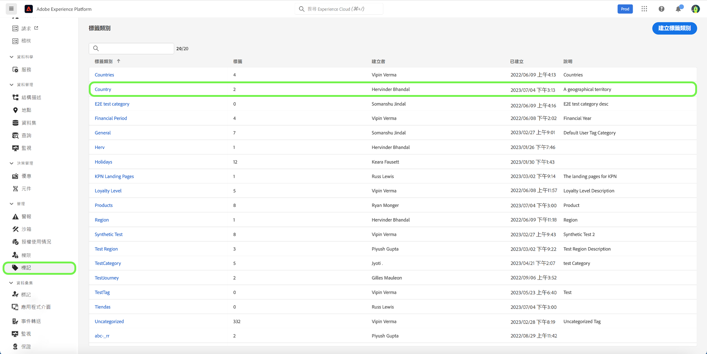

# 標籤類別指南

標籤類別將標籤組合為有意義的集合，以提供更多上下文並更好地闡明標籤的用途。 任何具有類別的標籤都將在標籤名稱前面加上類別名稱，然後是冒號。

## 建立標籤類別 {#create-tag-category}

要建立新類別，請選擇 **[!UICONTROL 標籤]** 在左側導航中，然後選擇 [!UICONTROL 建立標籤類別]。

的 **[!UICONTROL 建立標籤類別]** 對話框，提示您輸入唯一的類別名稱和可選說明。 完成後，選擇 **[!UICONTROL 保存]**。

新標籤類別已成功建立，您將重定向到標籤建立頁，在該頁中可以分配新標籤。 有關建立標籤的詳細資訊，請參閱 [管理標籤](./managing-tags.md#create-a-tag-create-tag) 的子菜單。

## 編輯標籤類別 {#edit-tag-category}

>[!NOTE]
>
>編輯或更名標籤類別可維護標籤與當前應用標籤的對象的關聯。

要編輯標籤類別，請選擇 **[!UICONTROL 標籤]** 在左側導航中，選擇要編輯的標籤類別。

在標籤類別中，選擇省略號(`...`) [!UICONTROL 建立標籤]。 下拉清單顯示要編輯類別或刪除的控制項，選擇 **[!UICONTROL 編輯類別]**。

的 **[!UICONTROL 編輯類別]** 對話框，提示您更新類別名稱和可選說明。 完成後，選擇 **[!UICONTROL 保存]**。

已成功更新標籤類別，並將您重定向到標籤類別。

## 刪除標籤類別 {#delete-tag-category}

>[!NOTE]
>
>在可以刪除標籤類別之前，它必須為空且沒有標籤。

要刪除標籤類別，請選擇 **[!UICONTROL 標籤]** 在左側導航中，選擇要刪除的標籤類別。

在標籤類別中，選擇省略號(`...`) [!UICONTROL 建立標籤]。 下拉清單顯示要編輯類別或刪除的控制項，選擇 **[!UICONTROL 刪除類別]**。

的 **[!UICONTROL 刪除類別]** 對話框，提示您確認標籤類別刪除。 選擇 **[!UICONTROL 刪除]** 確認。

已成功刪除標籤類別，並將您重定向到標籤類別清單頁。 標籤類別不再出現在清單中，並且已完全刪除。

## 後續步驟

您現在已學習了如何管理標籤類別。 您可以繼續下一步， [管理標籤](./managing-tags.md)。
