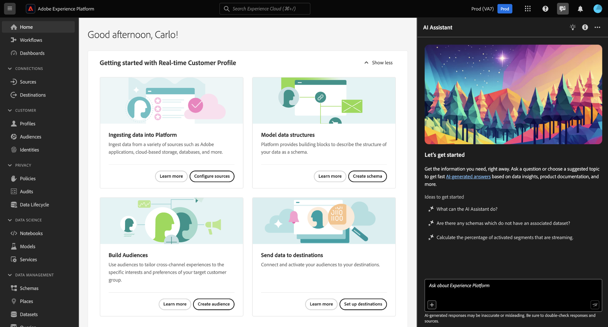

# Adobe Experience Platform中的AI助理（舊版）

>[!IMPORTANT]
>
>本檔案適用於AI助理（舊版）。 如需AI助理(Next-Gen)的相關資訊，請閱讀Experience Cloud[檔案中](https://experienceleague.adobe.com/en/docs/experience-cloud-ai/experience-cloud-ai/ai-assistant/ai-assistant-ui)AI的[AI助理UI指南](https://experienceleague.adobe.com/zh-hant/docs/experience-cloud-ai/experience-cloud-ai/home)。

請參閱下表以取得「AI助理（舊版）」和「AI助理（次世代）」的比較結果：

| 功能區域 | AI助理（舊版） | AI助理（新一代） |
| --- | --- | --- |
| 使用者體驗 | AI助理（舊版）僅在右邊欄面板中可用。 | AI Assistant (Next-Gen)提供右欄面板和沈浸式全熒幕體驗。 |
| 功能範圍 | 您可以使用AI助理（舊版）來取得產品知識和營運見解。 | 您可以使用AI Assistant （新一代）來瞭解產品知識、營運深入分析，以及進階代理技能和多步驟任務執行。 |
| 平台架構 | AI助理（舊版）並非建置在Agent Orchestrator棧疊上。 | AI Assistant (Next-Gen)由[Adobe Experience Platform Agent Orchestrator](https://experienceleague.adobe.com/zh-hant/docs/experience-cloud-ai/experience-cloud-ai/agents/agent-orchestrator)提供技術支援，可擴充性以及各種功能的進階協調。 |
| 應用程式涵蓋範圍 | AI助理（舊版）是應用程式專用的實作。 | 您可以使用AI助理（新一代），在所有Adobe Experience Cloud應用程式中提供統一的AI助理體驗。 |
| 存取與許可權模型 | 應用程式範圍的存取模型會與個別產品邊界對齊。 | 所有使用者都能存取AI Assistant (Next-Gen)和相關聯的Experience Platform代理程式。 **附註**： <ul><li>**Adobe Experience Manager**：您的管理員必須授予您透過[Adobe Admin Console](https://helpx.adobe.com/tw/enterprise/using/admin-console.html)存取AI小幫手(Next-Gen)的許可權。</li><li>**Customer Journey Analytics**：您的管理員必須透過[Customer Journey Analytics存取控制](https://experienceleague.adobe.com/en/docs/analytics-platform/using/technotes/access-control?lang=en)授與您存取AI小幫手的許可權。 這可讓您詢問產品知識和資料見解問題。 |

以下影片旨在協助您瞭解AI Assistant。

>[!VIDEO](https://video.tv.adobe.com/v/3429845?learn=on)

請閱讀本檔案，瞭解Adobe Experience Platform中的AI助理（舊版）。

Adobe Experience Platform中的AI助理（舊版）是一種對話式體驗，可用來加速Adobe應用程式中的工作流程。 您可以使用AI Assistant （舊版）來進一步瞭解產品知識、疑難排解問題，或搜尋資訊並尋找營運見解。 AI助理（舊版）支援Experience Platform、Real-Time Customer Data Platform、Adobe Journey Optimizer和Customer Journey Analytics。

>[!IMPORTANT]
>
>您必須先同意[使用者合約](https://www.adobe.com/tw/legal/licenses-terms/adobe-dx-gen-ai-user-guidelines.html)，才能使用AI小幫手（舊版）。 使用者合約也包含公開測試版合約。 這樣一來，您就可以在以Beta版容量推出其他AI Assistant （舊版）功能時，使用這些功能。

+++選取以檢視使用者合約介面

+++

## 瞭解AI助理 {#understanding-ai-assistant}

AI Assistant （舊版）會查詢資料庫，然後將資料庫中的資料轉譯成人類看得懂的答案，以回應您提交的問題。

此基礎資料的內部表示也稱為&#x200B;**[!DNL Knowledge Graph]** — 特定答案的概念、資料和中繼資料的完整網路。

[!DNL Knowledge Graph]包含每次提交查詢時所參考的子圖形：

* 客戶營運分析。
* 各種中繼商店的客戶營運分析。
* Experience League檔案。

在查詢AI助理（舊版）之前，需要考慮兩種型別的問題：

### 產品知識 {#product-knowledge}

產品知識是以Experience League檔案為根據的概念和主題。 產品知識問題可進一步指定到下列子群組中：

| 產品知識 | 範例 |
| --- | --- |
| 點式學習 | <ul><li>身分識別與主要或外部索引鍵之間有何差異？</li><li>什麼是相似客群？</li></ul> |
| 開啟探索 | <ul><li>如何匯出此資料集？</li><li>是否有適用於醫療保健客戶的結構描述？</li></ul> |
| 疑難排解 | <ul><li>為何我無法開啟Adobe擁有的結構描述以供設定檔使用？</li><li>我為何刪除不了區段？</li></ul> |

{style="table-layout:auto"}

觀看以下影片，瞭解有關AI助理（舊版）產品知識的其他資訊：

>[!VIDEO](https://video.tv.adobe.com/v/3438032/?learn=on)

### 運作洞察 {#operational-insights}

營運深入分析是指回答AI助理（舊版）產生的中繼資料物件（屬性、受眾、資料流、資料集、目的地、歷程、結構描述和來源），包括計數、查閱和歷程影響。 它不會檢視沙箱中的任何資料。

* 我有多少個資料集？
* 有多少結構描述屬性從未使用過？
* 已啟用哪些對象？

您可以在下列網域中詢問AI助理（舊版）有關您的營運見解的問題：

| 網域 | 支援的中繼資料 | 不支援的中繼資料 |
| --- | --- | --- |
| 屬性 | <ul><li>屬性名稱搜尋</li><li>屬性 — 結構描述關係</li><li>屬性 — 資料集關係</li><li>屬性 — 對象關係</li><li>屬性 — 目的地關係</li></ul> | <ul><li>屬性類別</li><li>稽核</li><li>淘汰狀態</li><li>標籤</li><li>儲存在屬性中的值</li></ul> |
| 客群 | <ul><li>客群計數</li><li>對象型別（串流或批次）</li><li>建立/修改日期</li><li>啟用狀態</li><li>設定檔計數</li><li>複製對象</li><li>對象定義搜尋</li><li>對象 — 對象關係</li><li>對象 — 屬性關係</li><li>對象 — 資料集關係</li><li>對象 — 目的地關係</li><li>名稱搜尋</li><li>名稱和ID搜尋 | <ul><li>客群重疊</li><li>Audience Activation</li><li>對象 — 行銷活動關係</li><li>稽核</li><li>建立/修改</li><li>標籤</li><li>設定檔資格趨勢</li></ul> |
| 資料流 | <ul><li>資料流計數</li><li>資料流程狀態</li><li>資料流 — 資料集關係</li><li>資料流 — 來源關係</li></ul> | <ul><li>建立/修改</li><li>資料流 — 批次關係</li><li>擷取設定檔計數</li></ul> |
| 資料集 | <ul><li>資料集計數</li><li>設定檔啟用狀態</li><li>建立/修改日期</li><li>資料集 — 結構描述關係</li><li>資料集 — 對象關係</li><li>資料集 — 屬性關係</li><li>資料集 — 資料流關係</li><li>資料集大小</li><li>列數</li><li>名稱搜尋 </li><li>名稱和ID搜尋</li></ul> | <ul><li>稽核</li><li>建立者</li><li>資料集 — 批次關係</li><li>資料集建立/修改</li><li>設定檔數</li><li>值搜尋</li></ul> |
| 資料模型（同盟對象構成） | <ul><li>資料模型計數</li><li>名稱搜尋</li><li>資料模型和結構描述關係</li><li>連結屬性</li><li>狀態</li><li>建立和修改日期</li><li>連結 — 資料模型關係</li></ul> | |
| 目的地 | <ul><li>設定的目的地計數</li><li>目的地 — 對象關係</li><li>目的地屬性關係</li></ul> | <ul><li>帳戶設定</li><li>帳戶認證資訊</li><li>啟用的不重複設定檔</li></ul> |
| 同盟資料庫（同盟對象構成） | <ul><li>資料庫計數</li><li>資料庫名稱</li><li>資料庫型別</li><li>建立/修改日期</li><li>狀態</li></ul> | |
| 歷程 | <ul><li>計數</li><li>名稱搜尋</li><li>名稱和ID搜尋</li><li>歷程狀態</li><li>觸發狀態（對象與事件）</li><li>建立/修改日期</li><li>循環頻率</li></ul> | <ul><li>屬性 — 歷程關係</li><li>稽核</li><li>建立/修改</li><li>建立者</li><li>活動</li><li>歷程 — 資料集</li><li>歷程 — 結構描述</li><li>產品建議</li><li>設定檔資格趨勢</li><li>步驟事件</li></ul> |
| 結構描述 | <ul><li>結構描述計數</li><li>建立/修改日期</li><li>結構描述 — 屬性關係</li><li>結構描述 — 資料集關係</li><li>結構描述 — 對象關係</li><li>設定檔啟用狀態</li><li>名稱搜尋</li><li>名稱和ID搜尋</li></ul> | <ul><li>稽核</li><li>建立/修改</li><li>建立者</li><li>欄位群組</li><li>身分識別</li><li>身分識別命名空間</li><li>標籤</li><li>設定檔數</li></ul> |
| 結構描述（同盟對象構成） | <ul><li>結構描述計數</li><li>結構描述名稱/標籤搜尋</li><li>建立和修改日期</li><li>結構描述 — 資料庫關係</li><li>對象型別結構描述</li></ul> | <ul><li>結構描述 — 組合關係</li><li>結構描述屬性</li></ul> |
| 來源 | <ul><li>帳戶計數</li><li>帳戶狀態</li><li>每個帳戶的作用中/非作用中資料流</li><li>Source聯結器 — 資料流關係</li><li>Source帳戶 — 資料流關係</li></ul> | <ul><li>帳戶認證資訊</li><li>帳戶設定</li><li>資料擷取量度</li><li>設定檔數</li><li>Source — 批次關係</li></ul> |

{style="table-layout:auto"}

若是操作見解問題，答案可能不會反映UI的目前狀態。 支援這些問題的資料每24小時更新一次。 例如，使用者白天在Real-Time CDP中所做的變更會在夜間與資料存放區同步，然後早上就可供使用者提問。 您需要登入沙箱以查詢與物件相關的特定資料。

觀看以下影片，瞭解有關AI助理（舊版）操作深入分析的更多資訊：

>[!VIDEO](https://video.tv.adobe.com/v/3444031?learn=on&enablevpops)

### 功能範圍 {#feature-scope}

目前，AI助理（舊版）的範圍如下：

* [產品知識](./home.md#product-knowledge)： AI助理（舊版）可以回答Experience Platform、Real-Time Customer Data Platform和Adobe Journey Optimizer的產品知識問題。 您也可以深入探討Customer Journey Analytics的產品知識主題，但必須透過Customer Journey Analytics UI。
* [作業深入分析](./home.md#operational-insights)：您可以詢問AI助理（舊版）對下列資料物件的作業深入分析的相關問題：屬性、對象、資料流、資料集、目的地、歷程、結構描述和來源。

## 後續步驟

現在您已大致瞭解AI助理（舊版），您現在可以在工作流程中繼續並使用AI助理（舊版）。 如需詳細資訊，請參閱下列檔案：

* [AI助理（舊版） UI指南](./ui-guide.md)
* [功能存取](./access.md)
* [問題指南](./questions.md)
* [AI助理的隱私權、安全性和控管（舊版）](./privacy.md)
* [常見問題集](./faq.md)
