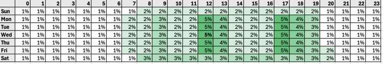

# 傳送時間最佳化模型詳細資料

## 模型概覽 {#model-overview}

* **模型名稱和版本**：傳送時間最佳化
* **模型發行日期**： 2024年9月
* **模型用途**： Adobe Journey Optimizer的傳送時間最佳化模型會根據消費者的歷史開啟和點按行為，選擇最佳的電子郵件和推播訊息傳送時間，以最大化消費者的參與度。
* **目標使用者**：此模型的主要使用者是行銷專業人員、產品經理和客戶參與團隊，他們利用Adobe Journey Optimizer來推動資料導向行銷策略。
* **使用案例**：傳送時間最佳化最適合用於不太緊急的行銷通訊 — 例如，每週廣告、新產品的促銷資訊，或長達一個月的銷售資訊。 傳送時間最佳化僅適用於Journey Optimizer的內建電子郵件和推播動作型別，目前不適用於透過自訂動作傳送的訊息或其他動作型別。
* **可能誤用**：傳送時間最佳化不應該用於緊急且有時效的作業訊息，例如訂單確認、密碼重設通知或航班閘道變更通知。

## 模型詳細資料 {#model-details}

* **模型型別**：「傳送時間最佳化」模型會擷取您組織的Adobe Journey Optimizer消費者行為資料，並檢視使用者層級的開啟和點按事件，以預測消費者何時最有可能與您的訊息互動。 使用[!DNL Bayesian]估算器加權一週中每個小時的消費者層級開啟和點按行為，並結合相似和整體消費者行為。 接著，系統會排名一週中每個小時的[!DNL Bayesian]預測，針對每個客戶產生每個量度（電子郵件開啟、電子郵件點按及推播開啟）的「熱度圖」，以預測一週中聯絡每個消費者最可能且最不可能導致所需參與結果的小時。
* **輸入**：傳送時間最佳化會使用[!UICONTROL 偏好設定詳細資料]欄位群組內`timeZone`欄位中的消費者時區資料（如果提供）來決定消費者時區。 如果`timeZone`欄位中沒有提供消費者的時區，「傳送時間最佳化」會嘗試根據最常見的時區符合儲存在消費者設定檔中的第一個郵寄地址，使用[郵寄地址資料型別](../../xdm/data-types/postal-address.md)推斷消費者的時區。 傳送時間最佳化會根據三種行為資料型別，對每個消費者進行預測：
   * 您消費者的整體開啟和點按行為。
   * 相同時區中相似消費者的開啟和點按行為。
   * 該個別消費者的開啟和點按行為。
* **輸出**：這些預測會使用[!DNL Bayesian]方法進行加權和組合，針對每個客戶產生每個量度（電子郵件開啟、電子郵件點按和推播開啟）的「熱度圖」，其指出連絡該消費者時產生所需參與結果（開啟/點按）的可能性最高且最低的一週時數，如下例熱度圖所示：

* **範例輸入和輸出**：為了將模型對於設定檔豐富度的影響降至最低，模型分數會儲存在`_experience.intelligentServices.journeyAI.sendTimeOptimization`中儲存的三個設定檔屬性中並加以壓縮，而且其設計不是為了可人為讀取。

## 模型訓練 {#model-training}

* **訓練資料與預先處理**：每個組織的訓練資料集只取自Adobe Experience Platform中自己的資料。
   * 為您的組織啟用傳送時間最佳化功能後，系統會針對過去16週貴組織所有歷程和動作（不論這些動作是否使用傳送時間最佳化），以電子郵件和推播、傳送、開啟和點選事件來訓練模型。 這可讓傳送時間最佳化受益於消費者產生的所有資料。
   * 模型最初會接受培訓，並每週評分。 16週後，模型會每月重新訓練並重新掃描。 模型評分包括自上次評分執行以來的所有客戶設定檔 — 現有和新的。
   * 「傳送時間最佳化」傳送的訊息會收到下列其中一項：
      * 「探索」訊息傳送時間，選取此項以測試不同的傳送時間並觀察消費者如何回應。
      * 「最佳化」訊息傳送時間，所選用來最大化點選/開啟率。 5%的傳送事件會收到「探索」傳送時間，而95%的傳送事件已「最佳化」。
   * 探索傳送時間是從傳送時間中隨機選取，而該傳送時間可由您設定的最長等待時間提供。 例如，如果在星期三上午9點選取訊息，並開啟傳送時間最佳化且等待時間上限3小時，則訊息的Exploration傳送時間將平均分割為上午9點、上午10點、上午11點與下午12點。

## 模型評估 {#model-evaluation}

* **模型評估**：傳送時間最佳化可能會增加組織最佳化之所有訊息的電子郵件點按率和推播開啟率，範圍大約為2%到10%。
   * 例如，如果組織傳送電子郵件時未將傳送時間最佳化，則平均點按率為5.0%，將傳送時間最佳化的同一組電子郵件則平均可產生高達5.5%的點按率(5.0% * (1+10%) = 5.5%)。
   * 由於小型樣本大小中的可變性，在傳送單一訊息時，可能無法觀察到傳送時間最佳化的好處。
   * 組織在以下情況下更有可能從使用傳送時間最佳化中獲得更大的好處：
      * 現有歷程使用的傳送時間是固定的且未妥善最佳化；
      * 消費者行為的可變性（點按和開啟）會與消費者位置和消費者偏好設定相對應；
      * 組織對大部分電子郵件和推播訊息使用傳送時間最佳化；
      * 組織會選擇建議的6-12小時範圍內的最長等待時間。

## 模型部署 {#model-deployment}

* **模型更新**：模型最初已訓練並每週評分。 16週後，模型會每月重新訓練並重新掃描。 模型評分包括所有消費者設定檔 — 自上次評分執行以來，既有且新的。

## 公平性和偏差 {#fairness-and-bias}

* **模型公平性**：不正確推斷消費者的時區，可能導致訊息的傳送早於指定消費者的最佳設定或晚於指定消費者的最佳設定值。 不過，使用傳送時間最佳化之通訊中的所有消費者最終都會收到訊息，並有機會與訊息互動。 此外，此模型不會使用消費者人口統計資料或人口統計資料的代理，而是只會使用消費者行為和消費者時區資料。 因此，對公平性的關注是有限制和減輕的。
* **資料偏差**：消費者時區的推斷不正確，可能導致訊息的傳送早於指定消費者的最佳設定或晚於指定消費者的最佳設定值。 不過，使用傳送時間最佳化之通訊中的所有消費者最終都會收到訊息，並有機會與訊息互動。 此外，此模型不會使用消費者人口統計資料或人口統計資料的代理，而是只會使用消費者行為和消費者時區資料。 因此，偏見問題會得到限制和緩解。

## 穩健性 {#robustness}

* **模型健全性**：沒有足夠互動事件資料的設定檔（通常是新設定檔的情況）會收到立即傳送時間、選定視窗內的探索傳送時間，或根據所有客戶中表現最佳的傳送時間計算的傳送時間。

## 道德考量 {#ethical-considerations}

* **與模型**&#x200B;相關的道德考量：消費者時區推斷不正確，可能導致訊息的傳送早於指定消費者的最佳時間或晚於指定消費者的最佳時間。 不過，使用傳送時間最佳化之通訊中的所有消費者最終都會收到訊息，並有機會與訊息互動。 此外，此模型不會使用消費者人口統計資料或人口統計資料的代理，而是只會使用消費者行為和消費者時區資料。 因此，道德上的顧慮會受到限制，並得以緩解。