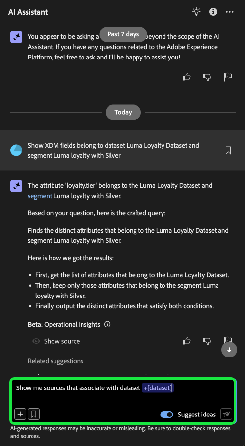
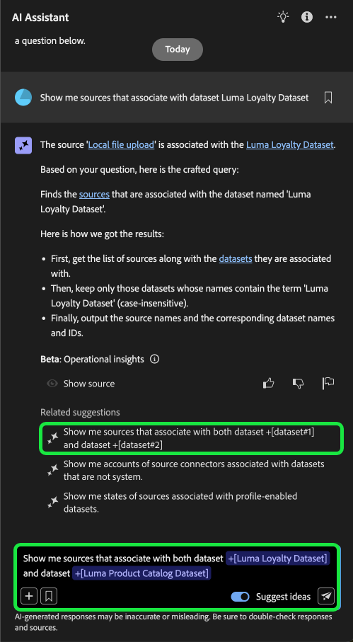

# AI Assistant UI指南

請閱讀本指南，瞭解如何在Adobe Experience Platform UI中使用AI Assistant。

## 在Experience PlatformUI中存取AI助理

若要啟動AI助理，請從Experience PlatformUI的頂端標題中選取&#x200B;**[!UICONTROL AI助理圖示]**。

AI Assistant介面隨即顯示，立即為您提供開始使用的資訊。 您可以使用[!UICONTROL Ideas下提供的選項開始使用]，回答下列問題和命令：

* [!UICONTROL 已啟動我的哪些對象？]
* [!UICONTROL 什麼是結構描述？]
* [!UICONTROL 告訴我Real-Time CDP的一些常見使用案例]

## AI助理使用者介面指南

>[!NOTE]
>
>以下工作流程是使用Experience Event結構描述建立程式的範例，說明如何使用Experience PlatformUI中的AI Assistant。

請考量您正在建立&#x200B;**事件結構描述中的裝置交易**&#x200B;的使用案例。 在體驗事件結構描述建立程式期間，您遇到了`eventType`欄位。 「此時，您可以選擇結束工作流程並參閱結構描述組合的[基本概念](../xdm/schema/composition.md)檔案，或者您可以使用AI助理來擷取問題的答案，並透過AI助理所建議的檔案連結尋找其他資源。」

若要開始，請在提供的文字方塊中輸入您的問題。 在以下範例中，AI助理會提出以下問題： &quot;**什麼是ExperienceEvent結構描述中的eventType欄位？**&quot;

AI Assistant接著會查詢其知識庫並計算答案。 幾分鐘後，AI Assistant會傳回答案和相關建議，您可將其用作後續提示。

收到來自AI助理的回應後，您可以從多個選項中進行選取，以決定要如何繼續。

### AI助理功能 {#features}

本節概述您可以在Experience Platform工作流程中使用的AI Assistant各種功能。

### 檢視作業資料物件 {#view-operational-data-objects}

根據您的查詢，AI Assistant會提供與沙箱中資料相關的其他資訊。 若要檢視您查詢的回應如何套用至您的特定沙箱，請選取「在您的沙箱中&#x200B;**[!UICONTROL 」]。**

在檢視與您的沙箱相關的資料時，AI Assistant可能會提供顯示您查詢的資料的特定UI頁面的直接連結。

+++選取以檢視範例

在此範例中，AI Assistant會傳回有關您沙箱中現有XDM結構描述的其他資訊，包括其總計數和五個最常用的欄位。

+++

### 檢視引文 {#view-citations}

您可以檢閱每個產品知識答案中可用的引文，來驗證AI助理傳回給您的回應。

+++選取此選項可檢視如何顯示來源的範例

若要檢視引文並驗證AI助理的回應，請選取&#x200B;**[!UICONTROL 顯示來源]**。

AI Assistant會更新介面，並提供檔案連結給您，以證實初始回應。 此外，當啟用引文時，AI Assistant會更新回應以包含註腳，以指出參照所提供檔案的回應特定部分。

+++

### 運作深入分析 {#operational-insights}

您必須處於作用中沙箱中，AI助理才能充分回應有關您營運深入分析的問題。

+++選取以檢視操作見解問題的範例

在下列範例中，AI助理被詢問下列查詢： **「顯示使用Amazon S3來源建立的資料流」**。

AI助理接著會以表格回應，該表格會列出您的資料流及其對應的ID。 若要檢視整個資料表格，請選取右上角的展開圖示。

此時會出現表格的展開檢視，讓您根據查詢的引數獲得更完整的資料流清單。

出現營運見解問題提示時，AI Assistant會提供其如何計算答案的解釋。 在以下範例中，AI Assistant概述識別使用[!DNL Amazon S3]來源建立的資料流時所採取的步驟。

您也可以提供篩選器和修改問題，也可以指示AI助理根據您包含的篩選器來呈現其結果。 例如，您可以要求AI助理按照區段定義的建立日期順序，顯示區段定義計數的趨勢；移除總設定檔為零的區段定義；以及在顯示資料時，使用月份名稱而非整數。

**注意：**&#x200B;操作深入分析答案目前為Beta版。 選取AI助理使用者介面中的工具提示圖示以檢視Beta通知和檔案的連結。

已選取

+++

### 驗證操作見解回應 {#verify-responses}

您可以使用AI助理提供的SQL查詢來驗證與操作深入分析問題相關的每個回應。

+++選取以檢視驗證作業分析回應的範例

在收到運作見解問題的答案後，請選取&#x200B;**[!UICONTROL 顯示來源]**，然後選取&#x200B;**[!UICONTROL 檢視來源查詢]**。

在查詢操作深入分析問題時，AI助理會提供SQL查詢，供您用來驗證運算其答案所花費的程式。 此來源查詢僅供驗證之用，查詢服務不支援。

+++

### 使用實體自動完成 {#use-entity-auto-complete}

您可以使用自動完成函式來接收沙箱中存在之資料物件的清單。 自動完成建議適用於下列網域：受眾、結構描述、資料集、歷程、來源和目的地。

+++選取以檢視自動完成的範例

您可以在查詢中加入加號(**`+`**)以使用自動完成。 或者，您也可以選取文字輸入方塊底部的加號(**`+`**)。 隨即顯示一個視窗，其中包含沙箱中建議的資料物件清單。

+++

### 使用多圈 {#use-multi-turn}

您可以使用AI Assistant的多圈功能，在體驗期間進行更自然的交談。 AI Assistant能夠回答後續的問題。 該上下文可從先前的互動中推斷。

+++選取以檢視多圈範例

在以下範例中，會先要求AI助理提供資料流總數，然後要求列出10個最近的資料流。

+++

### 開始新交談

您可以透過重設並開始新對話來變更AI助理的主題。

+++選取以檢視重設交談的範例

若要重設，請選取AI助理介面上的省略符號(**`...`**)，然後選取&#x200B;**[!UICONTROL 開始新交談]**。 這會通知AI助理您打算變更主題，並在疑難排解失敗或參考錯誤資訊的查詢時特別有用。

+++

### 使用可發現性 {#use-discoverability}

您可以使用AI助理的可發現性功能來檢視AI助理支援的一般主體清單（群組為實體）。

+++選取以檢視可發現性的範例

若要檢視可發現性，請選取AI Assistant介面頂端標題上的燈泡圖示。

接著，選取類別，然後從提供的清單中選取提示。 您可以使用此功能來進一步瞭解AI助理可以回答的問題型別。 您也可以使用自由文字或[自動完成](#use-auto-complete)，以與您的沙箱相關的特定詳細資訊更新現有的提示。

+++

### 使用問題自動完成 {#use-question-autocomplete}

您可以使用AI助理的問題自動完成功能，從AI助理的建議清單中選取問題。

+++選取以檢視問題自動完成的範例

若要檢視建議問題的面板，請在輸入方塊中輸入至少七(7)個字元。 接著，從出現的選單中選取與您相關的問題。

在某些建議問題涉及操作深入分析的情況下，您可能需要更新預留位置。 例如，如果AI助理的建議包含預留位置，您可能需要新增資料集或對象的特定名稱。

預留位置會以藍色反白。 選取預留位置以開始更新其值。 為獲得數字預留位置的最佳結果，請務必使用數字而非文字。 您也可以使用圖元自動完成功能來更新預留位置值。 您無法傳送包含未填預留位置的問題。

**注意**：建議預設為啟用。 選取&#x200B;**[!UICONTROL 建議想法]**&#x200B;切換以停用此功能。

+++

### 使用相關建議 {#use-related-suggestions}

您可以使用每個AI助理回應的相關建議區段來繼續您的交談。

+++選取以檢視相關建議的範例

AI助理的每個回應都會傳回相關建議。 若要繼續您的交談，請在相關建議區段中選取任何建議。

與問題中的預留位置自動完成類似，在提交查詢之前，您需要更新相關建議中包含的預留位置。

+++

## 提供意見反應 {#feedback}

您可以使用回答中提供的選項，針對AI助理的體驗提供意見回饋。

若要提供意見回饋，請在收到AI助理的回應後，選取向上拇指、向下拇指或標幟，然後在提供的文字方塊中輸入您的意見回饋。

+++選取以檢視更多範例

>[!BEGINTABS]

>[!TAB 縮圖向上]

選取向上拇指圖示，提供您對於AI助理的良好體驗的反饋。

>[!TAB 縮圖已關閉]

選取向下縮圖圖示，即可根據您使用AI助理的經驗，提供哪些可改善的意見回饋。 在此步驟中，您也可以提供關於體驗的特定註解。 評論中提供的意見回饋會每天稽核。

>[!TAB 旗標]

選取標幟圖示以提供關於您使用AI助理體驗的進一步報告。

>[!ENDTABS]

+++
