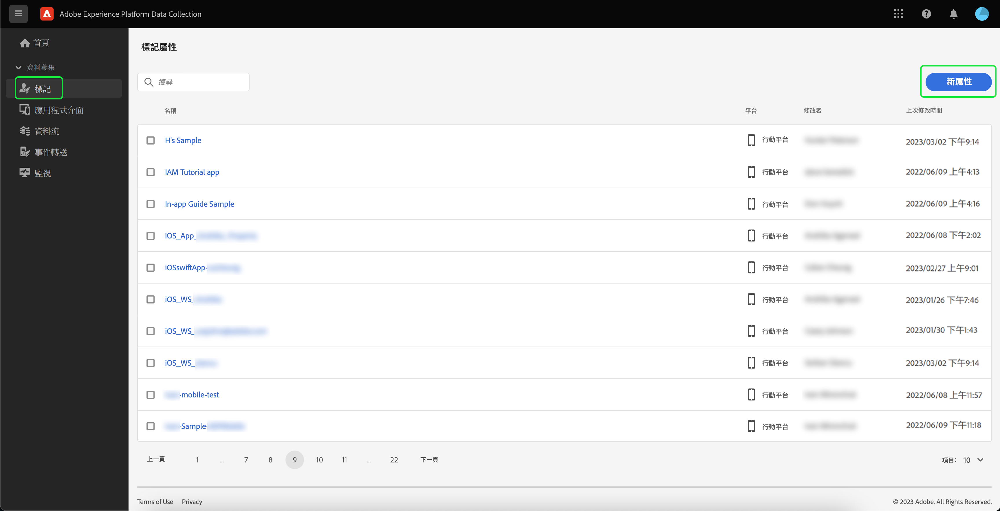
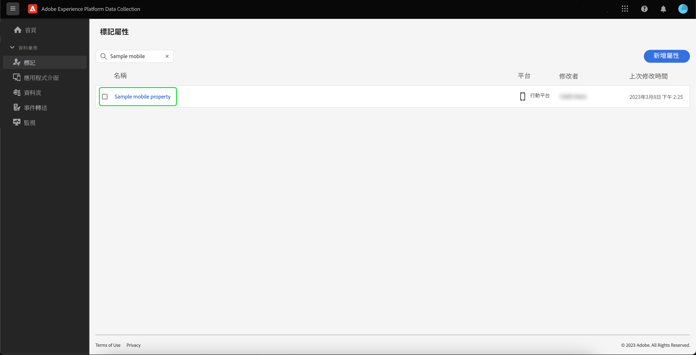
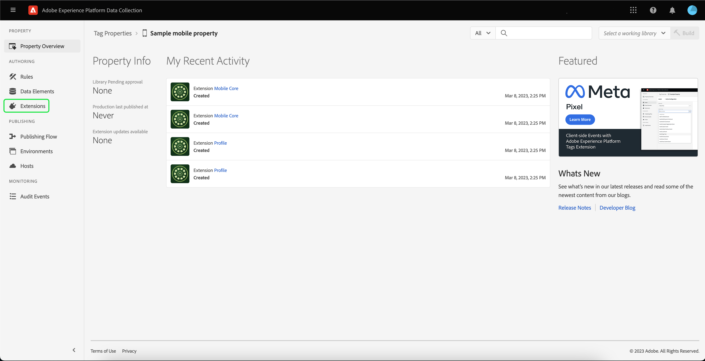

# 實施Adobe Experience Platform保證擴充功能

本教學課程說明如何在Mobile SDK中安裝及實作Platform Assurance擴充功能。 如需將Assurance擴充功能新增至應用程式的說明，請參閱 [Adobe Experience Platform保證擴充功能概觀](https://developer.adobe.com/client-sdks/documentation/platform-assurance-sdk/#add-the-aep-assurance-extension-to-your-app).

## 快速入門

若要安裝及實作Assurance擴充功能，您必須具備下列服務的存取權：

- 此 [Adobe Experience Platform資料彙集UI](https://experience.adobe.com/#/data-collection/)
- [Adobe Experience Platform Assurance](https://experience.adobe.com/assurance)

## 建立行動 屬性

>[!NOTE]
>
>如果您已有行動屬性，您可以繼續進行下一個步驟。

在資料收集UI中，選取 **[!UICONTROL 標籤]**. 行動和Web屬性清單隨即出現，其中包含屬於您組織的屬性相關資訊。 選取 **[!UICONTROL 新增屬性]** 以建立新屬性。

此 **[!UICONTROL 建立屬性]** 頁面便會顯示。 輸入新屬性的名稱，然後選取 **[!UICONTROL 行動]** 作為您的平台。 插入詳細資料後，選取 **[!UICONTROL 儲存]** 以建立行動屬性。

>[!NOTE]
>
>行動屬性的 **[!UICONTROL 隱私權]** 設定do **not** 影響Assurance的資料收集。

## 安裝Assurance擴充功能

選取您要安裝Assurance擴充功能的行動屬性。

此 **行動屬性詳細資料** 頁面便會顯示。 選取 **[!UICONTROL 擴充功能]** 開啟目前與您的行動屬性相關聯的擴充功能清單。

選取 **[!UICONTROL 目錄]** 以檢視可新增至行動屬性的擴充功能清單。 使用篩選器，找出 **[!UICONTROL AEP保證]** 擴充功能，並選取 **[!UICONTROL 安裝]**.

## 後續步驟

現在您已將Assurance擴充功能安裝在行動屬性中，您可以開始將Assurance用於應用程式。 若要瞭解如何將Assurance擴充功能新增至您的應用程式，請閱讀 [Adobe Experience Platform保證擴充功能概觀](https://developer.adobe.com/client-sdks/documentation/platform-assurance-sdk/#add-the-aep-assurance-extension-to-your-app). 若要瞭解如何使用Assurance，請參閱 [使用保證指南](./using-assurance.md).
