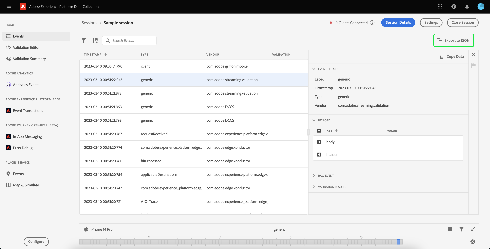

# 使用Adobe Experience Platform保證

本教程介紹如何使用Adobe Experience Platform保障。 有關如何安裝和實施Adobe Experience Platform保障擴展的說明，請閱讀有關 [實施保證延期](./implement-assurance.md)。

## 建立會話

登錄到 [保障UI](https://experience.adobe.com/assurance)頁籤 **[!UICONTROL 建立會話]** 開始建立會話。

的 **[!UICONTROL 建立新會話]** 對話框。 請查看給定的說明，然後選擇 **[!UICONTROL 開始]**。

現在，您可以輸入一個名稱來標識會話，然後提供 **[!UICONTROL 基本URL]** （深度連結應用程式的URL）。 提供這些詳細資訊後，選擇 **[!UICONTROL 下一個]**。

>[!INFO]
>
>基URL是用於從URL啟動應用的根定義。 會話URL將生成，您可以通過它啟動「保證」會話。 示例值可能如下所示： `myapp://default` 在 **[!UICONTROL 基本URL]** 欄位，鍵入應用的基深連結定義。

## 連接到會話

建立會話後，請確保 **[!UICONTROL 建立新會話]** 對話框現在顯示一個連結、一個QR碼和一個PIN。

如果顯示此對話框，您可以使用設備的攝像頭應用掃描QR代碼並開啟應用或複製連結並在應用中開啟。 當你的應用啟動時，你應看到PIN條目螢幕重疊。 從上一步鍵入PIN，然後按 **[!UICONTROL 連接]**。

當應用程式上顯示Adobe Experience Platform表徵圖(紅色Adobe「A」)時，您可以驗證您的應用程式是否已連接到Assurance。

## 導出會話

要導出「保證」會話，請在應用的會話詳細資訊頁面上，選擇 **[!UICONTROL 導出到JSON]** 在會話中：

導出選項考慮搜索篩選器結果，並且僅導出事件視圖中顯示的事件。 例如，如果搜索「跟蹤」事件，然後選擇 **[!UICONTROL 導出到JSON]**，只導出「跟蹤」事件結果。
