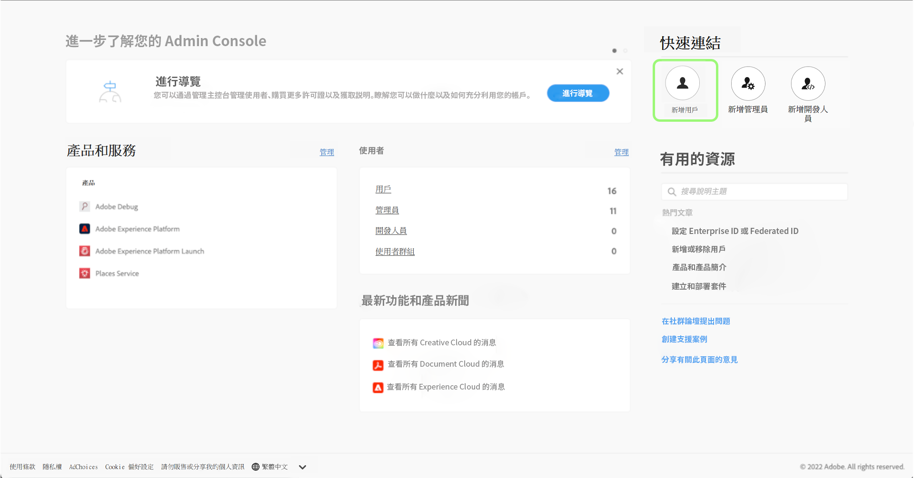
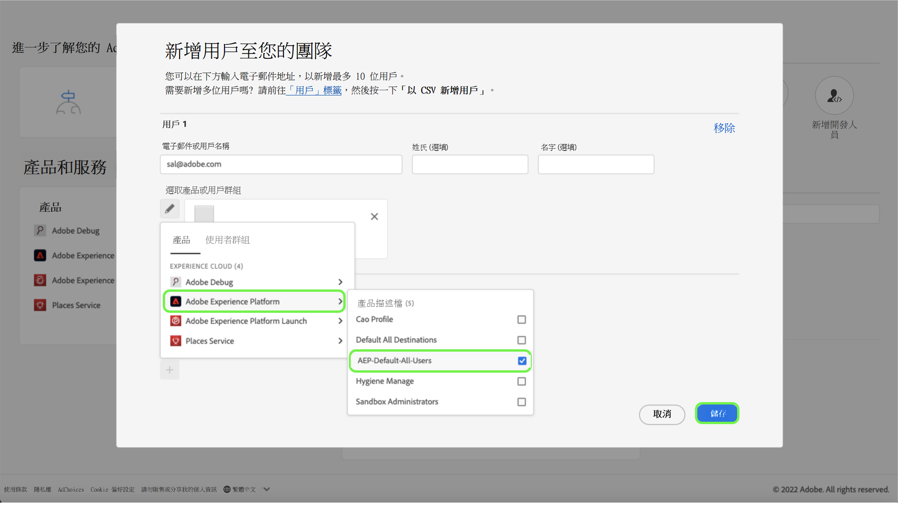

# 使用者存取權

>[!WARNING]
>
>請注意，使用者對 Assurance 的存取權會發生變更。隨著 Assurance 離開 Beta (Project Griffon) 並向所有 Adob&#x200B;&#x200B;e Experience Cloud 客戶正式推出 (以 Assurance 的名義) - 對 Assurance 的存取權會透過 [Admin Console](https://helpx.adobe.com/tw/enterprise/using/admin-console.html) 管理。
>
>如果您需要協助，請和貴公司的 Adob&#x200B;&#x200B;e Experience Cloud 管理員聯絡。

若要接收或持續保持對 Assurance 的存取權，請務必在 Admin Console 中完成下列步驟：

## 透過產品設定檔將使用者新增到 Experience Platform

若要將使用者新增到產品設定檔，請登入 Admin Console 並選取「**新增使用者**」。

「**將使用者新增到您的團隊**」對話框會隨即顯示。在此對話框中，您可以輸入要新增之使用者的詳細資料。輸入使用者的電子郵件地址、名字 (選填) 和姓氏 (選填)。

選取鉛筆圖示以選擇產品和使用者群組。在這裡選取 **Adobe Experience Platform**，然後選取 **AEP-Default-All-Users**，接著選取「**儲存**」。

