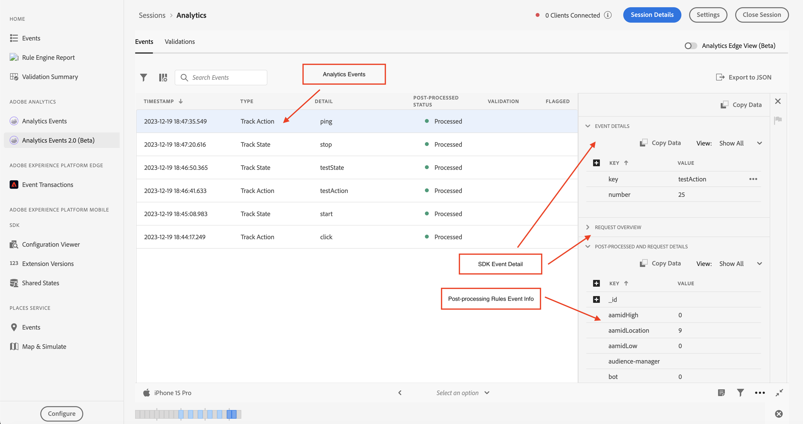

# Assurance中的Analytics Events 2.0

Analytics Events 2.0提供更豐富的SDK事件檢視，供使用者除錯和驗證其Adobe Analytics實作。 檢視會顯示從傳送至Adobe Analytics的事件 [Adobe Experience Platform Mobile SDK](https://developer.adobe.com/client-sdks/solution/adobe-analytics/) 以及 [Adobe Experience Platform Edge Network SDK](https://developer.adobe.com/client-sdks/edge/edge-network/). 此檢視也有詳細資訊面板，可提供使用者端SDK以及上游服務離開裝置後如何處理事件的相關內容。

## 快速入門

若要使用此檢視，請完成下列步驟：

1. [設定Adobe Experience Platform保證](../tutorials/implement-assurance.md).
2. [建立並連線至保證工作階段](../tutorials/using-assurance.md).
3. 在左側導覽的保證UI中 **首頁** 檢視功能表，選取 **Analytics Events 2.0 (Beta)**. 如果沒有看見此選項，請選取 **設定** 在視窗的左下方，新增 **Analytics Events 2.0 (Beta)**，並選取 **儲存**.

## Analytics事件檢視

如果您使用，請使用「Analytics事件檢視」 **Adobe Analytics** 行動擴充功能。 此檢視可讓您輕鬆檢視從連線使用者端傳送的Analytics事件，包括追蹤動作、追蹤狀態和生命週期事件。 選取表格中的其中一個Analytics事件，即可在右側面板檢視事件處理方式的詳細資訊。

### 後續處理的狀態

SDK透過Adobe Analytics提出網路要求後，狀態會告訴您保證是否能夠擷取Adobe Analytics要求的後處理資訊。 觸發請求後，當後續處理狀態仍在運作時，Analytics事件檢視必須保持作用中。

請注意，為了擷取後續處理資訊，已登入的使用者必須有權存取相對應的報表套裝。

| 狀態 | 說明 |
| :----- | :---------- |
| `Queued` | 網路要求正在擷取後續處理資訊。 |
| `Processed` | 網路要求成功，已收到後續處理資訊。 |
| `Delayed` | 已超出擷取後續處理資訊的要求重試次數上限。 |
| `Error` | 錯誤已導致網路要求失敗。有關錯誤的更多詳細資料會顯示在事件詳細資料檢視中。 |
| `Unauthorized` | 使用者無權存取 Adob&#x200B;&#x200B;e Analytics 報表套裝。 |
| `Unavailable` | Adobe Analytics 要求沒有相對應的 `AnalyticsResponse` 事件。 |
| `No Debug Flag` | 目前的 Adob&#x200B;&#x200B;e Analytics 或 Assurance SDK 版本可能不支援 Analytics 的偵錯功能。如需詳細資訊，請詳閱[疑難排解指南](../troubleshooting.md)。 |
| `Expired` | 此 `AnalyticsTrack` 或 `LifecycleStart` 事件發生時間已超過 24 小時。 |

### 事件詳細資料檢視

對於Analytics追蹤事件，詳細檢視包含下列部分：

- 起源的 SDK Analytics 要求事件。
- 請求的中繼和內容資料，例如報表套裝ID、SDK擴充功能版本和內容資料。
- Analytics事件的後續處理資訊，其中包含變數、eVar和prop的對應。

### Analytics檢視驗證

驗證檢視可讓您輕鬆檢視與Analytics相關之驗證指令碼的結果。 驗證器顯示的錯誤可能包含應加以修正的連結，或顯示處於錯誤狀態的事件。

## Analytics邊緣檢視

如果您使用，請使用Analytics邊緣檢視 **Edge Network** 或 **Edge Bridge** 行動擴充功能。 若要啟用此檢視，請選取右上角的「Analytics Edge (Beta)」切換按鈕，檢視目前工作階段中透過Edge網路傳送的Analytics事件。 這包括生命週期擴充功能、Edge要求和/或Edge Bridge事件根據追蹤動作和追蹤狀態所引發的所有事件。

Analytics Edge檢視包含有關使用者端所傳送的Analytics相關Edge請求和生命週期方法的資訊。 透過在清單中選擇事件，右側面板會顯示使用者端SDK以及上游服務在離開裝置後所處理的事件，因此您可以輕鬆檢視呼叫所導致的事件鏈。

### Analytics Edge驗證

Analytics Edge驗證檢視可讓您輕鬆檢視與Analytics Edge相關之驗證指令碼的結果。 驗證器顯示的錯誤可能包含應加以修正的連結，或顯示處於錯誤狀態的事件。

