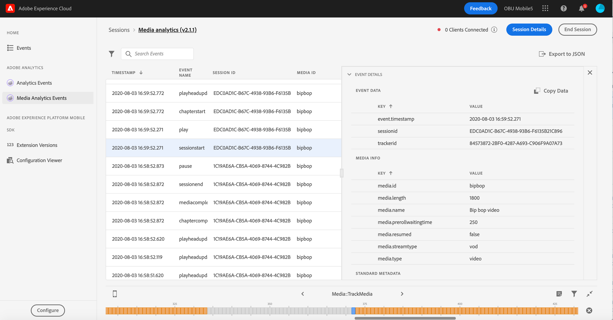

# 在 Assurance 中檢視適用於串流媒體的 Adobe Analytics

由於適用於串流媒體的 Adob&#x200B;&#x200B;e Analytics 和 Adob&#x200B;&#x200B;e Experience Platform Assurance 之間的整合，您現在可以驗證行動應用程式中的 Media Analytics 實作。Media Analytics 檢視會顯示在媒體工作階段中追蹤的內容，例如：

- 工作階段開始事件 (包含所有內容核心、標準中繼資料和自訂的中繼資料屬性)，以及工作階段結束和工作階段完成事件。
- 附加了所有廣告屬性的「廣告插播開始」和「廣告開始」事件，以及兩者的「略過」和「完成」事件。
- 附加了所有屬性的「章節開始」，以及「章節略過」和「章節完成」事件。
- 所有播放變更事件 (播放、暫停、緩衝、錯誤、位元速率變更)。
- 所有播放器狀態變更追蹤事件 (開始、結束)。

在 Analytics 中處理資料後，後續處理的狀態和資料 (例如花費的媒體時間和暫停持續時間總計) 也可在事件詳細資料檢視中查看。

## 快速入門

繼續進行之前，請確保您擁有以下服務：

- [Adobe Experience Platform 資料集合 UI](https://experience.adobe.com/#/data-collection/)。
- [Adobe Experience Platform Assurance](https://experience.adobe.com/assurance)

若要了解如何在您的應用程式中安裝 Assurance，請詳閱[實作 Assurance 指南](../tutorials/implement-assurance.md)。

## 將 Assurance 和適用於串流媒體的 Adobe Analytics 一起使用

將您的 Adob&#x200B;&#x200B;e Analytics 應用程式連線並設定完成後，您就準備好可以針對串流媒體 Analytics 對其進行設定。在左側面板的底部，選取&#x200B;**[!UICONTROL 設定]**，以新增 Media Analytics 事件檢視並將其&#x200B;**儲存**。

新增後，即可選取 **[!UICONTROL Media Analytics 事件]**&#x200B;檢視 (在 **[!UICONTROL Adobe Analytics]** 章節中)，以驗證您的工作階段追蹤。

在 **[!UICONTROL Media Analytics 事件]**&#x200B;檢視中，您可以依工作階段 ID (VSID) 搜尋和篩選，即可檢視特定的媒體工作階段。若要檢視其他事件的詳細資料，請選取特定事件。

若要以更精簡的方式檢視 API 呼叫，您還可以選取&#x200B;**[!UICONTROL 隱藏播放點更新事件]**&#x200B;篩選器，以隱藏播放點更新事件。

>[!INFO]
>
>檢視後續處理的媒體分析資料需要使用 SDK 版本：Android Media 2.1.2 和 iOS AEPMedia 3.0.1 (或更高版本)

若要檢視後續處理的資料，請找到工作階段開始事件並在狀態欄中驗證工作階段是否已完成。如已完成，請按一下該事件，即可在事件詳細資料檢視中檢視媒體工作階段摘要。如需進一步的詳細資料，請向下捲動即可找到後續處理的詳細資料。

