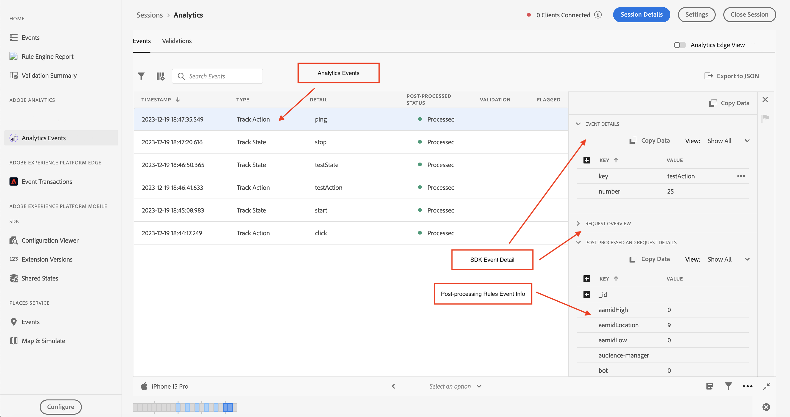

# 在Assurance中檢視Adobe Analytics事件

Analytics事件為使用者提供更豐富的SDK事件檢視，以便除錯和驗證其Adobe Analytics實施。 檢視會顯示從[Adobe AnalyticsEdge NetworkSDK](https://developer.adobe.com/client-sdks/edge/edge-network/)以及[Adobe Experience Platform行動SDK](https://developer.adobe.com/client-sdks/solution/adobe-analytics/)傳送到Adobe Experience Platform的事件。 此檢視也有詳細資訊面板，可提供使用者端SDK和上游服務在事件離開裝置後如何處理事件的相關內容。

## 快速入門

若要使用此檢視，請完成下列步驟：

1. [設定Adobe Experience Platform保證](../tutorials/implement-assurance.md)。
2. [建立並連線至保證工作階段](../tutorials/using-assurance.md)。
3. 在左側導覽&#x200B;**首頁**&#x200B;檢視功能表的Assurance UI中，選取&#x200B;**Analytics事件**。 如果沒有看到此選項，請選取視窗左下角的&#x200B;**設定**、新增&#x200B;**Analytics事件**，然後選取&#x200B;**儲存**。

## Analytics Edge檢視

如果您使用&#x200B;**Edge Network**&#x200B;或&#x200B;**Edge Bridge**&#x200B;行動擴充功能，請使用Analytics Edge檢視。 當右上角的「Analytics Edge檢視」切換開關已啟用此檢視，並在您目前的作業階段中顯示透過Edge網路傳送的Analytics事件。 這包括生命週期擴充功能、Edge擴充功能及/或Edge Bridge擴充功能所引發的所有事件。

Analytics Edge檢視包含使用者端傳送的Analytics相關Edge事件和生命週期事件的相關資訊。 透過在清單中選擇事件，右側的事件詳細資料檢視面板會顯示使用者端SDK和上游服務在離開裝置後所處理的事件。 這可讓您輕鬆檢視呼叫所導致的事件鏈。

清單中的&#x200B;**後續處理的資料**&#x200B;事件會確認資料已成功處理並傳送至Adobe Analytics。 如果此事件或任何已處理的資料遺失，使用者可以展開清單中的每個事件，以檢視詳細的偵錯資訊。

### Analytics Edge事件詳細資料檢視

對於Edge請求事件或Analytics追蹤事件，詳細檢視包含下列資訊：

* 事件詳細資料：原始SDK邊緣請求事件。
* Edge Bridge請求： Edge Bridge擴充功能工作流程專屬的事件。
* 資料流：代表此工作階段之資料流的事件。
* 收到的Edge點選：代表從Edge收到的點選。
* 已處理的Edge點選：代表Edge中已處理的點選。
* Analytics點選：代表從Analytics收到的點選。
* Analytics對應：代表Analytics中的資料對應狀態。
* Analytics已回應：來自Analytics的回應狀態。
* 處理後資料：包含迴轉、eVar和prop對應之事件的相關資訊。

### Analytics Edge驗證

Analytics Edge驗證檢視可讓您輕鬆檢視與Analytics Edge工作階段相關的驗證指令碼結果。 驗證器顯示的錯誤可能包含應加以修正的連結，或顯示處於錯誤狀態的事件。

![在Analytics Edge檢視中顯示[驗證器]索引標籤的影像。](./images/adobe-analytics/edge-analytics-validation-view.png)

## Analytics事件檢視

如果您使用&#x200B;**Adobe Analytics**&#x200B;行動擴充功能，請使用Analytics事件檢視。 此檢視可讓您輕鬆檢視從連線使用者端傳送的Analytics事件，包括追蹤動作、追蹤狀態和生命週期事件。 當右上方的「Analytics Edge檢視」切換功能停用時，此檢視即會啟用。

選取事件表格中的其中一個Analytics事件，即可在右側面板檢視事件處理方式的詳細資訊。

### 後續處理的狀態

SDK透過Adobe Analytics提出網路要求後，狀態會告訴您保證是否能夠擷取Adobe Analytics要求的後處理資訊。 觸發請求後，當後續處理狀態仍在運作時，Analytics事件檢視必須保持作用中。

請注意，為了擷取後續處理資訊，已登入的使用者必須有權存取相對應的報表套裝。

| 狀態 | 說明 |
| :----- | :---------- |
| `Queued` | 網路要求正在擷取後續處理資訊。 |
| `Processed` | 網路要求成功，已收到後續處理資訊。 |
| `Delayed` | 已超出擷取後續處理資訊的要求重試次數上限。 |
| `Error` | 錯誤已導致網路要求失敗。有關錯誤的更多詳細資料會顯示在事件詳細資料檢視中。 |
| `Unauthorized` | 使用者無權存取 Adob&#x200B;&#x200B;e Analytics 報表套裝。 |
| `Unavailable` | Adobe Analytics 要求沒有相對應的 `AnalyticsResponse` 事件。 |
| `No Debug Flag` | 目前的 Adob&#x200B;&#x200B;e Analytics 或 Assurance SDK 版本可能不支援 Analytics 的偵錯功能。如需詳細資訊，請詳閱[疑難排解指南](../troubleshooting.md)。 |
| `Expired` | 此 `AnalyticsTrack` 或 `LifecycleStart` 事件發生時間已超過 24 小時。 |

### 事件詳細資料檢視

對於Analytics追蹤事件，詳細檢視包含下列部分：

* 起源的 SDK Analytics 要求事件。
* 請求的中繼和內容資料，例如報表套裝ID、SDK擴充功能版本和內容資料。
* Analytics事件的後續處理資訊，其中包含變數、eVar和prop的對應。

### Analytics檢視驗證

驗證檢視可讓您輕鬆檢視與Analytics相關的驗證指令碼結果。 驗證器顯示的錯誤可能包含應加以修正的連結，或顯示處於錯誤狀態的事件。

![在Analytics檢視中顯示[驗證器]索引標籤的影像。](./images/adobe-analytics/analytics-validation-view.png)