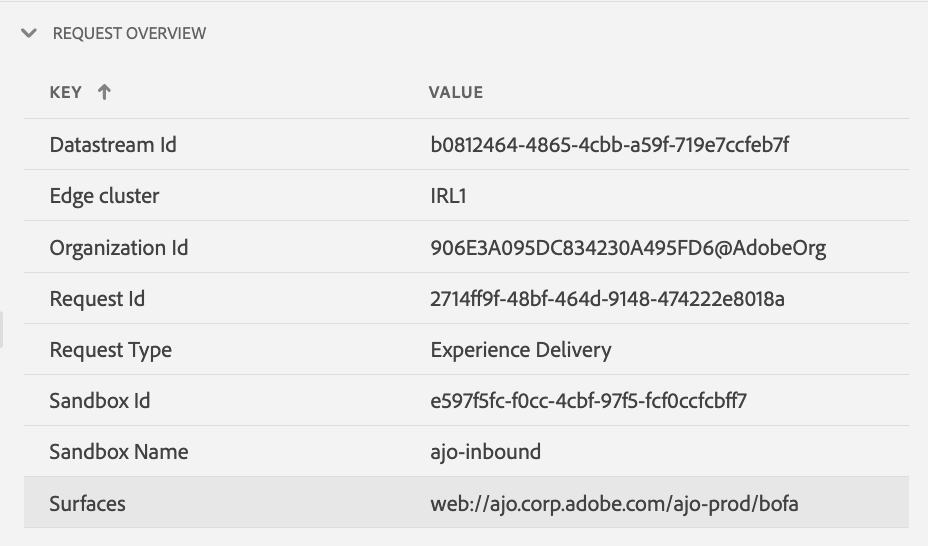

# Asurance中的Edge傳遞檢視

此 **[!UICONTROL Edge傳遞]** 檢視內部 **[!UICONTROL Adobe Experience Platform保證]** 提供檢查及驗證的能力 [!UICONTROL AJO傳入] 將訊息邊緣傳送到您的網頁和行動應用程式。 此檢視在疑難排解傳遞問題時特別有用 [!UICONTROL AJO傳入] 網頁和行動行銷活動與歷程。

## 快速入門

在繼續之前，請確定您有權存取以下服務：

- [Adobe Experience Platform 資料集合 UI](https://experience.adobe.com/#/data-collection/)。
- [Adobe Experience Platform Assurance](https://experience.adobe.com/assurance)

若要瞭解如何安裝 **[!UICONTROL 保證]** 在您的應用程式中，請參閱 [實作保證指南](../tutorials/implement-assurance.md).

## 使用邊緣傳送保證

一旦您開啟 **[!UICONTROL 保證]** 工作階段，您可以新增 **[!UICONTROL Edge傳遞]** 檢視到 **[!UICONTROL 保證]**. 在左側面板底部，選取 **[!UICONTROL 設定]** 新增 **[!UICONTROL Edge傳遞]** 檢視和 **儲存** it.

新增後，選取 **[!UICONTROL Edge傳遞]** 在中檢視 **[!UICONTROL Adobe Journey Optimizer]** 區段以驗證傳入邊緣傳遞。

## 請求清單

在檢視的主窗格上，會顯示邊緣傳送要求清單。 此清單顯示所有 [!UICONTROL 傳入AJO] 向Experience Edge提出並由處理之請求 **[!UICONTROL 傳入傳遞服務]**，包括擷取個人化決定的要求，以及追蹤個人化主張互動（例如顯示、點按、觸發或解除）。

請求會依時間戳記排序，最新的請求會位於頂端。 除了時間戳記之外，此清單也包含「請求ID」欄，以及「請求型別」，可為下列其中一項：

- **[!UICONTROL 體驗傳送]**：擷取個人化決定的請求
- **[!UICONTROL 體驗互動]**：追蹤個人化主張互動的要求
- **[!UICONTROL 體驗交付和互動]**：擷取個人化決定的請求，其中也包含個人化主張互動
- **[!UICONTROL 預覽傳遞]**：擷取預覽個人化決定的請求

您也可以在清單頂端的搜尋列中輸入搜尋字詞，以篩選請求。 依特定值（例如ID）篩選時，這項功能相當實用。

## 詳細請求檢視

在主檢視中選取請求後，所選請求的詳細資訊將顯示在右側。 此檢視包含下列段落：

### 請求總覽

本節提供所選請求的高層級概觀，包括 [!UICONTROL 組織ID]， [!UICONTROL 邊緣叢集]， [!UICONTROL 請求ID] 和 [!UICONTROL 請求型別]， [!UICONTROL 沙箱ID]， [!UICONTROL 沙箱名稱]， [!UICONTROL 資料串流ID]，以及若出現以下情形時的請求介面清單： [!UICONTROL 體驗傳送] 要求。

### 設定檔

本節提供處理請求時使用的設定檔資料相關資訊，包括身分對應、區段會籍和同意設定。\
此 [!UICONTROL 個人資料] 區段在疑難排解傳送因遺失或延遲區段成員資格或選擇退出同意設定而無法正常運作等問題時非常有用。

### 符合資格的活動

本節提供符合所選請求資格的活動清單，包括活動型別、ID、身分名稱空間、介面、排程和對象。 有關活動的更多詳細資訊，請參閱 [原始執行追蹤區段](#execution).

### 不合格活動

本節提供不合格之活動的清單。 除了活動型別、ID、身分名稱空間、介面、排程和對象之外，本節也包含活動不符合資格的原因清單。

### 訊息詳細資料

本節提供所選請求所傳遞之訊息的詳細資訊。 其中包含訊息ID、片段、決定原則、 [!UICONTROL offer decisioning] 引數，以及訊息選擇內容。

### 互動

本節提供在所選請求中追蹤之互動的詳細資訊。 其中包含互動型別(在 `propositionEventType`)以及相關的主張中繼資料，例如活動中繼資料（在底下） `scopeDetails.activity`)和主張事件Token (在 `scopeDetails.characteristics.eventToken`)。

### 原始追蹤

本節提供所選請求的原始追蹤。 其中包含請求的完整追蹤，包括收到的實際請求 **[!UICONTROL 傳入傳遞服務]**、執行追蹤和回應追蹤。 這對於進階疑難排解（例如由於傳送服務無法使用、資料遺失或不正確而導致傳送無法如預期運作）或瞭解完整的請求處理流程而言，非常有用。

#### 請求

請求追蹤包含完整請求，因為已由 **[!UICONTROL 傳入傳遞服務]** **[!UICONTROL Konductor]** 上游。 其中包含請求標頭、本文和其他中繼資料。 例如，您可在中檢查請求的XDM裝載 `event.body.xdm` 欄位。

#### 執行

執行追蹤包含要求的完整追蹤，因為它是由 **[!UICONTROL 傳入傳遞服務]**. 它會顯示執行內容、活動資格、訊息選擇和其他處理步驟。 處理請求期間發生的任何錯誤或警告可在下列位置找到： `context.messages` 和 `context.exceptions` 欄位。 若需詳細的活動資格資訊，請參閱 `context.qualifiedActivitiesDetailed` 和 `context.unqualifiedActivitiesDetailed` 欄位。

#### 回應

回應追蹤包含傳回的完整回應 **[!UICONTROL 傳入傳遞服務]** 下游至 **[!UICONTROL Konductor]**. 其中包含回應標頭、本文和其他中繼資料。 複製含有ID的訊息即可檢查完整的回應內文 `1` 至剪貼簿，使用 **[!UICONTROL 複製值]** 按鈕並將其貼到JSON檢視器中。

