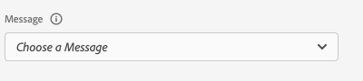
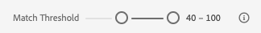

# Assurance 中的應用程式內傳訊檢視

Adobe Experience Platform Assurance 中的應用程式內傳訊檢視會提供驗證您的應用程式、監視傳遞到您的裝置的應用程式內訊息以及模擬傳送到您的裝置的訊息的功能。

## 裝置上的訊息

在「**[!UICONTROL 裝置上訊息]**」索引標籤頂端有一個&#x200B;**[!UICONTROL 訊息]**&#x200B;下拉選單。這會包括在 Assurance 工作階段中接收到的所有訊息。如果有訊息不在此清單中，即表示應用程式從未收到該訊息。



選取一則會顯示有關該訊息的大量資訊的訊息，如下節所述。

### 訊息預覽

右側面板中有一個&#x200B;**[!UICONTROL 訊息預覽]**&#x200B;窗格，會顯示預覽的訊息。選取「**[!UICONTROL 在裝置上模擬]**」會將該訊息傳送到目前和工作階段連線的任何裝置。


### 訊息行為

**[!UICONTROL 訊息預覽]**&#x200B;窗格下方是&#x200B;**[!UICONTROL 訊息行為]**&#x200B;索引標籤。其中會包含有關如何顯示訊息的所有詳細資料。此資訊包括定位資訊、動畫、滑動手勢和外觀設定。


### 資訊索引標籤

在左側章節中，有四個顯示訊息詳細資料的索引標籤。此&#x200B;**[!UICONTROL 資訊]**&#x200B;索引標籤會顯示從 Adob&#x200B;&#x200B;e Journey Optimizer (AJO) 載入的有關訊息活動的資訊。

您還可以選取「**[!UICONTROL 檢視行銷活動]**」，即可在 AJO 中開啟訊息，以進行檢查或編輯。


### 規則索引標籤

此「**[!UICONTROL 規則]**」索引標籤會顯示需要發生什麼情況才會顯示此訊息。這對於可觸發訊息顯示的原因提供了精確的分析。不妨看看以下範例：


此範例會顯示適用於該規則的三個不同條件。如果您 (從事件清單、「分析」索引標籤或時間表中) 選取某個事件，該事件即會根據這些規則受到評估。如果事件和條件相符，它會顯示綠色的打勾記號：


如果事件並不相符，則會顯示紅色圖示：


如果所有三個條件都和目前的事件相符，即會顯示該訊息。

### 「分析」索引標籤

此「**[!UICONTROL 分析]**」索引標籤會提供對規則的更多分析。在此，我們會根據我們的訊息規則和事件的相符程度來篩選工作階段中的每個事件。


在「**[!UICONTROL 規則索引標籤]**」一節的範例中，規則中有三個條件。此索引標籤會顯示每個事件和多少百分比的規則相符。大多數事件的相符程度為 33% (三個條件之一)，其餘則有 100% 的相符程度。

因此，您可以找到和事件近乎相符但不完全相符的事件。



此&#x200B;**[!UICONTROL 相符臨界值]**&#x200B;滑桿可讓您篩選應顯示的事件。例如，可以將其設定為 50% - 90%，以取得和三個條件中的兩個完全相符的事件清單。

### 互動索引標籤

此&#x200B;**[!UICONTROL 互動]**&#x200B;索引標籤會顯示傳送到 Edge 的互動清單，以用於追蹤。


每當顯示一則訊息時，通常會發生四個互動事件：

```
trigger > display > interact > dismiss
```

「進行互動」的互動具有一個和該互動相關聯的附加「動作」值。可能的值包括「已點擊」或「取消」。

驗證欄會顯示 Edge 是否正確接收並處理了互動事件。

## 驗證

此&#x200B;**[!UICONTROL 驗證]**&#x200B;索引標籤會針對目前的工作階段執行驗證，進行檢查以查看是否已將應用程式正確設定為應用程式內傳訊：


如果發現任何錯誤，會提供有關如何修正這些錯誤的詳細資料。

## 事件清單


此&#x200B;**[!UICONTROL 事件清單]**&#x200B;索引標籤可用於快速查看 Assurance 工作階段中和應用程式內傳訊相關的所有事件。您可在這裡看到的部分事件包括：

* 擷取訊息的要求和回應
* 顯示訊息事件
* 互動追蹤事件

在此檢視中，您可以使用許多標準事件清單的功能，包括套用搜尋、套用篩選器、新增或移除欄以及匯出資料。

選取一個事件以在右側面板中檢視該事件的原始詳細資料。

從右側的詳細資料面板中，可為選取的事件加上標幟，這有助於標記應由其他人檢閱的內容。
