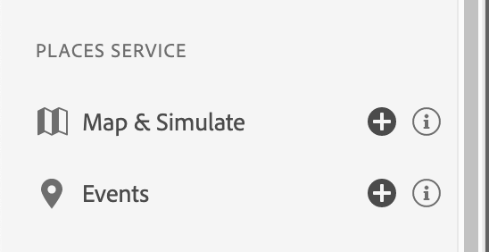

# 在保證中放置服務視圖

的 **[!UICONTROL 位置]** 查看允許您檢查Adobe Experience PlatformAssurance Web UI上的位置進入和退出事件，並提供創新的設備上視圖。 根據您的業務工作流，這些方便的視圖提供了一個方便的介面，可顯示特定於位置的資料點，供在Web/客戶端上檢查以進行上下文調試。

我們知道，將位置上下文與您的應用體驗結合起來，可以讓他們更有吸引力。 但是，調試和驗證位置觸發器可能會很痛苦。 使用這些視圖並查看您在設備上收集的資料有助於緩解這種痛苦。

## 使用Oracle Assurance與Places服務

要開始，請完成以下步驟：

1. [設定保證](../tutorials/implement-assurance.md)。
2. 要查看事件，請從左側菜單中選擇 **事件視圖** 下 **位置服務** 的子菜單。

