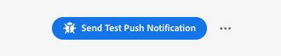

# 推播偵錯檢視

Adobe Experience Platform Assurance 內的「推播偵錯」檢視能夠驗證應用程式的推播設定並傳送測試訊息到您的裝置。

## 用戶端

用戶端下拉選單會包含已連線至此 Assurance 工作階段的每個唯一用戶端的清單。用戶端可以是不重複裝置，也可以是為裝置安裝的唯一應用程式。例如，如果 Android 裝置和 iOS 裝置都已經連線到工作階段，這些用戶端就會顯示在用戶端下拉選單中。

在裝置上重新安裝並和應用程式重新連線後，會顯示另一個用戶端。如果具有該名稱的裝置已經存在，新的下拉選單會在該名稱後附加 #2。

此檢視僅針對單一用戶端啟用，因此若選取不同的用戶端，畫面上的詳細資料即會變更。

## 驗證設定

此「**[!UICONTROL 驗證設定]**」索引標籤會驗證並提供有關應用程式推播設定的其他詳細資料。共有三個執行驗證的面板。如果驗證全部成功，這些面板會顯示綠色的打勾記號。如果出現三個綠色的打勾記號，則表示應用程式已正確設定推播訊息，正在將推播權杖寫入使用者設定檔，並且已設定相關聯的應用程式表面。

如果有某些功能未如預期運作，則會出現一則警示，其中會包含有關如何解決該問題的詳細資料：

### 用戶端詳細資料

此面板會檢查確認裝置是否已正確設定。這包括在資料集合 UI 中設定擴充功能、在應用程式中將擴充功能及其必要條件初始化，以及從裝置擷取推播權杖。

如果有效，則面板會顯示裝置的 ECID、推播權杖以及 Edge 沙箱名稱和類型。

### 設定檔詳細資料

正確設定用戶端後，此面板會檢查確認裝置是否寫入設定檔。它還會驗證設定檔中的推播權杖是否和裝置上的權杖相符。

如果有效，則面板會顯示裝置的 ECID、推播權杖、應用程式的應用程式 ID、傳訊平台以及是否已將推播權杖加入拒絕清單中。將權杖加入拒絕清單的原因可能有許多種，例如使用者已解除安裝應用程式或使用者已停用應用程式的推播訊息。

最後，在面板底部有一個連結，可用以在新索引標籤中開啟此特定的設定檔。

### AppStore 認證和設定

此面板會驗證儲存在設定檔中的應用程式 ID 和傳訊平台是否和已建立的應用程式表面相符。應用程式表面可用於上傳應用程式的推播認證。

如果有效，設定檔會顯示應用程式表面的名稱、應用程式 ID 和傳訊服務的名稱。

最後，在面板底部有一個連結，可用以在新索引標籤中開啟此特定的應用程式表面。

## 傳送測試推播

此「**[!UICONTROL 傳送測試推播]**」索引標籤可用於傳送測試訊息到您的裝置。

有多個窗格可供設定，以測試不同的 iOS 和 Android 推播功能。設定完成後，請選取「**[!UICONTROL 傳送測試推播通知]**」，即可傳送您的訊息。

### 訊息

您可在「**[!UICONTROL 訊息]**」窗格中提供訊息的標題和內文。也能在這裡啟用靜音通知功能。

### 推播目標

此「**[!UICONTROL 推播目標]**」窗格可讓您自訂傳送推播訊息時要使用哪個推播權杖和應用程式表面。

如果「**[!UICONTROL 驗證設定]**」索引標籤顯示三個綠色的打勾記號，則依預設會提供此資訊。但是，即使您的應用程式未完全設定，您也可以提供自己的推播權杖和應用程式表面。

### 點擊行為

您可在「**[!UICONTROL 點擊行為]**」窗格中選擇在裝置上點擊推播通知時應採取的行為。預設情況下，它會開啟應用程式，但它可開啟深度連結或網頁。

如果您選擇使用深度連結，則應用程式開發人員必須為您建立一個。

### 多媒體

此「**[!UICONTROL 多媒體]**」可讓您對訊息新增額外媒體，例如影像、影片或 GIF。應用程式開發人員必須在應用程式上新增程式碼才能啟用此功能。

### 按鈕

此「**[!UICONTROL 按鈕]**」窗格讓您可將額外的按鈕新增到推播通知。每個按鈕都可開啟應用程式、開啟應用程式的深度連結或開啟網頁。

應用程式開發人員必須在應用程式上新增程式碼才能啟用此功能。

### 自訂資料

此「**[!UICONTROL 自訂資料]**」讓您可將自訂資料新增到推播通知。每個索引鍵/值組都會以中繼資料的方式和訊息一起傳送，並可供開發人員用於建立強大的體驗及新增額外的追蹤。

## 測試結果

傳送訊息後，「**[!UICONTROL 測試結果]**」區段會從推播服務接收到訊息的資料。您可以在這裡查看是否已將訊息成功傳送至 Google/iOS 傳訊服務：

如果出現任何問題，會在這裡顯示：

## 進階

### 檢視訊息承載

在「**[!UICONTROL 傳送測試推播通知]**」按鈕旁有一組具有快顯視窗選單的省略符號。您可從這裡查看訊息承載。這讓您可查看將傳送到遠端傳訊服務的確切訊息內容。您可以檢閱此承載，或甚至可將其複製並貼到桌面的推播測試工具中。

