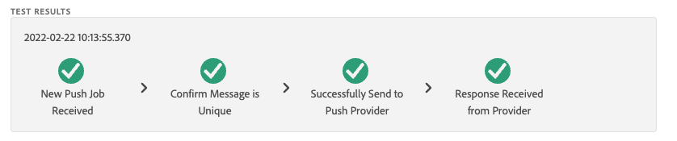

# 推送調試視圖

「Adobe Experience Platform保障內的推送調試視圖」提供了驗證應用的推送設定並將test消息發送到設備的功能。

## 客戶端

客戶端下拉清單包含連接到此保證會話的每個唯一客戶端的清單。 客戶端是設備的唯一設備或設備的唯一應用程式安裝。 例如，如果Android設備和iOS設備已連接到會話，則這些客戶端將顯示在「客戶端」下拉清單中。

在設備上重新安裝並重新連接應用程式後，將出現另一個客戶端。 如果已存在具有該名稱的設備，則新下拉清單將在名稱后追加#2。

此視圖僅對單個客戶端啟用，因此選擇其他客戶端將更改螢幕上的詳細資訊。

## 驗證設定

的 **[!UICONTROL 驗證設定]** 頁籤驗證並提供有關應用推送設定的其他詳細資訊。 有三個面板執行驗證。 如果驗證全部成功，則它們將顯示一個綠色複選標籤。 如果有三個綠色複選標籤，則應用程式已正確配置為推送消息傳遞，正在將推送令牌寫入用戶配置檔案，並且已配置了關聯的應用程式表面。

如果某個項目未按預期運行，則會出現警報，並提供有關如何解決此問題的詳細資訊：

### 客戶端詳細資訊

此面板檢查設備是否配置正確。 這包括在資料收集UI中配置擴展、初始化應用程式中的擴展及其先決條件，以及從設備捕獲推式令牌。

如果有效，面板將顯示設備的ECID、推式令牌以及邊緣沙盒名稱和類型。

### 配置檔案詳細資訊

正確設定客戶端後，此面板將檢查設備是否正在寫入配置檔案。 它還驗證配置檔案中的推令牌是否與設備上的推令牌匹配。

如果有效，則面板將顯示設備的ECID、推令牌、應用程式的應用ID、消息傳遞平台，以及推令牌是否已被拒絕列出。 由於用戶已卸載應用或用戶已禁用應用的推送消息等各種原因，可拒絕列出令牌。

最後，面板底部有一個連結，它將在新頁籤中開啟此特定配置檔案。

### AppStore憑據和配置

此面板驗證保存在配置檔案中的應用ID和消息傳遞平台是否已建立匹配的應用表面。 應用程式表面是上載應用程式的推送憑據的位置。

如果有效，配置檔案將顯示應用程式表面的名稱、應用程式ID和消息服務的名稱。

最後，面板底部有一個連結，該連結將在新頁籤中開啟此特定應用曲面。

## 發送test推送

的 **[!UICONTROL 發送Test推送]** 頁籤可用於向設備發送test消息。

有幾個窗格可配置為test不同的iOS和Android推送功能。 配置後，選擇 **[!UICONTROL 發送Test推送通知]** 來發送您的消息。

### 訊息

在 **[!UICONTROL 消息]** 的子菜單。 此處也可啟用靜默通知功能。

### 推送目標

的 **[!UICONTROL 推送目標]** 窗格允許您自定義在發送推送消息時要使用的推送令牌和應用曲面。

如果 **[!UICONTROL 驗證設定]** 頁籤中顯示三個綠色複選標籤。 但是，即使您的應用未完全配置，您也可以提供自己的推送令牌和應用曲面。

### 按一下行為

從 **[!UICONTROL 按一下行為]** 窗格中，您可以選擇在設備上按一下推送通知時應執行的行為。 預設情況下，它將開啟應用，但可以開啟一個瀏覽器或網頁。

如果選擇使用deeplink，則應用程式開發人員必須為您建立一個。

### 富媒體

的 **[!UICONTROL 富媒體]** 窗格允許您向消息添加額外的媒體，如影像、視頻或GIF。 應用開發者必須向應用添加代碼才能啟用此功能。

### 按鈕

的 **[!UICONTROL 按鈕]** 窗格中，您可以向推送通知添加附加按鈕。 每個按鈕都可以開啟應用、開啟應用的連結或開啟網頁。

應用開發者必須向應用添加代碼才能啟用此功能。

### 自訂資料

的 **[!UICONTROL 自定義資料]** 窗格允許您將自定義資料添加到推送通知。 每個密鑰/值對都作為元資料連同消息一起發送，開發人員可以使用它們建立強大的體驗並添加附加跟蹤。

## Test結果

一旦您發送了消息， **[!UICONTROL Test結果]** 部分從推送服務接收消息的資料。 在這裡，您可以看到消息是否已傳到Google/iOS消息服務：

如果出現任何問題，將在此處顯示：

## 進階

### 查看消息負載

在 **[!UICONTROL 發送Test推送通知]** 按鈕是一組帶有彈出菜單的省略號。 在此處，您可以查看消息負載。 這樣，您就可以看到將發送到遠程消息服務的確切消息。 您可以查看此負載，甚至可以將其複製並貼上到案頭推送測試工具中。

