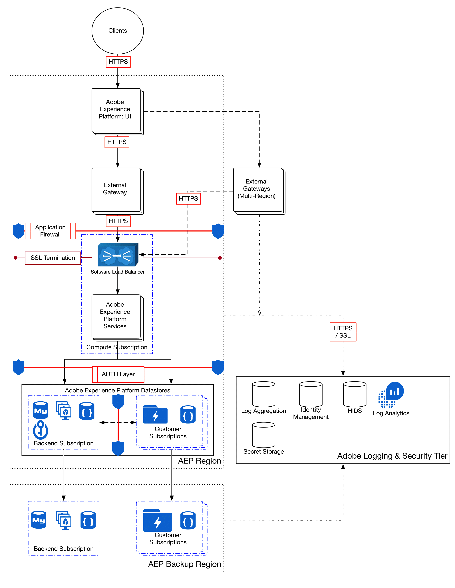

# Adobe Experience Platform中的資料保護

Adobe Experience Platform所吸收和使用的所有資料都會儲存在 [!DNL Data Lake]，這是高度精細的資料存放區，包含所有由管理的資料，不論來源或檔案 [!DNL Platform]格式為何。 所有保存在中的資料 [!DNL Data Lake] 都會加密、儲存並管理在您組織所獨有的隔 [!DNL Microsoft Azure Data Lake] 離儲存帳戶中。

以下流程圖說明了資料如何通過以下方式接收、處理、加密和保存 [!DNL Experience Platform]:

如需閒置資料在中加密的詳細資訊，請 [!DNL Data Lake Storage]參閱Azure資料湖 [儲存區中的資料加密檔案](https://docs.microsoft.com/en-us/azure/data-lake-store/data-lake-store-encryption)。 如需閒置資料在中如何加密的詳細資訊 [!DNL Cosmos DB]，請參閱Azure Cosmos DB中 [的資料加密檔案](https://docs.microsoft.com/en-us/azure/cosmos-db/database-encryption-at-rest)。