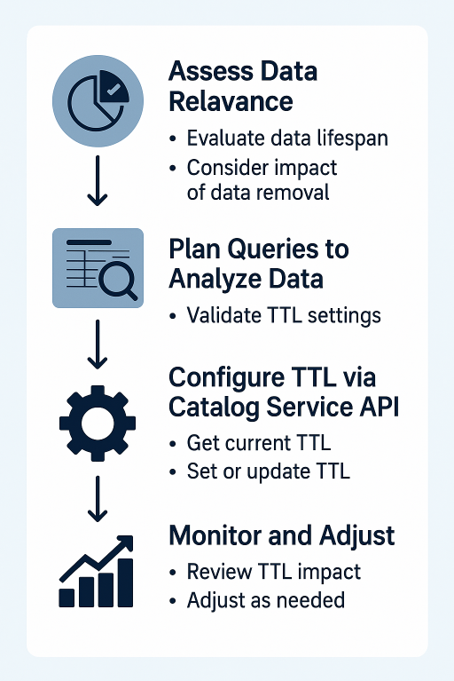

# 使用TTL管理資料湖中的體驗事件資料集保留

高效的資料管理對於最佳效能、成本控制及資料完整性至關重要。 使用體驗事件資料集保留存留時間(TTL)強制執行列層級的有效期，自動從資料湖的資料集中移除過時的記錄，同時確保最佳儲存效率和資料關聯性。

本指南說明如何使用目錄服務API來評估、設定和管理TTL。 您將瞭解何時及為何套用TTL、如何使用API呼叫設定和更新TTL值，以及確保有效實施的最佳實務。

>[!IMPORTANT]
>
> TTL的設計目標是最佳化資料生命週期管理和儲存效率。 這不是合規性工具，也不應依賴法規要求。 法規遵循通常需要更廣泛的資料治理策略。

## 為何使用TTL進行列層級資料管理

隨著資料整合長，有效率的資料管理對於保留效能、控制成本以及維持資料相關性的重要性日益提高。 TTL型資料列層級資料到期會移除過時的記錄，自動進行資料清理，無需手動介入，以協助最佳化儲存空間並提升系統效率。

TTL在管理時效性資料時會很有用，因為這類資料會隨著時間推移而失去相關性。 如果您有以下需要，請考慮實作TTL：

- 自動移除過時的記錄，降低儲存成本。
- 將無關資料減至最少，以改善查詢效能。
- 僅保留相關資訊以維持資料衛生。
- 最佳化資料保留，以支援業務目標。

>[!NOTE]
>
>體驗事件資料集保留適用於儲存在Data Lake中的事件資料。 如果您在Real-Time Customer Data Platform中管理保留，請考慮搭配使用[體驗事件有效期](../../profile/event-expirations.md)和[假名設定檔有效期](../../profile/pseudonymous-profiles.md)以及資料湖保留設定。
>
>TTL設定可協助您根據許可權最佳化儲存。 雖然在Real-Time CDP中使用的設定檔存放區資料可能會被視為過時，並在30天後移除，但針對分析和資料Distiller使用案例，資料湖中的相同事件資料仍可在12至13個月內可用（或更久則根據權益）。

### 行業範例 {#industry-example}

例如，考慮使用視訊串流服務來追蹤使用者互動，例如視訊檢視、搜尋和推薦。 雖然最近的參與資料對個人化至關重要，但較舊的活動記錄（例如一年前的互動）會失去相關性。 透過使用列層級的有效期，Experience Platform會自動移除過時的記錄，確保只有目前且有意義的資料才會用於分析和建議。

## 評估TTL適用性

在套用保留原則之前，請評估您的資料集是否適合列層級的有效期。 請考量下列事項：

- 一段時間的資料關聯性：較舊的資料是否提供價值，或是會過時？
- 對下遊程式的影響：移除資料是否會影響報表、分析或整合？
- 儲存成本與保留價值：舊資料的價值是否足以證明儲存資料的成本？

如果歷史記錄對長期分析或業務營運至關重要，則TTL可能不是正確的方法。 檢閱這些因素，可確保TTL符合您的資料保留需求，而不會對資料可用性造成負面影響。

## 計畫您的查詢 {#plan-queries}

在套用TTL之前，請務必評估資料集大小和資料關聯性，並評估應該保留多少歷史資料。 下列視覺效果概述實作TTL的完整程式，從規劃查詢到監控保留成效。



執行目標查詢可協助判斷在不同TTL設定下會保留或移除多少資料。 例如，下列SQL查詢會計算過去30天內建立的記錄數：

```sql
SELECT COUNT(1) FROM [datasetName] WHERE timestamp > date_sub(now(), INTERVAL 30 DAY);
```

針對不同的時間間隔執行類似的查詢有助於驗證TTL設定，並確保它們在儲存效率和資料可存取性之間取得平衡。

## 開始使用TTL管理

您必須先瞭解如何正確格式化請求，才能使用目錄服務API評估、設定及管理體驗事件資料集保留。 這包括瞭解API路徑、提供必要的標頭以及格式化要求承載。 如需此重要資訊，請參閱[目錄服務API快速入門手冊](../api/getting-started.md)。

>[!NOTE]
>
>本檔案說明列層級的有效期，此有效期會刪除資料集中的個別過期列，同時保持資料集本身不變。 這不適用於資料集有效期，因為到期日會移除整個資料集，並由另一個功能管理。 如需資料集層級的有效期，請參閱[資料集有效期API檔案](../../hygiene/api/dataset-expiration.md)。

### 如何檢查目前的TTL設定

若要開始進行TTL管理，請先檢查目前的TTL設定。 向`/ttl/{datasetId}`端點發出GET要求，以擷取資料集的預設、最大和最小TTL設定。 此為必要步驟，因為TTL規則可能會因資料集型別而異。

>[!TIP]
>
>目錄服務API的Experience Platform閘道URL和基本路徑為： `https://platform.adobe.io/data/foundation/catalog`。

**API格式**

```http
GET /ttl/{DATASET_ID}
```

| 參數 | 說明 |
| --- | --- |
| `{DATASET_ID}` | 系統產生的字串，可唯一識別資料集。 若要尋找資料集識別碼，請使用`/datasets`端點。 請參閱[清單目錄物件API指南](../api/list-objects.md)，取得篩選相關資料集回應的指示。 |

**要求**

以下請求會擷取貴組織特定資料集的TTL設定。

```shell
curl -X GET \
  'https://platform.adobe.io/data/foundation/catalog/ttl/5ba9452f7de80408007fc52a' \
  -H 'Authorization: Bearer {ACCESS_TOKEN}' \
  -H 'x-api-key: {API_KEY}' \
  -H 'x-gw-ims-org-id: {ORG_ID}' \
  -H 'x-sandbox-name: {SANDBOX_NAME}'
  -H 'x-sandbox-id: {SANDBOX_ID}'
```

**回應**

成功的回應會傳回資料集的TTL設定，包括`adobe_lakeHouse`和`adobe_unifiedProfile`儲存體的預設、最大和最小TTL值。

+++選取以檢視回應

```json
{
    "67976f0b4878252ab887ccd9": {
        "name": "Acme Sales Data",
        "description": "This dataset contains sales transaction records for Acme Corporation.",
        "imsOrg": "{ORG_ID}",
        "sandboxId": "{SANDBOX_ID}",
        "tags": {
            "adobe/pqs/table": [
                "acme_sales_20250127_113331_106"
            ],
            "adobe/siphon/table/format": [
                "delta"
            ]
        },
        "extensions": {
            "adobe_lakeHouse": {  
                "rowExpiration": {
                    "defaultValue": "P12M",
                    "maxValue": "P12M",
                    "minValue": "P30D"
                }
            },
            "adobe_unifiedProfile": {  
                "rowExpiration": {
                    "defaultValue": "P12M",
                    "maxValue": "P12M",
                    "minValue": "P7D"
                }
            }
        },
        "version": "1.0.0",
        "created": 1737977611118,
        "updated": 1737977611118,
        "createdClient": "acme_data_pipeline",
        "createdUser": "john.snow@acmecorp.com",
        "updatedUser": "arya.stark@acmecorp.com",
        "classification": {
            "managedBy": "CUSTOMER"
        }
    }
}
```

+++

| 屬性 | 說明 |
|--------------|-------------|
| `defaultValue` | 若未設定自訂TTL，則會套用預設的TTL週期。 |
| `maxValue` | 資料集允許的最長TTL。 如果為null，則沒有上限。 |
| `minValue` | 允許的最短TTL可確保符合系統原則。 |

<!-- Q) what is the default Max and Min values and are they system-imposed? -->

### 如何設定資料集的TTL {#set-ttl}

>[!IMPORTANT]
>
>列到期日只能套用至使用時間序列結構描述的事件資料集。 在設定TTL之前，請確認資料集的結構描述擴充`https://ns.adobe.com/xdm/data/time-series`以確保API要求成功。 使用結構描述登入API來擷取結構描述詳細資料並驗證`meta:extends`屬性。 請參閱[結構描述端點檔案](../../xdm/api/schemas.md#lookup)，以取得如何執行此動作的指引。

若要設定資料集的「體驗事件資料集保留」，請對`/v2/datasets/{ID}`端點發出PATCH要求，以設定新的TTL值。

**API格式**

```http
PATCH /v2/datasets/{DATASET_ID}
```

| 參數 | 說明 |
| --- | --- |
| `{DATASET_ID}` | 您要更新TTL值的資料集ID。 |

**要求**

在下列範例要求中，`ttlValue`設定為`P3M`。 這可確保自動刪除三個月以前的記錄。 您可以使用值（例如`P6M`為六個月，或`P12M`為一年）來調整保留期，以符合您的業務需求。

```shell
curl -X PATCH \
  'https://platform.adobe.io/data/foundation/catalog/v2/datasets/{DATASET_ID}' \
  -h 'Authorization: Bearer {ACCESS_TOKEN}' \
  -h 'Content-Type: application/json' \
  -h 'x-api-key: {API_KEY}' \
  -h 'x-gw-ims-org-id: {ORG_ID}' \
  -d '{
    "extensions": {
        "adobe_lakeHouse": {
            "rowExpiration": {
                "ttlValue": "P3M"  // A 3 month retention period
            }
        }
    }
}
```

**回應**

成功的回應會顯示資料集的TTL設定。 它包含`adobe_lakeHouse`和`adobe_unifiedProfile`存放區的資料列層級到期設定詳細資料。

+++選取以檢視回應

```JSON
{
    "67976f0b4878252ab887ccd9": {
        "name": "Acme Sales Data",
        "description": "This dataset contains sales transaction records for Acme Corporation.",
        "imsOrg": "{ORG_ID}",
        "sandboxId": "{SANDBOX_ID}",
        "tags": {
            "adobe/pqs/table": [
                "acme_sales_20250127_113331_106"
            ],
            "adobe/siphon/table/format": [
                "delta"
            ]
        },
        "extensions": {
            "adobe_lakeHouse": {
                "rowExpiration": {
                "ttlValue": "P3M",
                    "valueStatus": "custom",
                    "setBy": "user",
                    "updated": 1737977766499
                }
            },
            "adobe_unifiedProfile": {  
                "rowExpiration": {
                    "ttlValue": "P3M",
                    "valueStatus": "custom",
                    "setBy": "user",
                    "updated": 1737977766499
                }
            }
        },
        "version": "1.0.0",
        "created": 1737977611118,
        "updated": 1737977611118,
        "createdClient": "acme_data_pipeline",
        "createdUser": "john.snow@acmecorp.com",
        "updatedUser": "arya.stark@acmecorp.com",
        "classification": {
            "managedBy": "CUSTOMER"
        }
    }
}
```

+++

| 屬性 | 說明 |
|----------------------------------|-------------|
| `extensions` | 與資料集相關的其他中繼資料的容器。 |
| `extensions.adobe_lakeHouse` | 指定與儲存架構相關的設定，包括列層級的到期設定 |
| `rowExpiration` | 物件包含可定義資料集保留期間的TTL設定。 |
| `rowExpiration.ttlValue` | 定義自動移除資料集中的記錄之前的持續時間。 使用ISO-8601週期格式（例如，`P3M`代表3個月，`P30D`代表一週）。 |
| `rowExpiration.valueStatus` | 字串會指出TTL設定是預設系統值，還是使用者設定的自訂值。 可能的值為： `default`， `custom`。 |
| `rowExpiration.setBy` | 指定上次修改TTL設定的人。 可能的值包括： `user` （手動設定）或`service` （自動指派）。 |
| `rowExpiration.updated` | 上次TTL更新的時間戳記。 此值表示上次修改TTL設定的時間。 |

### 如何更新TTL {#update-ttl}

調整TTL，延長或縮短保留時間，以符合您的業務需求。 例如，在考慮先前提及的視訊串流平台時，平台可能會將TTL最初設定為三個月，以確保個人化有全新的參與資料。 但是，如果他們的分析顯示超過三個月的互動模式仍可提供有價值的深入分析，他們可以將TTL期間延長到六個月，以保留較舊的記錄，以獲得更好的建議模型。

若要修改現有的TTL值，請在`/v2/datasets/{DATASET_ID}`端點上使用`PATCH`方法。

#### API格式

```http
PATCH /v2/datasets/{DATASET_ID}
```

**要求**

在下列請求中，TTL已更新為六個月(`P6M`)，延長自動刪除前的記錄保留期。

```shell
curl -X PATCH \
  'https://platform.adobe.io/data/foundation/catalog/v2/datasets/{DATASET_ID}' \
  -h 'Authorization: Bearer {ACCESS_TOKEN}' \
  -h 'Content-Type: application/json' \
  -h 'x-api-key: {API_KEY}' \
  -h 'x-gw-ims-org-id: {ORG_ID}' \
  -d '{
    "extensions": {
        "adobe_lakeHouse": {
            "rowExpiration": {
                "ttlValue": "P6M"  // Extend to 6 months
            }
        }
    }
}
```

<!-- Q) For Clarity, should this example show both data stores being updated by expanding the example payload above? -->

**回應**

```JSON
{  "extensions": {
        "adobe_lakeHouse": {
            "rowExpiration": {
              "ttlValue": "P6M",
              "valueStatus": "custom",
              "setBy": "user",
              "updated": "1737977766499"
            }
        },
        "adobe_unifiedProfile": {
            "rowExpiration": {
                "ttlValue": "P3M",
                "valueStatus": "custom",
                "setBy": "user",
                "updated": "17379754766355"
            }
        }
    }
}
```

## 設定TTL的最佳實務 {#best-practices}

選擇正確的TTL值至關重要，可確保您的體驗事件資料集保留政策在資料保留、儲存效率和分析需求之間取得平衡。 太短的TTL可能會導致資料遺失，而太長的TTL可能會增加儲存成本及不必要的資料累積。 考量資料被存取的頻率以及資料的相關性維持多久，確保TTL符合資料集的用途。

下表根據資料集型別和使用模式提供常見的TTL建議：

| 資料集型別 | 建議的TTL | 典型使用案例 |
|-----------------------------|------------------------|-------------------|
| 經常存取的資料集 | 30-90天 | 使用者參與記錄、網站點按資料流資料、短期行銷活動績效資料。 |
| 封存資料集 | 1年以上 | 財務交易記錄、合規性資料、長期趨勢分析、機器學習訓練資料集。 |
| 應用程式管理的資料集 | 最長13個月 | 系統管理的資料集有預先定義的TTL限制，這些限制會自動強制以遵守系統施加的限制。 |
| 客戶管理的資料集 | 30天 — 最大TTL | 透過UI、API或Data Distiller建立的資料集。 TTL必須至少為30天，並且必須在定義的最大TTL範圍內。 |

請定期檢閱TTL設定，以確保其持續符合您的儲存原則、分析需求及業務需求。

### 設定TTL時的主要考量事項

<!-- What are the default TTL limits for system-generated Profile Store and data lake datasets? -->

<!-- Q) Are the limits: 90 days for data in the Profile store and 13 months for data in the data lake? This is true for Journey Optimizer. -->

請遵循下列最佳實務，以確保TTL設定符合您的資料保留策略：

- 定期稽核TTL變更。 每次TTL更新都會觸發稽核事件。 使用稽核記錄來追蹤TTL修改，以符合法規、資料控管和疑難排解目的。
- 如果資料必須無限期保留，請移除TTL。 若要停用TTL，請將`ttlValue`設定為`null`。 如此可防止自動過期，並永久保留所有記錄。 進行此變更前，請先考量儲存空間的影響。

<!-- Q) Are there any specific system constraints or impacts of setting TTL to null? -->

## TTL的限制 {#limitations}

使用TTL時，請注意下列限制：

- 使用TTL的&#x200B;**體驗事件資料集保留套用至資料列層級的有效期**，而非資料集刪除。 TTL會根據定義的保留期移除記錄，但不會刪除整個資料集。 若要移除資料集，請使用[資料集到期端點](../../hygiene/api/dataset-expiration.md)或手動刪除。
- 無法移除&#x200B;**TTL**，僅更新。 套用後，無法刪除TTL，但您可以[修改保留期間](#update-ttl)以延長或縮短保留期間。 若要無限期保留資料，請設定足夠長的TTL，而非嘗試移除它。
- **TTL不是規範工具**。 TTL可最佳化儲存與資料生命週期管理，但不符合法規資料保留要求。 針對法規遵循，實施更廣泛的資料控管策略。

## 資料集保留原則常見問題集 {#faqs}

本節提供有關Adobe Experience Platform中資料集保留原則的常見問題解答。

### 我可以套用保留原則規則到哪些型別的資料集？

+++回答
您可以將保留原則套用至使用XDM ExperienceEvent類別建立的資料集。 對於設定檔服務，保留原則僅適用於已啟用設定檔的體驗事件資料集。
+++

### 資料集保留工作多久會從Data Lake服務中刪除資料？

+++回答
資料集TTL每週都會評估及處理，刪除所有過期的記錄。 如果事件在超過30天（擷取日期> 30天）前擷取至Experience Platform，且其事件日期超過定義的保留期間(TTL)，則會視為已過期。
+++

### 資料集保留工作多久會從設定檔服務中刪除資料？

+++回答
設定保留原則後，如果Experience Platform中的現有事件的事件時間戳記超過保留期間(TTL)，就會立即刪除現有事件。 一旦新事件的時間戳記超過保留期間，就會刪除這些事件。

例如，如果您在5月15日套用30天到期原則，便會發生下列情況：

- 新事件在擷取時會收到30天的有效期。
- 時間戳記早於4月15日的現有事件會立即刪除。
- 時間戳記在4月15日之後的現有事件，都會在其時間戳記後30天過期（例如，4月18日的事件將會在5月18日刪除）。
+++

### 我可以為資料湖和設定檔服務設定不同的保留原則嗎？

+++回答
可以，您可以為Data Lake和Profile服務設定不同的保留原則。 不過，設定檔的保留期間不得短於資料湖的保留期間。
+++

### 如何檢查我目前的資料集使用情形？

+++回答
您可以在[!UICONTROL 資料集]詳細目錄工作區中，以個別量度的形式檢查資料湖和設定檔存放區的最新資料集存放大小。 排序欄以識別最大的資料集，並驗證保留原則是否已套用。

如需沙箱層級的使用量，請參閱授權使用量儀表板。 如需詳細資訊，請參閱[授權使用檔案](../../dashboards/guides/license-usage.md)。
+++

### 如何驗證資料保留工作是否成功？

+++回答
您可以在[資料集保留組態UI](./user-guide.md#data-retention-policy)或「資料詳細目錄」頁面中檢查上次資料保留作業的時間戳記，以驗證上次的資料保留作業。

歷史資料集使用量報告目前無法使用。
+++

### 我可以復原已刪除的資料嗎？

+++回答
否，一旦套用保留原則，任何超過保留期的資料都會永久刪除且無法復原。
+++

### 我可以在資料湖體驗事件資料集上設定的最低TTL是多少？

+++回答
資料湖體驗事件資料集的最低TTL為30天。 資料湖在初始擷取與處理期間充當處理備份與復原系統。 因此，資料必須在擷取之後在資料湖中保留至少30天，才能過期。
+++

### 如果需要保留某些Data Lake欄位的時間超過TTL原則所允許的時間，該怎麼辦？

+++回答
使用Data Distiller可保留超出資料集TTL的特定欄位，同時保持在您的使用率限制以內。 建立只定期將必要欄位寫入衍生資料集的工作。 此工作流程可確保遵循較短的TTL，同時保留重要資料以供長期使用。

如需詳細資訊，請參閱[使用SQL建立衍生資料集指南](../../query-service/data-distiller/derived-datasets/create-derived-datasets-with-sql.md)。
+++

## 後續步驟 {#next-steps}

現在您已瞭解如何管理列層級到期的TTL設定，請檢閱下列檔案以進一步瞭解TTL管理：

- 保留工作：瞭解如何使用[資料生命週期UI指南](../../hygiene/ui/dataset-expiration.md)，在Experience Platform UI中排程並自動化資料集有效期，或檢查資料集保留設定，以及驗證是否已刪除過期的記錄。
- [資料集過期API端點指南](../../hygiene/api/dataset-expiration.md)：探索如何刪除整個資料集，而不只是刪除資料列。 瞭解如何使用API排程、管理和自動化資料集到期日，以確保有效率的資料保留。
- [資料使用原則概觀](../../data-governance/policies/overview.md)：瞭解如何將您的資料保留策略與更廣泛的法規遵循要求及行銷使用限制保持一致。
