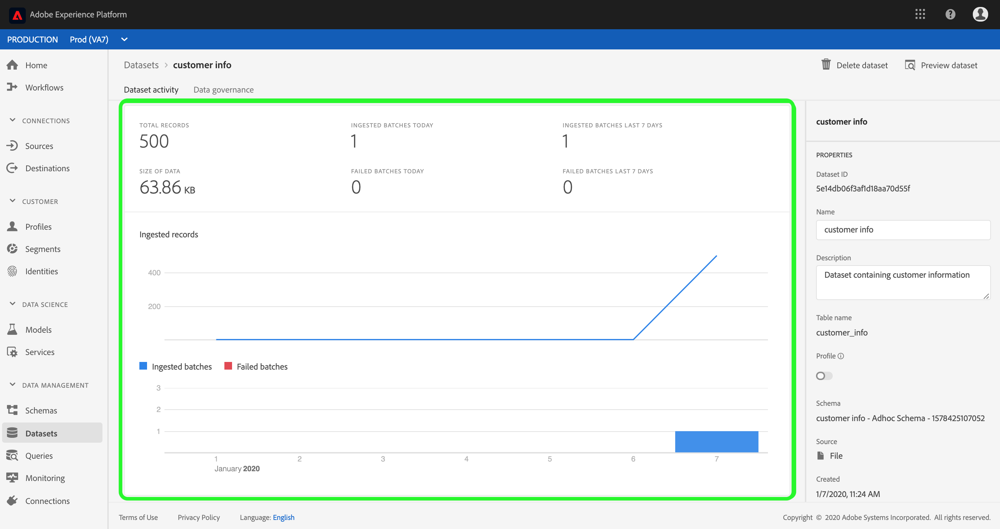
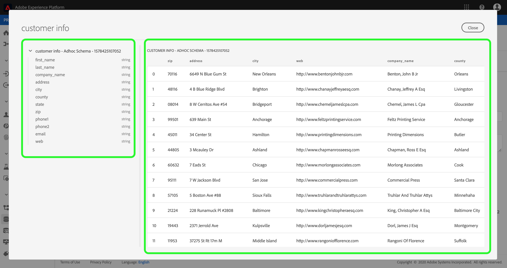
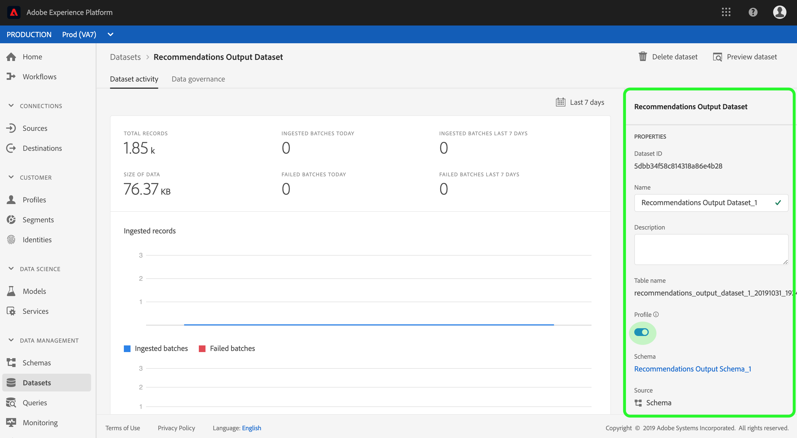
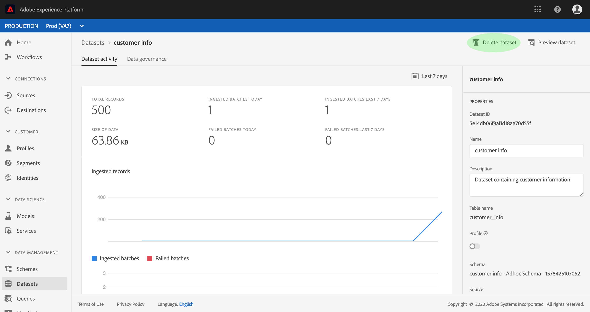
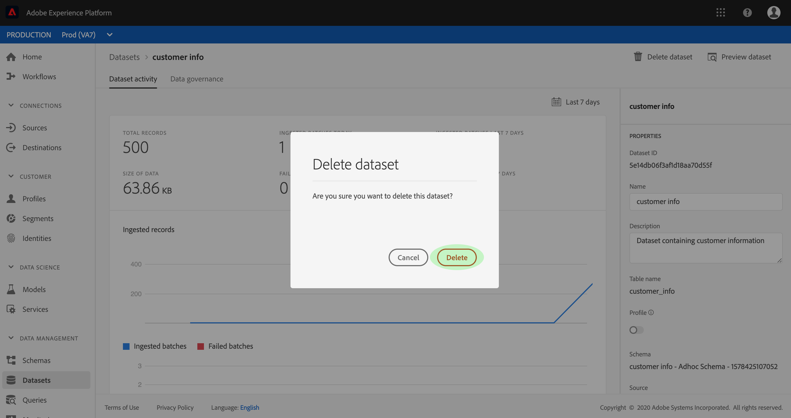
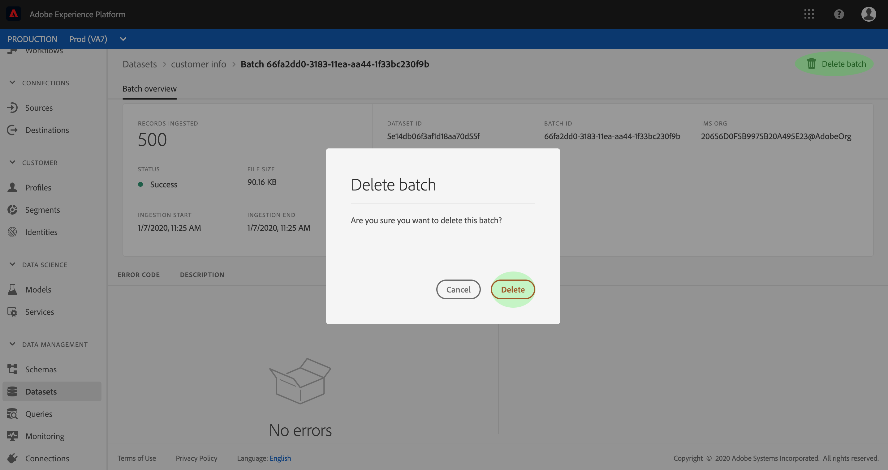

# 資料集使用指南

本使用指南提供在Adobe Experience Platform使用者介面中使用資料集時執行常見動作的指示。

## 快速入門

本使用指南需要有效瞭解Adobe Experience Platform的下列元件：

* [資料集](overview.md):中用於資料持久性的儲存和管理結構 [!DNL Experience Platform]。
* [[!DNL體驗資料模型(XDM)系統]](../../xdm/home.md):組織客戶體驗資料 [!DNL Experience Platform] 的標準化架構。
   * [架構構成基礎](../../xdm/schema/composition.md):瞭解XDM架構的基本建置區塊，包括架構組合的主要原則和最佳實務。
   * [架構編輯器](../../xdm/tutorials/create-schema-ui.md):瞭解如何使用使用者介面建立您自己 [!DNL Schema Editor] 的自訂 [!DNL Platform] XDM架構。
* [[!DNL即時客戶基本資料]](../../profile/home.md):根據來自多個來源的匯整資料，提供統一、即時的消費者個人檔案。
* [[!DNL資料治理]](../../data-governance/home.md):確保遵守有關客戶資料使用的法規、限制和政策。

## 檢視資料集

在UI中 [!DNL Experience Platform] ，按一下左 **[!UICONTROL 側導覽中的「資料集]** 」，以開啟「資料集 **** 」控制面板。 控制面板會列出您組織的所有可用資料集。 會針對每個列出的資料集顯示詳細資訊，包括其名稱、資料集所遵守的架構，以及最近擷取執行的狀態。

按一下資料集的名稱以存取其「資 **[!UICONTROL 料集」活動畫面]** ，並查看您選取之資料集的詳細資訊。 該活動頁籤包括圖形，該圖形可視化正在消耗的消息速率以及成功和失敗批的清單。

## 預覽資料集

在「資 **[!UICONTROL 料集]** 」活動畫面中，按一下畫面右上角的「 **[!UICONTROL Preview dataset]** 」（預覽資料集），最多可預覽100列資料。 如果資料集為空，預覽連結將會停用，而會指出「預 **[!UICONTROL 覽」不可用]**。

在預覽視窗中，資料集的架構階層檢視會顯示在右側。

若要存取您的資料，提供更強穩 [!DNL Experience Platform] 的方法，請提供下游服務， [!DNL Query Service] 例如 [!DNL JupyterLab] 探索和分析資料。 如需詳細資訊，請參閱下列檔案：

* [查詢服務概述](../../query-service/home.md)
* [JupyterLab使用指南](../../data-science-workspace/jupyterlab/overview.md)

## 建立資料集 {#create}

若要建立新資料集，請先按一下「資料集」控 **[!UICONTROL 制面板中的]** 「建立 **[!UICONTROL 資料集]** 」。

在下一個畫面中，您會看到下列兩個建立新資料集的選項：

* [從架構建立資料集](#create-a-dataset-with-an-existing-schema)
* [從CSV檔案建立資料集](#create-a-dataset-with-a-csv-file)

### 使用現有模式建立資料集

在「建 **[!UICONTROL 立資料集]** 」畫面中，按一 **[!UICONTROL 下「從架構建立資料集]** 」以建立新的空資料集。

將出 **[!UICONTROL 現選擇方]** 案步驟。 在按一下「下一步」之前，瀏覽模式清單並選擇資料集將遵循的 **[!UICONTROL 模式]**。

此時會 **[!UICONTROL 顯示「設定資料集]** 」步驟。 提供資料集的名稱和選用說明，然後按一下「完 **[!UICONTROL 成]** 」以建立資料集。

### 使用CSV檔案建立資料集

當使用CSV檔案建立資料集時，會建立臨機模式，以提供資料集符合所提供CSV檔案的結構。 在「建 **[!UICONTROL 立資料集]** 」畫面中，按一下「從CSV檔案 **[!UICONTROL 建立資料集」方塊]**。

此時將 **[!UICONTROL 顯示]** 「配置」步驟。 提供資料集的名稱和選用說明，然後按一下「下 **[!UICONTROL 一步]**」。

此時將 **[!UICONTROL 顯示「添加資料]** 」步驟。 將CSV檔案拖放至畫面中央，或按一下「瀏覽」以瀏覽 **[!UICONTROL 您的檔案目錄]** ，即可上傳它。 該檔案最大可以有10GB的大小。 上傳CSV檔案後，按一下「 **[!UICONTROL 儲存]** 」以建立資料集。

>[!NOTE]
>
>CSV欄名稱必須以英數字元開頭，且只能包含字母、數字和底線。

## 為即時客戶個人檔案啟用資料集

每個資料集都能運用其收錄的資料豐富客戶個人檔案。 若要這麼做，資料集所遵守的架構必須相容，才能在中使用 [!DNL Real-time Customer Profile]。 相容的架構符合下列需求：

* 架構至少有一個屬性指定為標識屬性。
* 架構具有定義為主標識的身份屬性。

有關為啟用方案的詳細資訊，請 [!DNL Profile]參閱方案編 [輯器使用手冊](../../xdm/tutorials/create-schema-ui.md)。

若要啟用描述檔的資料集，請存取其 **[!UICONTROL Dataset活動畫面]** ，然後按一下「屬性」欄內的「描述檔 **[!UICONTROL 」切換]** 功能 **** 。 啟用後，資料集中的資料也會用來填入客戶個人檔案。

如果資料集已包含資料，然後啟用 [!DNL Profile]，則現有資料不會被使用 [!DNL Profile]。 啟用資料集後，建 [!DNL Profile]議您重新收錄任何現有資料，讓其填入客戶個人檔案。

## 在資料集上管理並強制執行資料控管

Data Usage Labeling and Enforcement(DULE)是核心的資料治理機制 [!DNL Experience Platform]。 DULE標籤允許您根據應用於該資料的使用策略對資料集和欄位進行分類。 請參閱 [Data Governance概觀](../../data-governance/home.md) ，以進一步瞭解標籤，或參閱資料使  用標籤使用指南，以取得如何將標籤套用至資料集的指示。

## 刪除資料集

您可以先存取資料集活動畫面，以刪除 **[!UICONTROL 資料集]** 。 然後，按一下 **[!UICONTROL 刪除資料集]** ，將其刪除。

>[!NOTE]
>
>Adobe應用程式和服務(例如Adobe Analytics、Adobe Audience Manager或 [!DNL Decisioning Service])所建立和使用的資料集無法刪除。

隨即出現確認框。 按一 **[!UICONTROL 下刪除]** ，確認刪除資料集。

## 刪除啟用設定檔的資料集

如果資料集已啟用， [!DNL Profile]則透過UI刪除資料集會停用資料集以擷取，但不會自動刪除後端的資料集。 為了完全刪除資料集，包括資料集提供的描述檔和身分資料，必須提出額外的刪除要求。 如需如何正確刪除商店資料的 [!DNL Profile] 步驟，請參閱 [!DNL Real-time Customer Profile][描述檔系統工作的API子指南，也稱為「刪除請求」](../../profile/api/profile-system-jobs.md)。

## 監控資料擷取

在UI中 [!DNL Experience Platform] ，按一下左 **[!UICONTROL 側導覽]** 中的「監控」。 「監 **[!UICONTROL 控]** 」控制面板可讓您檢視來自批次或串流擷取的傳入資料狀態。 若要檢視個別批次的狀態，請按一 **[!UICONTROL 下批次端對端]****[!UICONTROL 或串流端對端]**。 控制面板會列出所有批次或串流擷取執行，包括成功、失敗或仍在進行中的執行。 每個清單都會提供批次的詳細資訊，包括批次ID、目標資料集的名稱，以及所擷取的記錄數。 如果目標資料集已啟用， [!DNL Profile]則也會顯示所擷取的身分和描述檔記錄數。

您可以按一下個別的 **[!UICONTROL 批次ID]** ，存取「批次概述 **** 」控制面板，並查看批次的詳細資訊，包括批次無法收錄的錯誤記錄檔。

如果要刪除批，可按一下儀表板右上角附近的「刪 **[!UICONTROL 除批]** 」來執行此操作。 這麼做也會從批次原本擷取到的資料集中移除其記錄。

## 後續步驟

本使用手冊提供了在用戶介面中使用資料集時執行常見操作 [!DNL Experience Platform] 的說明。 有關執行涉及資料集的 [!DNL Platform] 常見工作流的步驟，請參閱以下教程：

* [使用API建立資料集](create.md)
* [使用資料存取API查詢資料集資料](../../data-access/home.md)
* [使用API為即時客戶個人檔案和身分服務設定資料集](../../profile/tutorials/dataset-configuration.md)