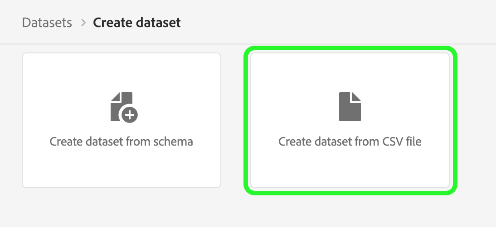

# 資料集UI指南

本使用手冊提供在Adobe Experience Platform使用者介面內使用資料集時，執行常見動作的相關指示。

## 快速入門

本使用手冊需要妥善了解下列Adobe Experience Platform元件：

* [資料集](overview.md):資料永續的儲存管理結構 [!DNL Experience Platform].
* [[!DNL Experience Data Model (XDM) System]](../../xdm/home.md):標準化框架 [!DNL Experience Platform] 組織客戶體驗資料。
   * [結構構成基本概念](../../xdm/schema/composition.md):了解XDM結構描述的基本建置組塊，包括結構描述的主要原則和最佳實務。
   * [結構編輯器](../../xdm/tutorials/create-schema-ui.md):了解如何使用 [!DNL Schema Editor] 在 [!DNL Platform] 使用者介面。
* [[!DNL Real-Time Customer Profile]](../../profile/home.md):根據來自多個來源的匯總資料，提供統一的即時消費者設定檔。
* [[!DNL Adobe Experience Platform Data Governance]](../../data-governance/home.md):確保符合有關使用客戶資料的法規、限制和政策。

## 檢視資料集 {#view-datasets}

>[!CONTEXTUALHELP]
>id="platform_datasets_negative_numbers"
>title="資料集活動中的負數"
>abstract="擷取記錄中的負數表示使用者在選取的時間範圍內刪除了某些批次。"
>text="Learn more in documentation"

在 [!DNL Experience Platform] UI, select **[!UICONTROL 資料集]** 在左側導覽中開啟 **[!UICONTROL 資料集]** 控制面板。 控制面板會列出貴組織的所有可用資料集。 系統會顯示每個列出資料集的詳細資訊，包括其名稱、資料集所遵守的結構，以及最新擷取執行的狀態。

依預設，只會顯示您已擷取的資料集。 如果要查看系統產生的資料集，請啟用 **[!UICONTROL 顯示系統資料集]** 切換。 系統產生的資料集僅用於處理其他元件。 例如，系統產生的設定檔匯出資料集可用來處理設定檔控制面板。

選取要存取其資料集的名稱 **[!UICONTROL 資料集活動]** 畫面，並查看您選取資料集的詳細資訊。 活動索引標籤包含將所使用訊息的比率視覺化的圖形，以及成功和失敗批次的清單。

## 預覽資料集

從 **[!UICONTROL 資料集活動]** 螢幕，選擇 **[!UICONTROL 預覽資料集]** 靠近畫面的右上角，可預覽最多100列資料。 如果資料集空白，預覽連結將會停用，而是表示無法預覽。

在預覽視窗中，資料集的架構階層檢視會顯示在右側。

若要取得更健全的資料存取方法， [!DNL Experience Platform] 提供下游服務，例如 [!DNL Query Service] 和 [!DNL JupyterLab] 來探索和分析資料。 如需詳細資訊，請參閱下列檔案：

* [查詢服務概述](../../query-service/home.md)
* [JupyterLab使用手冊](../../data-science-workspace/jupyterlab/overview.md)

## 建立資料集 {#create}

若要建立新資料集，請先選取 **[!UICONTROL 建立資料集]** 在 **[!UICONTROL 資料集]** 控制面板。

在下一個畫面中，畫面會顯示以下兩個建立新資料集的選項：

* [從結構建立資料集](#schema)
* [從CSV檔案建立資料集](#csv)

### 使用現有結構建立資料集 {#schema}

在 **[!UICONTROL 建立資料集]** 螢幕，選擇 **[!UICONTROL 從結構建立資料集]** 來建立新的空資料集。

此 **[!UICONTROL 選擇架構]** 步驟。 瀏覽結構清單，並選取資料集要加入的結構，再選取 **[!UICONTROL 下一個]**.

此 **[!UICONTROL 設定資料集]** 步驟。 提供資料集的名稱和可選說明，然後選取 **[!UICONTROL 完成]** 來建立資料集。

### 使用CSV檔案建立資料集 {#csv}

使用CSV檔案建立資料集時，會建立隨選結構，讓資料集的結構與提供的CSV檔案相符。 在 **[!UICONTROL 建立資料集]** 螢幕，選擇 **[!UICONTROL 從CSV檔案建立資料集]**.

此 **[!UICONTROL 設定]** 步驟。 提供資料集的名稱和可選說明，然後選取 **[!UICONTROL 下一個]**.

此 **[!UICONTROL 新增資料]** 步驟。 將CSV檔案拖曳至畫面中央，或選取「 」，即可上傳該檔案 **[!UICONTROL 瀏覽]** 以探索您的檔案目錄。 檔案的大小最多可達10GB。 上傳CSV檔案後，請選取 **[!UICONTROL 儲存]** 來建立資料集。

>[!NOTE]
>
>CSV欄名稱必須以英數字元開頭，且只能包含字母、數字和底線。

## 啟用即時客戶個人檔案的資料集 {#enable-profile}

每個資料集都能以擷取的資料豐富客戶設定檔。 若要這麼做，資料集所遵守的結構必須相容，才能用於 [!DNL Real-Time Customer Profile]. 相容的架構符合下列需求：

* 架構至少有一個屬性被指定為標識屬性。
* 架構具有定義為主要身分的身分屬性。

有關為 [!DNL Profile]，請參閱 [結構編輯器使用手冊](../../xdm/tutorials/create-schema-ui.md).

若要啟用設定檔的資料集，請存取其 **[!UICONTROL 資料集活動]** 畫面，然後選取 **[!UICONTROL 設定檔]** 在 **[!UICONTROL 屬性]** 欄。 啟用後，擷取至資料集的資料也將用來填入客戶設定檔。

>[!NOTE]
>
>如果資料集已包含資料，則 [!DNL Profile]，則不會自動使用現有資料 [!DNL Profile]. 在為 [!DNL Profile]，建議您重新內嵌任何現有資料，讓其為客戶設定檔貢獻內容。

## 管理和強制資料集的資料控管

資料使用量標籤可讓您根據套用至該資料的使用量原則，對資料集和欄位進行分類。 請參閱 [資料控管概觀](../../data-governance/home.md) 若要進一步了解標籤，請參閱 [資料使用標籤使用指南](../../data-governance/labels/overview.md) 如何將標籤套用至資料集的指示。

## 刪除資料集 {#delete}

您可以先存取資料集，以刪除資料集 **[!UICONTROL 資料集活動]** 螢幕。 然後，選取 **[!UICONTROL 刪除資料集]** 刪除它。

>[!NOTE]
>
>由Adobe應用程式和服務(例如Adobe Analytics、Adobe Audience Manager或 [!DNL Offer Decisioning])。

確認方塊隨即出現。 選擇 **[!UICONTROL 刪除]** 確認刪除資料集。

## 刪除啟用設定檔的資料集

如果資料集已啟用設定檔，透過UI刪除該資料集後，該資料集將會從資料湖、Identity Service和Platform內的設定檔存放區中刪除。

您可以從 [!DNL Profile] 使用即時客戶設定檔API僅儲存（將資料保留在Data Lake）。 如需詳細資訊，請參閱 [設定檔系統作業API端點指南](../../profile/api/profile-system-jobs.md).

## 監視資料內嵌

在 [!DNL Experience Platform] UI, select **[!UICONTROL 監控]** 的下一頁。 此 **[!UICONTROL 監控]** 控制面板可讓您檢視批次或串流內嵌傳入資料的狀態。 要查看單個批的狀態，請選擇以下任一項 **[!UICONTROL 批次端對端]** 或 **[!UICONTROL 端對端串流]**. 控制面板會列出所有批次或串流內嵌執行，包括成功、失敗或仍在執行的內嵌執行。 每份清單都提供批次的詳細資訊，包括批次ID、目標資料集的名稱，以及擷取的記錄數。 如果目標資料集已啟用 [!DNL Profile]，也會顯示擷取的身分和設定檔記錄數。

您可以在個別 **[!UICONTROL 批次ID]** 若要存取 **[!UICONTROL 批次概觀]** 控制面板，並查看批次的詳細資訊，包括批次無法內嵌時的錯誤記錄。

如果要刪除批，可通過選擇 **[!UICONTROL 刪除批]** 位於控制面板右上角附近。 這麼做也會從批次原本擷取到的資料集中移除其記錄。

## 後續步驟

本使用手冊提供使用中的資料集時，執行常見動作的指示 [!DNL Experience Platform] 使用者介面。 關於執行常見 [!DNL Platform] 與資料集相關的工作流程，請參閱下列教學課程：

* [使用API建立資料集](create.md)
* [使用資料存取API查詢資料集資料](../../data-access/home.md)
* [使用API為「即時客戶個人檔案與身分服務」設定資料集](../../profile/tutorials/dataset-configuration.md)
