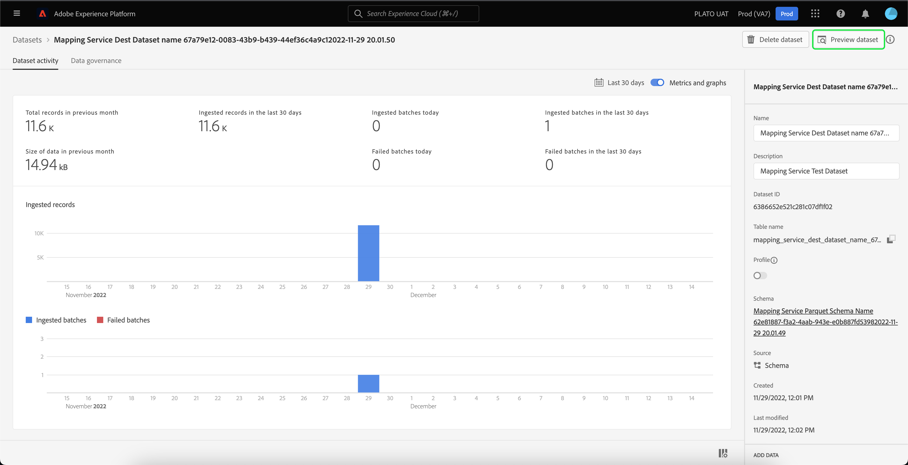

# 資料集UI指南

本使用手冊提供了在Adobe Experience Platform用戶介面內處理資料集時執行常見操作的說明。

## 快速入門

本使用手冊要求對Adobe Experience Platform的以下組成部分有工作上的瞭解：

* [資料集](overview.md):資料永續的儲存與管理結構 [!DNL Experience Platform]。
* [[!DNL Experience Data Model (XDM) System]](../../xdm/home.md):標準化框架 [!DNL Experience Platform] 組織客戶體驗資料。
   * [架構組合的基礎](../../xdm/schema/composition.md):瞭解XDM架構的基本構建基塊，包括架構組成中的關鍵原則和最佳做法。
   * [架構編輯器](../../xdm/tutorials/create-schema-ui.md):瞭解如何使用 [!DNL Schema Editor] 在 [!DNL Platform] 用戶介面。
* [[!DNL Real-Time Customer Profile]](../../profile/home.md):基於來自多個源的聚合資料提供統一、即時的用戶配置檔案。
* [[!DNL Adobe Experience Platform Data Governance]](../../data-governance/home.md):確保遵守有關使用客戶資料的法規、限制和策略。

## 查看資料集 {#view-datasets}

>[!CONTEXTUALHELP]
>id="platform_datasets_negative_numbers"
>title="資料集活動中的負數"
>abstract="擷取記錄中的負數表示使用者在選取的時間範圍內刪除了某些批次。"
>text="Learn more in documentation"

在 [!DNL Experience Platform] UI，選擇 **[!UICONTROL 資料集]** 中開啟 **[!UICONTROL 資料集]** 控制項欄。 儀表板列出了組織的所有可用資料集。 系統會顯示每個列出資料集的詳細資訊，包括其名稱、資料集所遵守的結構描述，以及最新擷取執行的狀態。

預設情況下，只會顯示您已擷取的資料集。如果要查看系統生成的資料集，請啟用 **[!UICONTROL 顯示系統資料集]** 切換。 系統生成的資料集僅用於處理其他元件。 例如，系統生成的配置檔案導出資料集用於處理配置檔案儀表板。

選擇資料集的名稱以訪問其 **[!UICONTROL 資料集活動]** 螢幕並查看所選資料集的詳細資訊。 活動索引標籤包含將所使用訊息的比率視覺化的圖形，以及成功和失敗批次的清單。

## 預覽資料集

從 **[!UICONTROL 資料集活動]** 螢幕，選擇 **[!UICONTROL 預覽資料集]** 靠近螢幕右上角，最多可預覽100行資料。 如果資料集為空，則預覽連結將被停用，而是表示預覽不可用。

在預覽窗口中，資料集模式的分層視圖在右側顯示。

要獲得更強健的資料存取方法， [!DNL Experience Platform] 提供下游服務，如 [!DNL Query Service] 和 [!DNL JupyterLab] 來分析資料。 有關詳細資訊，請參閱以下文檔：

* [查詢服務概述](../../query-service/home.md)
* [JupyterLab使用手冊](../../data-science-workspace/jupyterlab/overview.md)

## 建立資料集 {#create}

若要建立新資料集，請先在「資料集」儀表板先選取&#x200B;**[!UICONTROL 建立資料集]**。****

在下一個螢幕中，將顯示以下兩個用於建立新資料集的選項：

* [從結構建立資料集](#schema)
* [從CSV檔案建立資料集](#csv)

### 使用現有模式建立資料集 {#schema}

在 **[!UICONTROL 建立資料集]** 螢幕，選擇 **[!UICONTROL 從架構建立資料集]** 建立新的空資料集。

的 **[!UICONTROL 選擇架構]** 的上界。 瀏覽模式清單並選擇資料集將遵循的模式，然後再選擇 **[!UICONTROL 下一個]**。

的 **[!UICONTROL 配置資料集]** 的上界。 為資料集提供名稱和可選說明，然後選擇 **[!UICONTROL 完成]** 建立資料集。

### 使用CSV檔案建立資料集 {#csv}

當使用CSV檔案建立資料集時，會建立專用模式以為資料集提供與所提供的CSV檔案匹配的結構。 在 **[!UICONTROL 建立資料集]** 螢幕，選擇 **[!UICONTROL 從CSV檔案建立資料集]**。

的 **[!UICONTROL 配置]** 的上界。 為資料集提供名稱和可選說明，然後選擇 **[!UICONTROL 下一個]**。

的 **[!UICONTROL 添加資料]** 的上界。 將CSV檔案拖放到螢幕的中心，或選擇 **[!UICONTROL 瀏覽]** 以瀏覽檔案目錄。 該檔案的大小可高達十GB。 上載CSV檔案後，選擇 **[!UICONTROL 保存]** 建立資料集。

>[!NOTE]
>
>CSV列名必須以字母數字字元開頭，並且只能包含字母、數字和下划線。

## 為Real-Time Customer Profile啟用資料集 {#enable-profile}

每個資料集都能夠利用其所攝取的資料來豐富客戶配置檔案。 為此，資料集所遵循的架構必須相容，以便在 [!DNL Real-Time Customer Profile]。 相容架構滿足以下要求：

* 架構至少有一個屬性指定為標識屬性。
* 架構具有定義為主標識的標識屬性。

有關啟用架構的詳細資訊 [!DNL Profile]，請參見 [架構編輯器使用手冊](../../xdm/tutorials/create-schema-ui.md)。

要為配置檔案啟用資料集，請訪問其 **[!UICONTROL 資料集活動]** 並選擇 **[!UICONTROL 配置檔案]** 在 **[!UICONTROL 屬性]** 的雙曲餘切值。 啟用後，資料集中攝取的資料也將用於填充客戶配置檔案。

>[!NOTE]
>
>如果資料集已包含資料，並且已為 [!DNL Profile]，現有資料不會自動被 [!DNL Profile]。 在為 [!DNL Profile]，建議您重新攝取任何現有資料，使其對客戶配置檔案有所貢獻。

## 在資料集上管理和強制實施資料治理

資料使用情況標籤允許您根據應用於該資料的使用情況策略對資料集和欄位進行分類。 查看 [資料治理概述](../../data-governance/home.md) 瞭解有關標籤的詳細資訊，或參閱 [資料使用標籤使用手冊](../../data-governance/labels/overview.md) 有關如何將標籤應用於資料集的說明。

## 刪除資料集 {#delete}

可以通過首先訪問資料集來刪除資料集 **[!UICONTROL 資料集活動]** 的上界。 然後，選擇 **[!UICONTROL 刪除資料集]** 刪除它。

>[!NOTE]
>
>由Adobe應用程式和服務(如Adobe Analytics、Adobe Audience Manager或 [!DNL Offer Decisioning])。

將出現確認框。 選擇 **[!UICONTROL 刪除]** 確認刪除資料集。

## 刪除啟用配置檔案的資料集

如果為Profile啟用了資料集，則通過UI刪除該資料集將從資料湖、Identity Service和平台內的Profile儲存中將其刪除。

可以從 [!DNL Profile] 僅儲存（將資料保留在資料湖中），使用即時客戶配置檔案API。 有關詳細資訊，請參見 [配置檔案系統作業API終結點指南](../../profile/api/profile-system-jobs.md)。

## 監視資料內嵌

在 [!DNL Experience Platform] UI，選擇 **[!UICONTROL 監視]** 的上界。 的 **[!UICONTROL 監視]** 通過「儀表板」，可以查看來自批處理或流式處理接收的入站資料的狀態。 要查看單個批的狀態，請選擇 **[!UICONTROL 批端到端]** 或 **[!UICONTROL 流式端到端]**。 儀表板列出所有批處理或流式接收運行，包括成功、失敗或仍在進行的運行。 每個清單都提供批的詳細資訊，包括批ID、目標資料集的名稱和接收的記錄數。 如果為 [!DNL Profile]，還顯示所攝取的身份和配置檔案記錄的數量。

可以在單個 **[!UICONTROL 批ID]** 訪問 **[!UICONTROL 批概覽]** 控制板，並查看批的詳細資訊，包括如果批未能接收錯誤日誌。

如果要刪除批，可通過選擇 **[!UICONTROL 刪除批]** 在儀表板右上角找到的。 這樣做還會從最初接收批的資料集中刪除其記錄。

## 後續步驟

本使用手冊提供了在使用中的資料集時執行常見操作的說明 [!DNL Experience Platform] 用戶介面。 有關執行常用操作的步驟 [!DNL Platform] 涉及資料集的工作流，請參閱以下教程：

* [使用API建立資料集](create.md)
* [使用資料存取API查詢資料集資料](../../data-access/home.md)
* [使用API為Real-Time Customer Profile和Identity Service配置資料集](../../profile/tutorials/dataset-configuration.md)
