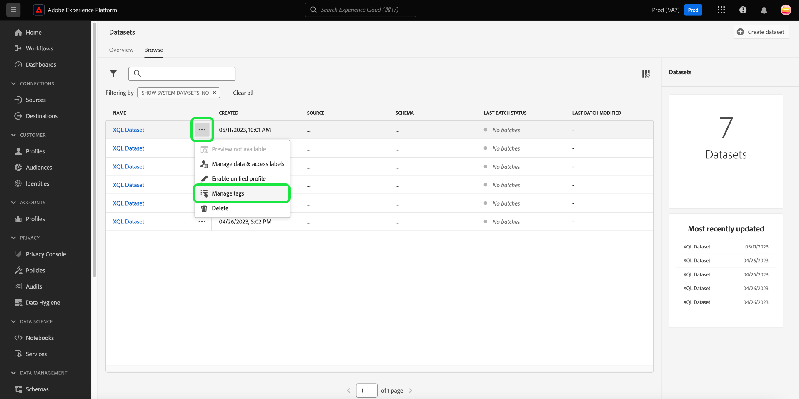
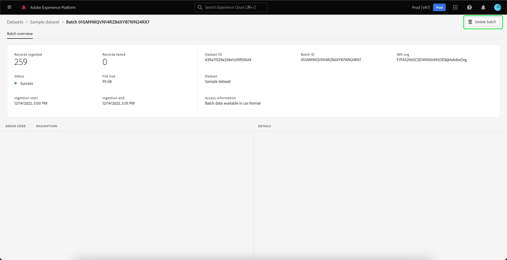

# 資料集UI指南

本使用手冊提供在Adobe Experience Platform使用者介面中使用資料集時，執行常見動作的相關指示。

## 快速入門

本使用手冊需要您實際瞭解下列Adobe Experience Platform元件：

* [資料集](overview.md)：資料持續存在的儲存和管理結構 [!DNL Experience Platform].
* [[!DNL Experience Data Model (XDM) System]](../../xdm/home.md)：作為依據的標準化架構 [!DNL Experience Platform] 組織客戶體驗資料。
   * [結構描述組合基本概念](../../xdm/schema/composition.md)：瞭解XDM結構描述的基本建置組塊，包括結構描述組合中的關鍵原則和最佳實務。
   * [結構描述編輯器](../../xdm/tutorials/create-schema-ui.md)：瞭解如何使用建置您自己的自訂XDM結構描述 [!DNL Schema Editor] 在 [!DNL Platform] 使用者介面。
* [[!DNL Real-Time Customer Profile]](../../profile/home.md)：根據來自多個來源的彙總資料，提供統一的即時消費者設定檔。
* [[!DNL Adobe Experience Platform Data Governance]](../../data-governance/home.md)：確保遵守使用客戶資料的相關法規、限制和政策。

## 檢視資料集 {#view-datasets}

>[!CONTEXTUALHELP]
>id="platform_datasets_negative_numbers"
>title="資料集活動中的負數"
>abstract="擷取記錄中的負數表示使用者在選取的時間範圍內刪除了某些批次。"
>text="Learn more in documentation"

>[!CONTEXTUALHELP]
>id="platform_datasets_browse_daysRemaining"
>title="資料集有效期"
>abstract="此欄表示目標資料集在自動到期之前剩餘的天數。"

在 [!DNL Experience Platform] UI，選取 **[!UICONTROL 資料集]** 在左側導覽中開啟 **[!UICONTROL 資料集]** 儀表板。 儀表板會列出貴組織的所有可用資料集。 系統會顯示每個列出資料集的詳細資訊，包括其名稱、資料集所遵守的結構描述，以及最新擷取執行的狀態。

從中選擇資料集的名稱 [!UICONTROL 瀏覽] 標籤以存取其 **[!UICONTROL 資料集活動]** 畫面並檢視您選取之資料集的詳細資訊。 活動索引標籤包含將所使用訊息的比率視覺化的圖形，以及成功和失敗批次的清單。

## 內嵌資料集動作 {#inline-actions}

資料集UI現在為每個可用的資料集提供一組內嵌動作。 選取您要管理的資料集省略符號，在快顯功能表中檢視可用選項。 可用的動作包括； [[!UICONTROL 預覽資料集]](#preview)， [[!UICONTROL 管理資料和存取標籤]](#manage-and-enforce-data-governance)， [[!UICONTROL 啟用統一的設定檔]](#enable-profile)， [[!UICONTROL 管理標籤]](#add-tags)、和 [[!UICONTROL 刪除]](#delete). 如需這些可用動作的詳細資訊，請參閱其各自章節。

### 新增資料集標籤 {#add-tags}

新增自訂建立的標籤以組織資料集並改善搜尋、篩選和排序功能。 從 [!UICONTROL 瀏覽] 的標籤 [!UICONTROL 資料集] 工作區中，選取您要管理的資料集省略符號，然後選取 **[!UICONTROL 管理標籤]** 下拉式選單中的。

此 [!UICONTROL 管理標籤] 對話方塊隨即顯示。 輸入簡短說明以建立自訂標籤，或選擇預先存在的標籤以標籤您的資料集。 選取 **[!UICONTROL 儲存]** 以確認您的設定。

此 [!UICONTROL 管理標籤] 對話方塊也可以從資料集中移除現有標籤。 只要選取您要移除的標籤旁的「x」，然後選取 **[!UICONTROL 儲存]**.

將標籤新增到資料集後，即可根據對應的標籤篩選資料集。 請參閱如何操作的區段 [依標籤篩選資料集](#enable-profile) 以取得詳細資訊。

如需如何分類商業物件以便輕鬆探索和分類的詳細資訊，請參閱以下指南中的 [管理中繼資料分類](../../administrative-tags/ui/managing-tags.md). 本指南詳細說明具有適當許可權的使用者如何在Platform UI中建立預先定義的標籤、指派標籤類別以及執行標籤和標籤類別的所有相關CRUD作業。

## 搜尋和篩選資料集 {#search-and-filter}

若要搜尋或篩選可用資料集清單，請選取篩選圖示()。 左側邊欄中出現一組篩選選項。 有數種方法可篩選您的可用資料集。 其中包括： [[!UICONTROL 顯示系統資料集]](#show-system-datasets)， [[!UICONTROL 包含在設定檔中]](#filter-profile-enabled-datasets)， [[!UICONTROL 標籤]](#filter-by-tag)， [[!UICONTROL 建立日期]](#filter-by-creation-date)， [[!UICONTROL 修改日期]， [!UICONTROL 建立者]](#filter-by-creation-date)、和 [[!UICONTROL 結構描述]](#filter-by-schema).

套用的篩選器清單會顯示在篩選結果上方。

### 顯示系統資料集 {#show-system-datasets}

依預設，只會顯示您擷取資料的資料集。 如果您想要檢視系統產生的資料集，請選取 **[!UICONTROL 是]** 核取方塊(位於 [!UICONTROL 顯示系統資料集] 區段。 系統產生的資料集僅用於處理其他元件。 例如，系統產生的設定檔匯出資料集可用來處理設定檔儀表板。

![資料集工作區的篩選選項，具有 [!UICONTROL 顯示系統資料集] 區段反白顯示。](../images/datasets/user-guide/show-system-datasets.png)

### 篩選設定檔啟用的資料集 {#filter-profile-enabled-datasets}

為設定檔資料啟用的資料集用於在擷取資料後填入客戶設定檔。 請參閱以下小節： [為設定檔啟用資料集](#enable-profile) 以深入瞭解。

若要根據資料集是否已為設定檔啟用來篩選資料集，請選取 [!UICONTROL 是] 核取方塊。

![資料集工作區的篩選選項，具有 [!UICONTROL 包含在設定檔中] 區段反白顯示。](../images/datasets/user-guide/included-in-profile.png)

### 依標籤篩選資料集 {#filter-by-tag}

在「 」中輸入您的自訂標籤名稱 [!UICONTROL 標籤] 輸入，然後從可用選項清單中選取您的標籤，以搜尋和篩選與該標籤對應的資料集。

![資料集工作區的篩選選項，具有 [!UICONTROL 標籤] 反白顯示輸入和篩選圖示。](../images/datasets/user-guide/filter-tags.png)

### 依建立日期篩選資料集 {#filter-by-creation-date}

資料集可以依建立日期在自訂時段內篩選。 這可用來排除歷史資料，或產生依時間順序排列的資料深入分析和報表。 選擇 [!UICONTROL 開始日期] 和 [!UICONTROL 結束日期] 為每個欄位選取行事曆圖示。 之後，只有符合該條件的資料集才會出現在「瀏覽」標籤中。

### 依修改日期篩選資料集 {#filter-by-modified-date}

與建立日期的篩選類似，您可以根據資料集的上次修改日期來篩選資料集。 在 [!UICONTROL 修改日期] 區段，選擇 [!UICONTROL 開始日期] 和 [!UICONTROL 結束日期] 為每個欄位選取行事曆圖示。 之後，只有在該時段內修改的資料集才會顯示在「瀏覽」標籤中。

### 依結構描述篩選 {#filter-by-schema}

您可以根據定義資料集結構的結構來篩選資料集。 選取下拉式清單圖示，或將結構描述名稱輸入文字欄位中。 可能的相符專案清單隨即顯示。 從清單中選取適當的結構描述。

## 依建立日期排序資料集 {#sort}

中的資料集 [!UICONTROL 瀏覽] 索引標籤可依遞增或遞減日期排序。 選取 [!UICONTROL 已建立] 或 [!UICONTROL 上次更新時間] 欄標題在升序和降序之間切換。 選取後，欄會以向上或向下箭頭指向欄標題的側邊來指示此專案。

## 預覽資料集 {#preview}

您可以從「 」的兩個內嵌選項預覽資料集樣本資料 [!UICONTROL 瀏覽] 標籤及 [!UICONTROL 資料集活動] 檢視。 從 [!UICONTROL 瀏覽] 索引標籤中，選取您要預覽的資料集名稱旁的省略符號。 選單選項清單隨即出現。 接下來，選取 **[!UICONTROL 預覽資料集]** 從可用選項清單中選取。 如果資料集為空，預覽連結將會停用，並改為表示無法預覽。

這會開啟預覽視窗，其中資料集的結構描述階層檢視會顯示在右側。

或者，從 **[!UICONTROL 資料集活動]** 畫面，選取 **[!UICONTROL 預覽資料集]** 靠近熒幕右上角，可預覽最多100列資料。

如需更穩健的資料存取方法， [!DNL Experience Platform] 提供下游服務，例如 [!DNL Query Service] 和 [!DNL JupyterLab] 以探索及分析資料。 如需詳細資訊，請參閱下列檔案：

* [查詢服務總覽](../../query-service/home.md)
* [JupyterLab使用手冊](../../data-science-workspace/jupyterlab/overview.md)

## 建立資料集 {#create}

若要建立新資料集，請先在「資料集」儀表板先選取&#x200B;**[!UICONTROL 建立資料集]**。****

在下一個畫面中，畫面會顯示下列兩個建立新資料集的選項：

* [從結構建立資料集](#schema)
* [從CSV檔案建立資料集](#csv)

### 使用現有結構描述建立資料集 {#schema}

在 **[!UICONTROL 建立資料集]** 畫面，選取 **[!UICONTROL 從結構描述建立資料集]** 以建立新的空白資料集。

此 **[!UICONTROL 選取結構描述]** 步驟隨即顯示。 瀏覽結構描述清單，並選取資料集將遵循的結構描述，然後再選取 **[!UICONTROL 下一個]**.

此 **[!UICONTROL 設定資料集]** 步驟隨即顯示。 為資料集提供名稱和可選說明，然後選取「 」 **[!UICONTROL 完成]** 以建立資料集。

資料集可使用結構描述篩選器從UI中的可用資料集清單中篩選。 請參閱如何操作的區段 [依結構描述篩選資料集](#filter-by-schema) 以取得詳細資訊。

### 使用CSV檔案建立資料集 {#csv}

使用CSV檔案建立資料集時，會建立臨時結構描述，為資料集提供符合所提供CSV檔案的結構。 在 **[!UICONTROL 建立資料集]** 畫面，選取 **[!UICONTROL 從CSV檔案建立資料集]**.

此 **[!UICONTROL 設定]** 步驟隨即顯示。 為資料集提供名稱和可選說明，然後選取「 」 **[!UICONTROL 下一個]**.

此 **[!UICONTROL 新增資料]** 步驟隨即顯示。 將CSV檔案拖放至熒幕中央或選取「 」，即可上傳CSV檔案 **[!UICONTROL 瀏覽]** 以探索您的檔案目錄。 檔案大小最多可達10GB。 上傳CSV檔案後，選取「 」 **[!UICONTROL 儲存]** 以建立資料集。

>[!NOTE]
>
>CSV欄名稱的開頭必須為英數字元，並且只能包含字母、數字和底線。

## 啟用即時客戶個人檔案的資料集 {#enable-profile}

每個資料集都能夠使用其擷取的資料擴充客戶設定檔。 若要這麼做，資料集所遵守的結構描述必須相容，才能在中使用 [!DNL Real-Time Customer Profile]. 相容的結構描述符合下列要求：

* 結構描述至少指定一個屬性做為身分屬性。
* 結構描述具有定義為主要身分的身分屬性。

如需啟用結構描述的詳細資訊，請參閱 [!DNL Profile]，請參閱 [結構描述編輯器使用手冊](../../xdm/tutorials/create-schema-ui.md).

您可以從以下兩個內嵌選項為設定檔啟用資料集： [!UICONTROL 瀏覽] 標籤及 [!UICONTROL 資料集活動] 檢視。 從 [!UICONTROL 瀏覽] 的標籤 [!UICONTROL 資料集] 工作區中，選取您要為設定檔啟用的資料集省略符號。 選單選項清單隨即出現。 接下來，選取 **[!UICONTROL 啟用統一的設定檔]** 從可用選項清單中選取。

或者，從資料集的 **[!UICONTROL 資料集活動]** 熒幕中，選取 **[!UICONTROL 設定檔]** 切換於 **[!UICONTROL 屬性]** 欄。 啟用後，擷取到資料集中的資料也將用於填入客戶設定檔。

>[!NOTE]
>
>如果資料集已包含資料，且已啟用 [!DNL Profile]，現有資料不會自動由使用 [!DNL Profile]. 為啟用資料集後 [!DNL Profile]，建議您重新內嵌任何現有資料，以貢獻給客戶設定檔。

您也可以根據此條件篩選已針對設定檔啟用的資料集。 請參閱如何操作的區段 [篩選設定檔啟用的資料集](#filter-profile-enabled-datasets) 以取得詳細資訊。

## 管理和強制執行資料集的資料控管 {#manage-and-enforce-data-governance}

您可以選取「 」的內嵌選項，管理資料集的資料控管標籤。 [!UICONTROL 瀏覽] 標籤。 選取您要管理的資料集名稱旁的省略符號，然後選取 **[!UICONTROL 管理資料和存取標籤]** 下拉式選單中的。

套用至結構描述層級的資料使用標籤，可讓您根據套用至該資料的使用原則來分類資料集和欄位。 請參閱 [資料控管概觀](../../data-governance/home.md) 以進一步瞭解標籤，或參閱 [資料使用標籤使用手冊](../../data-governance/labels/overview.md) 瞭解如何將標籤套用至結構描述，以傳播至資料集。

## 刪除資料集 {#delete}

您可以從的任一資料集內嵌動作中刪除資料集 [!UICONTROL 瀏覽] 標籤或右上角 [!UICONTROL 資料集活動] 檢視。 從 [!UICONTROL 瀏覽] 檢視，選取您要刪除的資料集名稱旁的省略符號。 選單選項清單隨即出現。 接下來，選取 **[!UICONTROL 刪除]** 下拉式選單中的。

確認對話方塊隨即顯示。 請選取「**[!UICONTROL 刪除]**」完成確認。

或者，選取 **[!UICONTROL 刪除資料集]** 從 **[!UICONTROL 資料集活動]** 畫面。

>[!NOTE]
>
>Adobe應用程式和服務(例如Adobe Analytics、Adobe Audience Manager或 [!DNL Offer Decisioning])無法刪除。

確認方塊隨即出現。 選取 **[!UICONTROL 刪除]** 以確認刪除資料集。

## 刪除啟用設定檔的資料集

如果設定檔已啟用資料集，透過UI刪除該資料集將會從Data Lake、Identity Service和Platform內的設定檔存放區中刪除它。

您可以從中刪除資料集 [!DNL Profile] 使用即時客戶個人檔案API僅儲存（將資料保留在資料湖中）。 如需詳細資訊，請參閱 [設定檔系統作業API端點指南](../../profile/api/profile-system-jobs.md).

## 監視資料內嵌

在 [!DNL Experience Platform] UI，選取 **[!UICONTROL 監視]** 左側導覽中的。 此 **[!UICONTROL 監視]** 控制面板可讓您檢視批次或串流擷取的傳入資料狀態。 若要檢視個別批次的狀態，請選取 **[!UICONTROL 批次端對端]** 或 **[!UICONTROL 端對端串流]**. 儀表板會列出所有批次或串流擷取執行，包括成功、失敗或仍在進行的作業。 每個清單都提供批次的詳細資訊，包括批次ID、目標資料集的名稱和擷取的記錄數。 如果目標資料集已啟用 [!DNL Profile]，也會顯示內嵌的身分和設定檔記錄數。

您可以對個人進行選取 **[!UICONTROL 批次識別碼]** 存取 **[!UICONTROL 批次總覽]** 儀表板，並檢視批次的詳細資料，包括批次擷取失敗時的錯誤記錄。

如果要刪除批次，請選取 **[!UICONTROL 刪除批次]** 在控制面板右上角附近。 刪除批次也會從批次最初被攝取的資料集中移除其記錄。

## 後續步驟

本使用手冊提供在中處理資料集時執行常見動作的指示。 [!DNL Experience Platform] 使用者介面。 有關執行常見問題的步驟 [!DNL Platform] 涉及資料集的工作流程，請參閱下列教學課程：

* [使用API建立資料集](create.md)
* [使用資料存取API查詢資料集資料](../../data-access/home.md)
* [使用API設定即時客戶個人檔案和身分服務的資料集](../../profile/tutorials/dataset-configuration.md)
